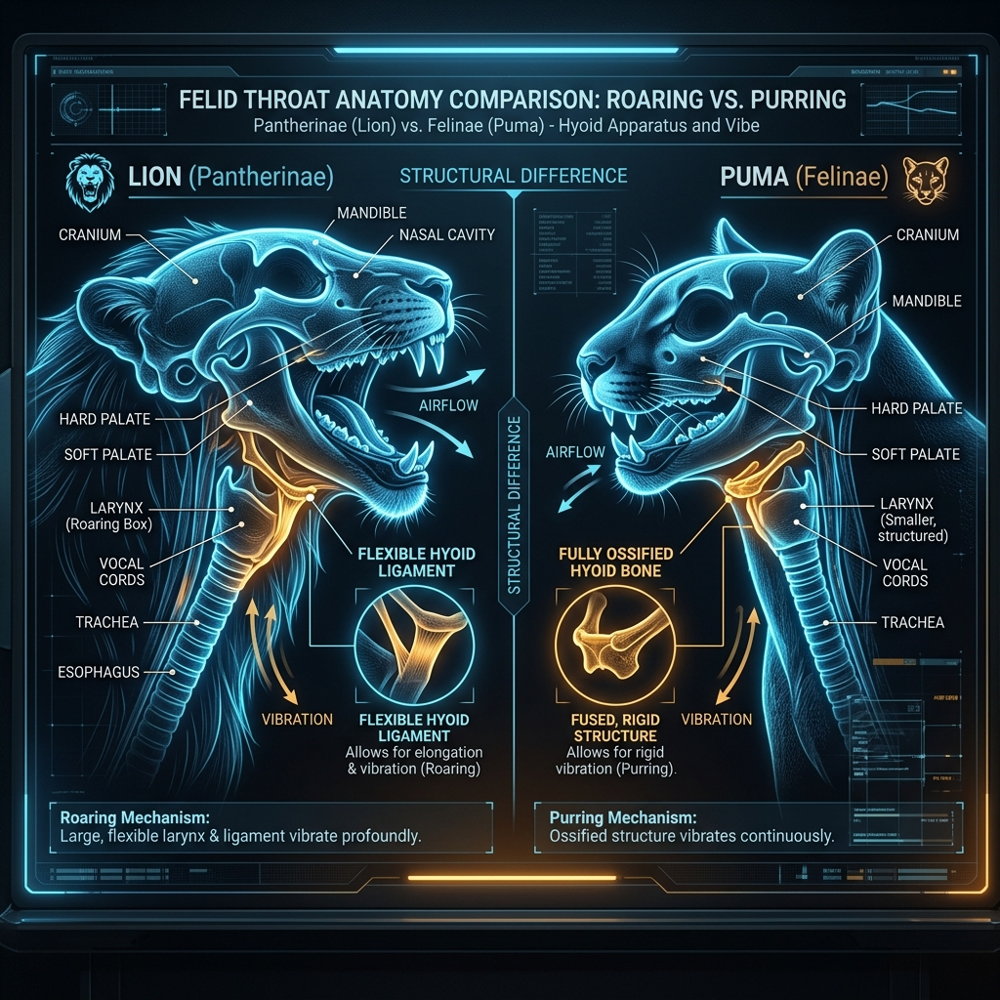

# Big Cats vs Small Cats

People often talk about “big cats” and “small cats”, but the distinction is not just about size. In felid taxonomy the terms correspond loosely to the subfamilies **_Pantherinae_** and **_Felinae_**, yet popular usage can blur the boundaries. This page clarifies the differences.

## Size and body form

**Big cats**—tigers, lions, jaguars, leopards and snow leopards—are generally much larger than other felids, with males often exceeding 100 kg. Clouded leopards are smaller (up to 50 kg) but are often grouped with big cats because they share the _Pantherinae_ lineage. **Small cats** (felinae) range from the diminutive black‑footed cat (under 2 kg) to the puma and cheetah (over 40 kg), illustrating that body size alone does not define the group.

## Vocalisations

The classic distinction hinges on the **hyoid apparatus**. Big cats have a flexible ligament connecting the hyoid bone, allowing the larynx to stretch and produce a full‑throated **roar**. Lions use this ability to advertise their territory across long distances. Small cats have a fully ossified hyoid bone; they **purr** continuously but cannot roar. Cheetahs and pumas, despite their size, lack the hyoid ligament and thus belong to the small cat group.

## Behaviour and ecology

Big cats are typically apex predators in their ecosystems. They tend to hunt larger prey (deer, ungulates or buffalo) and often require extensive territories. Small cats occupy a wider array of ecological niches. Caracals and servals are dryland specialists that leap to catch birds, whereas ocelots prowl dense forests and feed on rodents. Pallas’s cats inhabit Central Asian steppes and survive on pikas and voles.

## Overlaps and exceptions

Modern usage sometimes labels cheetahs, pumas or even male lynx as “big cats” due to their size. However, in a strict taxonomic sense these species are part of _Felinae_. Conversely, clouded leopards are not particularly large but belong to _Pantherinae_. When using the term “big cat,” be clear whether you mean size, evolutionary lineage or roaring ability.

For a breakdown of the two subfamilies see **[[Pantherinae_vs_Felinae.md]]**. The **[[Felidae_Family_Tree.md|family tree]]** provides a visual of their relationships.
