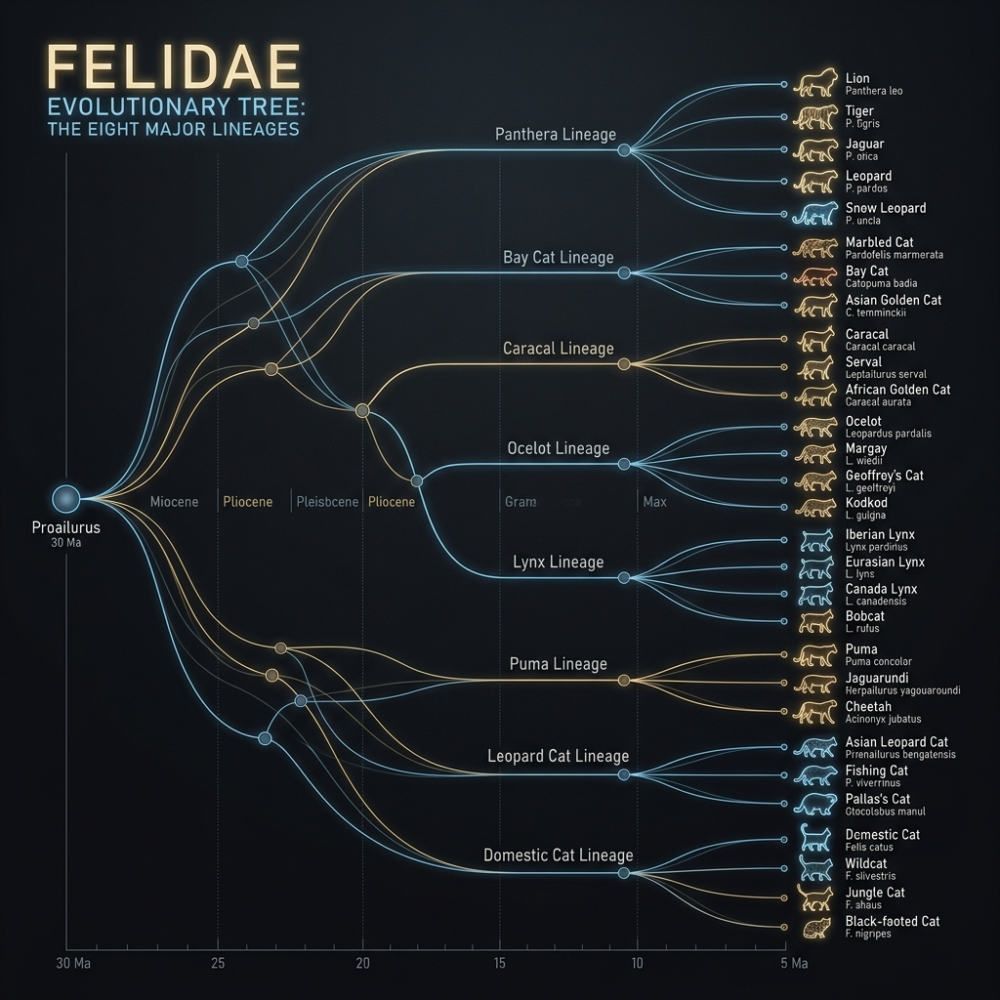

# Cat Lineages Overview

This page summarises the major evolutionary lineages within the cat family (_Felidae_). Modern taxonomic studies recognise two living subfamilies—**_Pantherinae_** (big cats) and **_Felinae_** (small and medium cats)—containing roughly 41 wild species. Within these subfamilies, genetic analyses reveal distinct lineages that reflect ancient radiations across different continents. Understanding these lineages helps place each exhibit species in a broader evolutionary context.

## The Panthera lineage

The **Panthera** lineage belongs to the subfamily _Pantherinae_. It comprises the largest and most charismatic species, characterised by a flexible hyoid apparatus that allows most members to roar. The lineage includes:

- **Tigers** (_Panthera tigris_) – represented in this atlas by the Siberian/Amur tiger. Tigers occupy a wide range of forests and grasslands across Asia and show strong regional variation in size and coat colour.
- **Lions** (_Panthera leo_) – the only truly social cats, living in prides on African savannas and in India's Gir forest.. Males sport a mane and defend territory, while females hunt cooperatively.
- **Jaguars** (_Panthera onca_) – the largest cat of the Americas; they have powerful jaws and distinctive rosettes with central spots. Jaguars thrive in tropical forests and wetlands and are excellent swimmers.
- **Leopards** (_Panthera pardus_) – adaptable predators ranging from Africa to Asia; their rosette pattern and climbing ability are hallmarks of the species.
- **Snow leopards** (_Panthera uncia_) – high‑altitude specialists with thick fur and long tails that inhabit the mountains of Central Asia.

## The clouded leopard lineage

Clouded leopards form their own genus **_Neofelis_** within _Pantherinae_. They are smaller than the true big cats and are highly arboreal. Their proportionally large canines and rotating ankles allow them to climb headfirst down trees.

## The puma lineage

Within _Felinae_ the **puma lineage** includes the puma (cougar/mountain lion), the cheetah and several extinct species. Genetic studies indicate that pumas and cheetahs share a common ancestor despite their different hunting strategies. The puma is a versatile ambush predator that occupies diverse habitats from Alaska to South America, while the cheetah is a speed specialist adapted to open savannas.

## The lynx lineage

The **lynx lineage** comprises four species in the genus _Lynx_: the Eurasian lynx, Canada lynx, Iberian lynx and bobcat. In this atlas we feature the **Eurasian lynx** (_Lynx lynx_), the largest member of the lineage. Lynx species share tufted ears, a short tail and a flared facial ruff. They inhabit forested and mountainous environments and hunt a mixture of ungulates and small mammals.

## The caracal lineage

The **caracal lineage** encompasses the caracal, serval and African golden cat. These medium‑sized cats are known for their long legs and large ears. The caracal (_Caracal caracal_) has distinctive black ear tufts and is a powerful jumper. The serval (_Leptailurus serval_) has the longest legs relative to body size of any cat and hunts by listening for small rodents in grass. The African golden cat is not covered in this atlas but is closely related.

## The ocelot lineage

The **ocelot lineage** includes the ocelot, margay and oncilla. These cats inhabit the Neotropical forests of the Americas. The ocelot (_Leopardus pardalis_), featured here, has a golden coat with black rosettes and stripes and is an agile climber and swimmer.

## The Pallas’s cat lineage

The **Pallas’s cat** (_Otocolobus manul_) is the sole extant member of its lineage. It has a flat face, low‑set ears and a dense, frosted coat that blend with the rocky steppes of Central Asia. Genetic studies place it within the domestic cat lineage but its distinctive morphology warrants separate mention.

## The domestic cat lineage

Domestic cats and their wild relatives form the **domestic cat lineage**. Wild members include the African and European wildcats, jungle cats and sand cats. These species gave rise to the domestic cat (_Felis catus_) through domestication events in the Near East. The **Siberian forest cat** covered in this atlas is a natural domestic breed evolved in Russia with a thick triple coat.

These lineages are not strict taxonomic ranks but convenient groupings that reflect evolutionary history. As research continues, relationships may be revised; consult the **Taxonomy Notes and Caveats** page for more discussion of ongoing debates.
