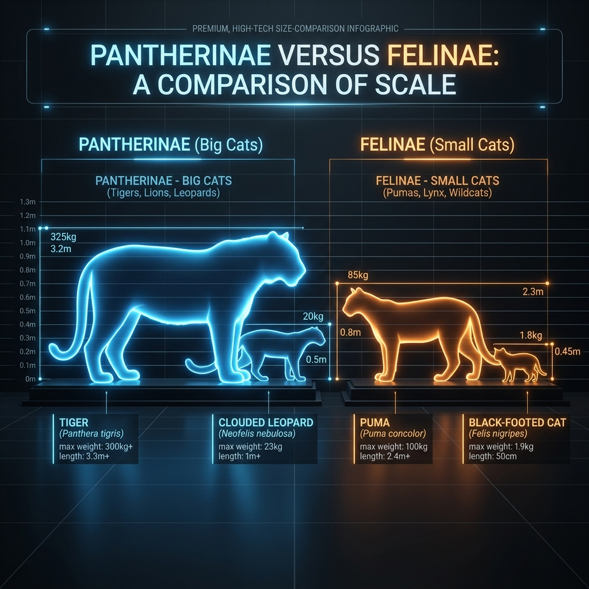

# *Pantherinae* vs *Felinae*

The family **Felidae** is divided into two extant subfamilies: **_Pantherinae_** and **_Felinae_**. Understanding this split helps explain why some cats can roar while others purr and why “big cat” is both an anatomical and cultural category.

## _Pantherinae_ – the big cats

The subfamily **_Pantherinae_** contains the genus **_Panthera_** (tiger, lion, jaguar, leopard and snow leopard) and the genus **_Neofelis_** (clouded and Sunda clouded leopards). Members of this group share several traits:

- **Large body size** – most weigh over 50 kg and occupy the top of food chains in their ecosystems.
- **Roaring mechanism** – a flexible ligament in the hyoid apparatus allows them to produce deep roars. The lion’s roar can carry up to 8 km.
- **Territorial but overlapping ranges** – males maintain large territories that may overlap with several females, while females raise their cubs alone.
- **Conservation focus** – many _Panthera_ species are endangered due to habitat loss and poaching; clouded leopards are vulnerable.

## _Felinae_ – the small and medium cats

All other extant felids belong to **_Felinae_**. This subfamily is diverse, containing eleven genera and more than thirty species, including the cheetah, puma, lynx, caracal, serval, ocelot and domestic cats. Common features include:

- **Smaller stature** – although pumas and cheetahs are relatively large, most felinae weigh under 40 kg.
- **Purring** – the hyoid bone in felinae is fully ossified, which permits continuous purring but prevents true roaring.
- **Wide ecological range** – felinae occupy almost every terrestrial habitat, from deserts and savannas (caracal, serval) to dense forests (ocelot, marbled cat) and high mountains (pallas’s cat). Many are highly adaptable generalists.
- **High species diversity** – with 11 genera and more than 30 species, felinae show a wide array of hunting strategies and body forms.

## Why the distinction matters

The distinction between _Pantherinae_ and _Felinae_ reflects both evolutionary lineage and anatomy. Roaring requires a special hyoid apparatus and enlarged larynx, while purring relies on a rigid hyoid bone. Cheetahs and pumas are sometimes called “big cats” in popular culture because of their size, but they lack the hyoid ligament and thus belong to _Felinae_. Understanding these differences helps avoid misconceptions (for example, grouping cheetahs with true _Panthera_ cats).

For a visual representation of the family tree, see **[[Felidae_Family_Tree.md]]**.
