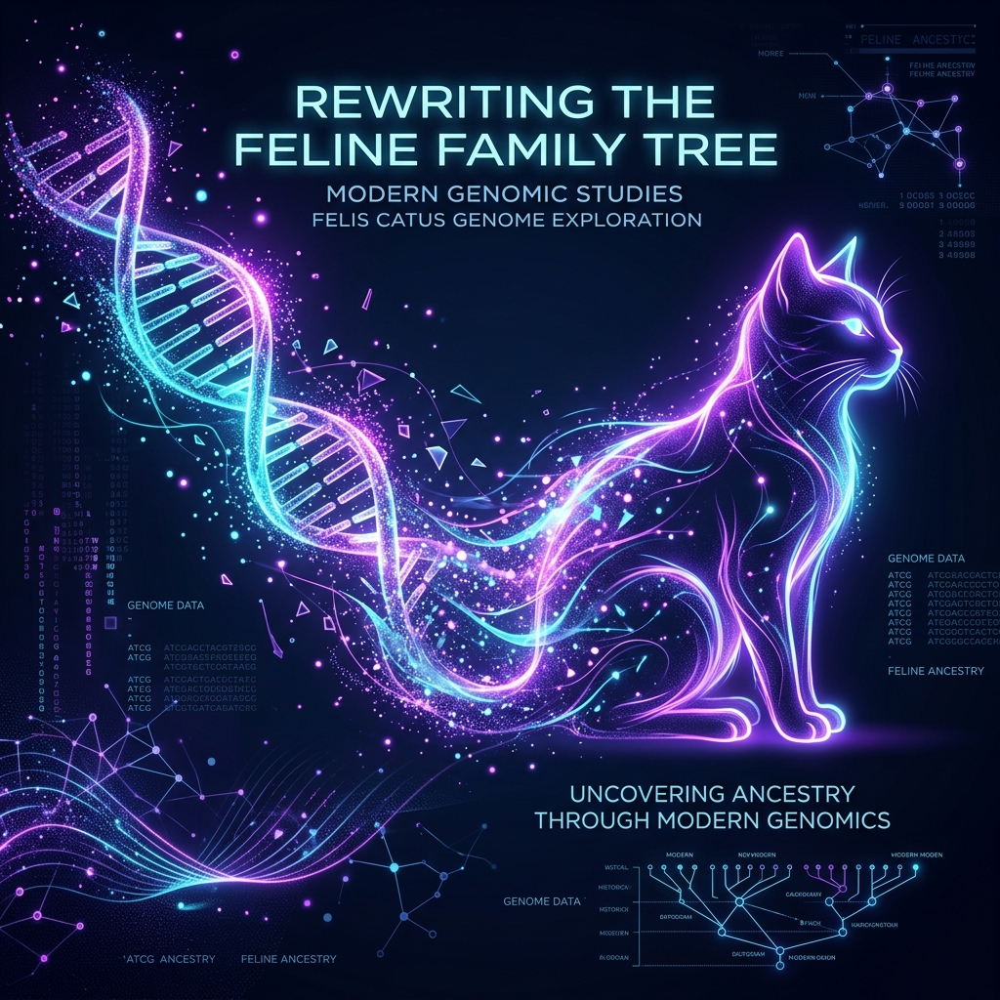

# Taxonomy Notes and Caveats

Taxonomy is a living science. Names, ranks and groupings change as new evidence from genetics, morphology and biogeography accumulates. This atlas follows the Cat Classification Task Force (2017) and other recent syntheses, but readers should be aware of several caveats:

## Subspecies revisions

Many well‑known cats were historically divided into numerous subspecies based on regional differences in size, colour or skull shape. For example, the **Amur or Siberian tiger** was long recognised as _Panthera tigris altaica_, distinct from Bengal, Malayan and other subspecies. Recent genetic work has consolidated mainland tigers into a single subspecies (_P. tigris tigris_), with the Amur tiger treated as a regional population. In this atlas we retain the traditional name for clarity but note the modern classification in the species index and profile.

Similarly, **African leopards** are sometimes treated as a subspecies (_P. pardus pardus_), yet the leopard as a whole is now often considered monotypic with regional clades. Subspecies designations vary across authorities.

## Big cats vs small cats

The term **“big cat”** originally referred to the four roaring species—lion, tiger, jaguar and leopard—but some authors extend it to the snow leopard and clouded leopards. The primary anatomical distinction is the hyoid apparatus: big cats have a flexible ligament that allows most to roar, whereas small cats have a completely ossified hyoid and can purr continuously. Size alone does not determine membership; the cheetah and puma are among the largest felids yet belong to the **Felinae** subfamily.

## Rapid discoveries and cryptic species

Genomic studies continue to reveal hidden diversity within the cat family. New species have been described in recent decades (e.g., the Sunda clouded leopard split) and populations thought to belong to one species may warrant recognition as separate species or subspecies. Conversely, some names may be synonymised as evidence accumulates. Always consult up‑to‑date sources when undertaking conservation or research work.

## Domestic breeds

Domestic cats represent a single species, _Felis catus_, but selective breeding has produced numerous breeds with distinct appearances and behaviours. The **Siberian forest cat** included in this atlas is a natural landrace from Russia rather than a separate wild species. Its inclusion highlights the link between wild felids and our pets.

## Local names and cultural significance

Many cats have multiple common names across their range. The puma alone has over 40 names, earning it a Guinness World Record. We list major alternatives in each profile. Cultural significance and indigenous knowledge are integral to taxonomy; however, this atlas focuses on scientific nomenclature for consistency.

Taxonomy will continue to evolve. When in doubt, cross‑reference multiple sources or consult the latest IUCN assessments. The goal of this atlas is clarity and education rather than strict nomenclatural authority.
