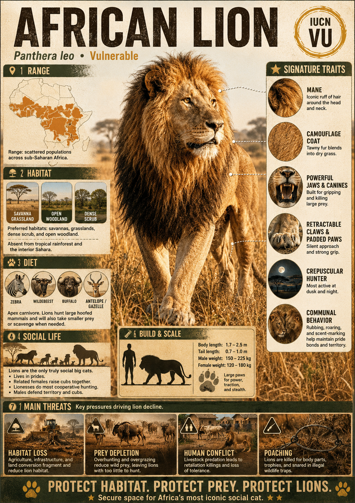

# African Lion

> **The thunder of the plains, ruling the dry grasslands in coordinated family empires**

## 1. Core Identity

- **Common name:** African lion
- **Alternative names:** Lion
- **Scientific name:** _Panthera leo_
- **Taxonomic group:** Subfamily _Pantherinae_; genus _Panthera_
- **Lineage:** Lion lineage within the Panthera clade
- **Exhibit role:** Big cat exhibit
- **Main biome:** Grasslands, savannas and open woodlands
- **Main hunting style:** Cooperative ambush and chase

## 2. Museum Summary

Across the vast, golden grasslands of the African savanna, a deep, resonant rumble vibrates through the earth, carrying for miles in every direction. This thunderous roar belongs to the **African lion**, a legendary big cat that broke the solitary mold of the feline family to build dynamic, cooperative empires. Living in close-knit family groups called **prides**, these highly social cats work together to dominate their territory, raise their young in communal crèches, and bring down some of the largest, most formidable prey on the planet.

Within the pride, there is a striking display of sexual dimorphism (a biological term meaning that males and females of the same species look drastically different). The lionesses, sleeker and more agile, serve as the primary hunters, using sophisticated tactical coordination to surround and ambush heavy prey like zebras, wildebeest, and buffalo. Meanwhile, the much larger males—adorned with magnificent, dark manes that signal their age and health while protecting their necks in battle—patrol the pride's boundaries, keeping rival predators at bay. Today, as human development encroaches on their ancient savannas, these iconic rulers are facing silent declines, making their protection a vital crusade for the future of wild Africa.

## 3. Range

- **Continents:** Africa (with a separate, critically endangered subspecies, the Asiatic lion, residing in India's Gir Forest).
- **Countries/regions:** Patchily distributed across sub-Saharan Africa; strongholds exist in eastern and southern Africa (such as Tanzania, Kenya, South Africa, and Botswana).
- **Range type:** Highly fragmented; largely restricted to national parks and wildlife reserves.
- **Range notes:** Lions have vanished from over 94% of their historic African range due to expanding agriculture and human settlements.

## 4. Habitat

- **Primary habitat:** Open grasslands and savannas with reliable prey populations and shade trees.
- **Secondary habitat:** Semi-arid scrublands, open woodlands, and dry mountain forests.
- **Climate adaptation:** Well-adapted to dry, hot environments; they avoid the midday heat by resting under acacia trees and shift their main hunting activities to the cool night hours.
- **Terrain preference:** Flat plains and gently rolling hills that permit coordinated stalking and visual communication during hunts.

## 5. Diet

- **Main prey:** Large ungulates (hoofed mammals) such as wildebeest, plains zebras, gemsbok, and African buffalo.
- **Secondary prey:** Smaller antelopes, warthogs, young giraffes, and occasionally carrion (decaying animal carcasses); they frequently scavenge or steal kills from cheetahs and spotted hyenas.
- **Hunting method:** Coordinated group ambush. Lionesses fan out to encircle a herd, with some driving the prey toward hidden pride members waiting in ambush. They overpower prey using sheer muscle mass and apply a clamping bite to the throat.
- **Feeding ecology:** Prides gorge themselves on fresh kills, consuming up to a quarter of their body weight in a single sitting, followed by days of resting and digesting.

## 6. Behaviour / Ecology

- **Social structure:** Prides typically consist of a dozen closely related females, their offspring, and a coalition of 1–4 resident adult males who defend the pride from outsiders.
- **Activity rhythm:** Nocturnal (night-active) and crepuscular (active at dawn and dusk); they spend up to 20 hours a day resting to conserve energy.
- **Territory:** Prides actively defend territories ranging from 20 to over 400 square kilometres, using scent marks, claw scratches, and roaring to warn off intruders.
- **Ecological role:** Keystone species (an organism that has a disproportionately large effect on its natural environment) regulating herbivore populations, which prevents overgrazing and supports local biodiversity.

## 7. Build & Scale

- **Body size:** Males **1.8–2.1 m** (6–7 ft) in body length excluding the tail; shoulder height up to **1.2 m** (4 ft).
- **Weight range:** Males **150–250 kg** (330–550 lb); females **120–180 kg** (265–395 lb).
- **Key proportions:** Massive chest and thick neck; robust skeletal structure; a long tail tipped with a black tuft of hair that hides a small bony spur.
- **Movement style:** Powerful sprinters built for short, explosive charges up to **80 km/h** (50 mph) rather than long-distance pursuits.

## 8. Signature Traits

1. **The pride social system:** The only wild cat species that lives in cooperative, multi-generational family units.
2. **The dark mane:** A shield of dense hair that grows darker and fuller with testosterone, indicating prime health to females and intimidating rivals.
3. **The long-distance roar:** Powered by a specialized larynx (voice box), a lion's roar can travel up to **8 kilometres** through the night air.
4. **Coordinated hunting tactics:** Tactical team maneuvers where specific females occupy set roles (wings or center) to intercept prey.

## 9. Conservation

- **IUCN status:** Vulnerable.
- **Population trend:** Decreasing; roughly **20,000** individuals remain in the wild.
- **Main threats:** Habitat fragmentation, retaliatory killings by livestock herders, declining prey populations due to the bushmeat trade, and localized poaching.
- **Conservation notes:** Conservation programs focus on community-led livestock protection, building predator-proof fences ("bomas"), and establishing safe wildlife corridors to link isolated prides.

## 10. Visual Production Notes

- **Hero poster concept:** A majestic male lion standing sentinel on a weathered granite outcrop (kopje) at sunrise, looking out over a misty grassland where a small pride rests.
- **Preview card concept:** Close-up of a lioness head showing gold eyes and alert ears; icons for pride size, cooperative hunting, and weight.
- **Anatomy/trait image:** Diagram illustrating mane development stages and the anatomical structure of the vocal chords that enable roaring.
- **Range map:** Map of Africa contrasting the historic range with today's tiny, isolated pockets of protected reserves.
- **Hunting video poster:** A dramatic scene of three lionesses surrounding a zebra herd in tall, dry grass.
- **3D model placeholder:** 3D model highlighting the heavy forequarters of the male and the sleek, athletic build of the female.
- **Conservation panel:** Infographic demonstrating the success of community guardians in reducing livestock conflict.
- **AI prompt (Midjourney/DALL-E style):** _A magnificent male African lion with a massive, dark, flowing mane standing proudly atop a massive granite boulder in the Serengeti at sunrise, warm golden light catching its fur, dust motes in the air, a vast golden savanna stretching to the horizon under a soft morning sky. Majestic, detailed wildlife photography, 200mm lens, tack-sharp eye detail._

## 11. Internal Links

- [[../01_Taxonomy_and_Evolution/Felidae_Overview.md|Felidae]]
- [[../05_Ecology_Comparisons/Solitary_vs_Social_Cats.md|Solitary vs Social Cats]]
- [[../05_Ecology_Comparisons/Wetland_and_Grassland_Cats.md|Wetland and Grassland Cats]]
- [[../05_Ecology_Comparisons/Apex_Predators.md|Apex Predators]]
- [[01_Siberian_Tiger_Amur_Tiger.md|Siberian Tiger / Amur Tiger]]
