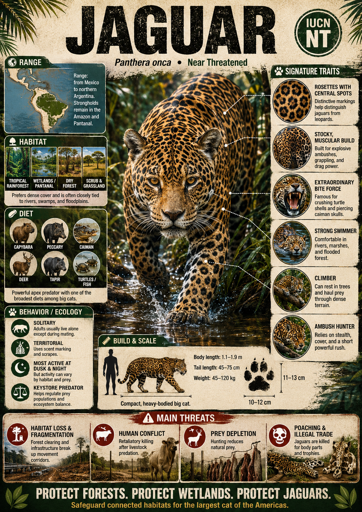

# Jaguar

> **Lord of the flooded rainforest, wielding an armor-shattering bite that conquers land and water**

## 1. Core Identity

- **Common name:** Jaguar
- **Alternative names:** El tigre (in Spanish), painted onça (in Portuguese)
- **Scientific name:** _Panthera onca_
- **Taxonomic group:** Subfamily _Pantherinae_; genus _Panthera_
- **Lineage:** Jaguar lineage (within Panthera clade)
- **Exhibit role:** Big cat exhibit
- **Main biome:** Tropical rainforests, wetlands and dry forests
- **Main hunting style:** Ambush predator with exceptionally strong bite

## 2. Museum Summary

Deep within the flooded, emerald corridors of the Amazon Basin, a low, guttural cough echoes through the humid air, signaling the presence of the supreme ruler of the Americas. This is the **jaguar**, a muscular and heavily built titan that represents the third largest cat on Earth. While other big cats generally avoid deep water, the jaguar is a passionate swimmer, navigating wide rivers and flooded forests with ease to patrol an aquatic kingdom where it reigns absolute.

What truly sets the jaguar apart is its jaw-dropping physical power. It possesses the strongest bite force relative to size of any big cat, supported by a massive skull and highly developed jaw muscles. Rather than employing the standard throat-suffocation bite, the jaguar frequently kills by biting directly through the temporal bones of the skull, effortlessly piercing the armor-like shells of river turtles or the thick hides of caimans (alligator-like reptiles). Admired by ancient Mesoamerican civilizations as a symbol of strength and night spirits, the jaguar remains a critical keystone species, but deforestation and rancher conflicts have pushed this glorious predator out of much of its historic northern range.

## 3. Range

- **Continents:** South America and Central America; historically extended into the southwestern United States.
- **Countries/regions:** Brazil (especially the Amazon and Pantanal wetlands), Peru, Colombia, Bolivia, and parts of Mexico; critically rare or extirpated (locally extinct) in the United States.
- **Range type:** Increasingly fragmented pockets, with the Amazon Basin remaining the absolute stronghold.
- **Range notes:** International conservation initiatives are working to establish the "Jaguar Corridor"—a continuous network of protected habitats stretching from Mexico to Argentina.

## 4. Habitat

- **Primary habitat:** Lowland tropical rainforests and seasonally flooded wetlands (such as the Pantanal) near rivers and lakes.
- **Secondary habitat:** Dry deciduous forests, tropical scrublands, and coastal mangroves.
- **Climate adaptation:** Excellent thermal tolerance for hot, highly humid environments; spends significant time in water to cool down and hunt.
- **Terrain preference:** Heavily vegetated, low-lying terrains with abundant water bodies and dense canopy cover for ambush camouflage.

## 5. Diet

- **Main prey:** Capybaras (the world's largest rodent), white-lipped peccaries (wild forest pigs), and deer.
- **Secondary prey:** Caimans, freshwater turtles, large fish, iguanas, birds, and tapirs.
- **Hunting method:** Stalk-and-ambush. Creeps through dense riverbank vegetation or crouches on low-hanging branches before launching a powerful, short spring. It uses its massive canine teeth to puncture the skull or carapace (outer shell) of its prey.
- **Feeding ecology:** Solitary hunter that drags heavy carcasses into thick brush or up trees to feed undisturbed; will consume almost every part of a carcass, including bones.

## 6. Behaviour / Ecology

- **Social structure:** Strictly solitary, meeting only to mate. Mothers raise their litters of 1–4 cubs in secluded dens, teaching them to hunt and swim over a two-year period.
- **Activity rhythm:** Crepuscular (active at dawn and dusk) to nocturnal (night-active), though they will hunt during the day if prey is active.
- **Territory:** Males establish exclusive territories of 30 to over 150 square kilometres that overlap the smaller ranges of several females.
- **Ecological role:** Apex predator regulating the populations of herbivores and mesopredators (mid-sized predators like raccoons or coatimundis), preserving the delicate balance of the forest ecosystem.

## 7. Build & Scale

- **Body size:** **1.5–1.8 m** (5–6 ft) in body length excluding the tail; shoulder height up to **75 cm** (2.5 ft).
- **Weight range:** **45–113 kg** (100–250 lb); larger individuals are consistently found in the open Pantanal wetlands compared to the dense Amazon forest.
- **Key proportions:** Stocky, barrel-chested build with relatively short, exceptionally muscular legs; broad head and exceptionally wide, powerful muzzle.
- **Movement style:** Slow, deliberate stalking walk; explosive short sprint; highly skilled at vertical tree climbing and long-distance swimming.

## 8. Signature Traits

1. **Rosettes with central spots:** Golden coat patterned with dark rings (rosettes) enclosing small, dark central spots, a design unique among big cats.
2. **Skull-crushing bite:** A massive bite force capable of puncturing turtle shells, armadillo armor, and mammalian skulls with surgical force.
3. **Wetland dominion:** Master of aquatic hunting, easily catching caimans, fish, and swimming mammals in deep rivers.
4. **Melanistic color morphs:** Occasional "black panthers" occur, where a genetic mutation causes a dark coat that still reveals ghost rosettes under direct light.

## 9. Conservation

- **IUCN status:** Near Threatened.
- **Population trend:** Decreasing; primarily threatened by the destruction of the Amazon rainforest.
- **Main threats:** Deforestation for agriculture, habitat fragmentation, retaliatory killings by cattle ranchers, and illegal poaching for teeth and skins.
- **Conservation notes:** Key strategies involve working with ranchers to implement predator-proof electric fences, compensating livestock losses, and protecting wild corridors to prevent inbreeding.

## 10. Visual Production Notes

- **Hero poster concept:** A massive jaguar standing half-submerged in a slow-moving Amazon river channel at dusk, water dripping from its chin, framed by giant water lilies.
- **Preview card concept:** Close-up of the jaguar's muzzle, emphasizing the powerful jaw muscles and gold-flecked eyes; icons for bite force and swimming ability.
- **Anatomy/trait image:** Comparative diagram illustrating the difference between jaguar rosettes (with central spots) and leopard rosettes (empty).
- **Range map:** Map of the Americas showing the dramatic contraction of its historic range from the US border down to its South American remnants.
- **Hunting video poster:** Storyboard showing a jaguar diving from a riverbank to capture a caiman in a splash of water.
- **3D model placeholder:** 3D model emphasizing the stocky, heavy-chested skeletal frame and wide paws.
- **Conservation panel:** Graphic illustrating the Jaguar Corridor Initiative and its cross-border wildlife pathways.
- **AI prompt (Midjourney/DALL-E style):** _A powerful, muscular jaguar wading stealthily through shallow emerald river water in the Amazon rainforest, dappled golden sunlight filtering through the dense canopy above and hitting its beautiful spotted rosettes. Water ripples around its chest, intense golden eyes locked on the camera, photorealistic, cinematic lighting, ultra-sharp detail._

## 11. Internal Links

- [[../01_Taxonomy_and_Evolution/Felidae_Overview.md|Felidae]]
- [[../05_Ecology_Comparisons/Apex_Predators.md|Apex Predators]]
- [[../05_Ecology_Comparisons/Arboreal_Cats.md|Arboreal Cats]]
- [[../05_Ecology_Comparisons/Speed_vs_Stealth.md|Speed vs Stealth]]
- [[05_African_Leopard.md|African Leopard]]
