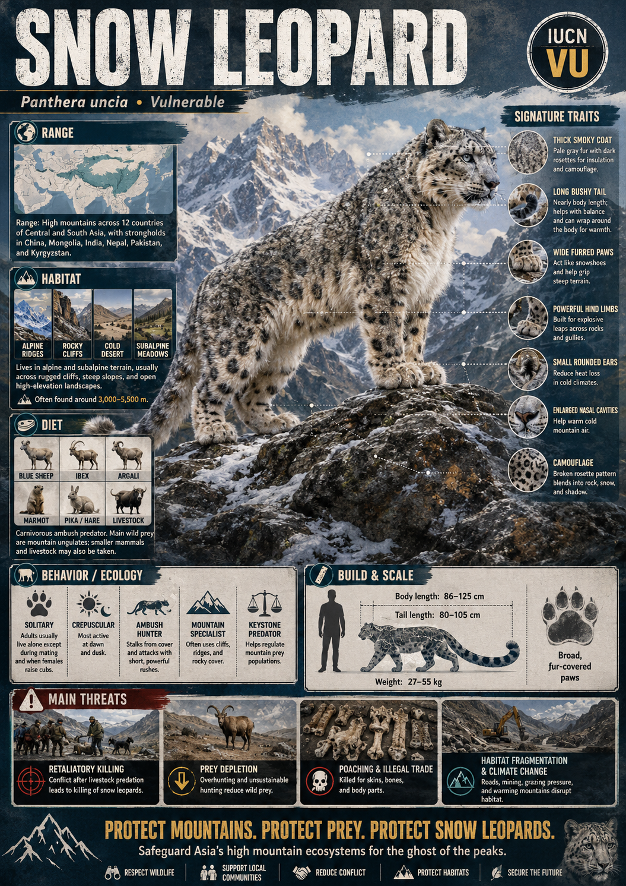
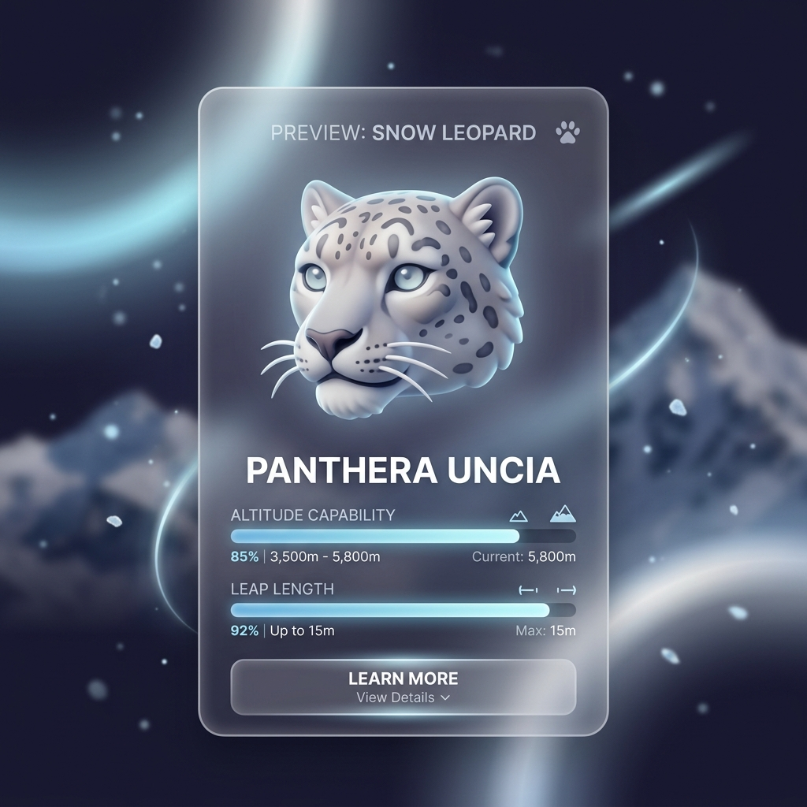
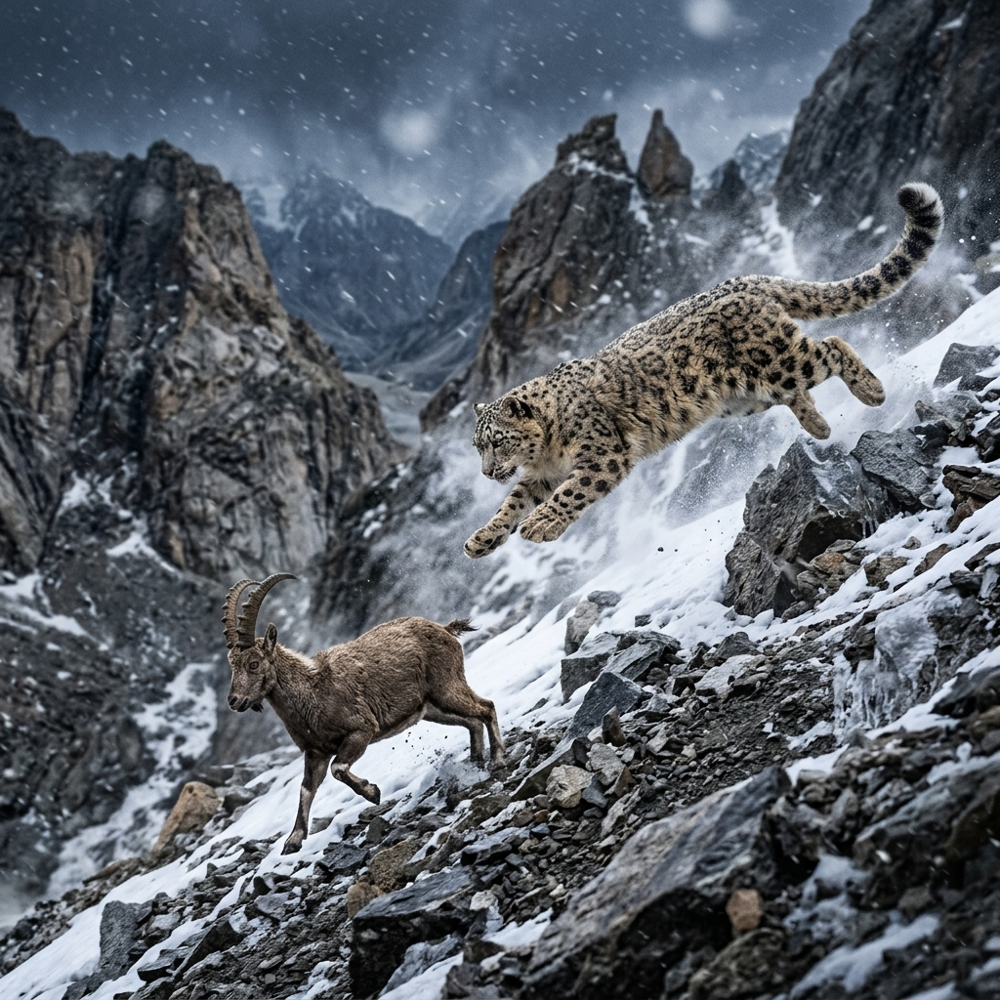

# Snow Leopard

> **The grey ghost of the Himalayas, dancing across vertical cliffs in the thin air of the roof of the world**

## 1. Core Identity

- **Common name:** Snow leopard
- **Alternative names:** Ounce
- **Scientific name:** _Panthera uncia_
- **Taxonomic group:** Subfamily _Pantherinae_; genus _Panthera_
- **Lineage:** Snow leopard lineage within Panthera Clade
- **Exhibit role:** Mountain cat exhibit
- **Main biome:** Alpine and subalpine mountains of Central Asia
- **Main hunting style:** Ambush predator on steep terrain

## 2. Museum Summary

Poised on a razor-thin mountain ledge against a backdrop of swirling snow and towering crags, a master of survival peers down into a dizzying abyss. This is the **snow leopard**, affectionately known as the "grey ghost" of the high mountains. Engineered to live at the absolute vertical limits of our planet, this enigmatic predator occupies a rugged alpine kingdom where the air is thin, the temperatures are sub-zero, and the slopes are nearly vertical.

Every aspect of the snow leopard's anatomy is a marvel of high-altitude adaptation. It possesses a shortened, domed skull with broad nasal passages that warm the freezing mountain air before it reaches the lungs. Its smoke-grey coat, covered in dark rosettes, blends seamlessly with the fractured granite and snow of its habitat, rendering it invisible to prey and researchers alike. Using its long hind legs to spring up to **15 metres** across rocky chasms, the snow leopard stalks wild mountain sheep and ibex, steering its trajectory in mid-air with an extraordinary, thick tail that acts as both a high-speed rudder and a warm scarf to wrap around its face when resting.

## 3. Range

- **Continents:** Asia
- **Countries/regions:** Scattered across twelve countries in Central and South Asia, including India, Nepal, Bhutan, China, Mongolia, and the mountainous borders of Russia.
- **Range type:** Discontinuous; populations are restricted to isolated alpine massifs (compact groups of connected mountain peaks).
- **Range notes:** Primarily found at elevations between 1,500 and 5,500 metres above sea level, following the seasonal migration of mountain herbivores.

## 4. Habitat

- **Primary habitat:** Steep, rocky alpine cliffs, ridges, scree slopes (steep slopes covered in loose rock fragments), and deep gorges.
- **Secondary habitat:** Subalpine shrublands and dry montane grasslands.
- **Climate adaptation:** Extremely dense fur (up to 12 cm long on the belly) and a thick undercoat; chest muscles are highly developed for breathing thin, low-oxygen air.
- **Terrain preference:** Rugged, broken ground that provides high vantage points and ambush cover.

## 5. Diet

- **Main prey:** Wild mountain ungulates (hoofed mammals) like bharal (Himalayan blue sheep), Siberian ibex, and argali sheep.
- **Secondary prey:** Himalayan marmots, pikas, hares, and domestic livestock (including goats, sheep, and young yaks).
- **Hunting method:** Downhill ambush. The snow leopard stalks quietly from a high ridge, using gravity to launch a sudden, high-speed chase down steep slopes, seizing its prey with its forelimbs and securing a throat bite.
- **Feeding ecology:** Due to the physical difficulty of high-altitude hunting, a snow leopard will carefully guard and feed on a single large carcass in rocky crevices for up to a week.

## 6. Behaviour / Ecology

- **Social structure:** Strictly solitary. Individuals communicate over vast distances using scent marks, claw scrapings on rocks, and low, non-roaring vocalizations like prusten (a friendly puffing sound).
- **Activity rhythm:** Crepuscular (active at dawn and dusk), aligning its movements with the active hours of mountain goats and sheep.
- **Territory:** Extremely large home ranges spanning 30 to over 1,000 square kilometres, reflecting the sparse distribution of prey in alpine deserts.
- **Ecological role:** Apex predator maintaining the health of high-altitude grasslands by regulating mountain herbivore populations.

## 7. Build & Scale

- **Body size:** **1.0–1.3 m** (3.3–4.3 ft) in body length excluding the tail; tail adds an impressive **0.8–1.0 m** (2.6–3.3 ft).
- **Weight range:** **23–41 kg`** (50–90 lb), a compact size that prevents slipping on loose gravel.
- **Key proportions:** Extremely long, thick tail; short, stout forelimbs coupled with elongated hind limbs; broad chest and skull.
- **Movement style:** Unmatched leaping ability, bounding effortlessly down steep rock walls and jumping vast ravines.

## 8. Signature Traits

1. **The rudder tail:** An exceptionally long, heavily furred tail that acts as a counterweight during high-speed mountain chases and doubles as a face heater.
2. **Built-in snowshoes:** Large, broad paws with thick fur on the undersides that spread the cat's weight over snow and protect against freezing rocks.
3. **Granite camouflage:** A pale grey or cream coat decorated with faded black rosettes that blends perfectly into the shattered rocks of alpine ridges.
4. **Altitude-adapted nose:** Enlarged nasal cavities that warm the icy air before it enters the lungs, paired with deep chest cavities.

## 9. Conservation

- **IUCN status:** Vulnerable.
- **Population trend:** Decreasing; estimated **2,500–10,000** individuals remain in the wild.
- **Main threats:** Habitat loss from climate change shifting the tree line upward, poaching for the illegal bone and skin trade, and retaliatory killings by nomadic herders.
- **Conservation notes:** Innovative programs focus on community-owned predator-proof corrals, livestock insurance schemes, and educating local communities about the ecological value of the "ghost of the mountains."

## 10. Visual Production Notes

- **Hero poster concept:** A snow leopard crouched on a frozen, windswept rock ledge overlooking a majestic Himalayan valley at twilight, its heavy tail wrapped around its paws.
- **Preview card concept:** Close-up of the snow leopard's face, highlighting the wide nose, pale blue-grey eyes, and thick whiskers; icons for altitude capability and leap length.
- **Anatomy/trait image:** Diagram illustrating the internal structure of the nasal cavity and the wide, snowshoe-like paw structure.
- **Range map:** Map of Central Asia highlighting the high-altitude mountain chains (Himalayas, Pamir, Altai) that form the snow leopard's range.
- **Hunting video poster:** A dramatic storyboard showing a snow leopard leaping down a steep rocky chute to intercept an ibex.
- **3D model placeholder:** 3D model highlighting the heavy-furred tail and broad paws.
- **Conservation panel:** Infographic showing the positive impact of livestock insurance programs on local herder communities.
- **AI prompt (Midjourney/DALL-E style):** _A beautiful snow leopard crouched on a snowy, windswept rock ledge high in the Himalayas at dusk, its thick bushy tail wrapped around its paws, pale grey rosetted fur catching the soft twilight light. Swirling snow in the air, jagged mountain peaks in the background under a dark blue sky, photorealistic, cinematic composition, high-detail telephoto shot._

## 11. Visual Production Exhibits

This section showcases the native Antigravity AI generations for the Visual Production.

### 🪪 Preview Card

### 🧬 Anatomy Traits

### 🎬 Hunting Scene

### 🗺️ Range Map

## 12. Internal Links

- [[../01_Taxonomy_and_Evolution/Felidae_Overview.md|Felidae]]
- [[../05_Ecology_Comparisons/Mountain_Cats.md|Mountain Cats]]
- [[../05_Ecology_Comparisons/Arboreal_Cats.md|Arboreal Cats]]
- [[../05_Ecology_Comparisons/Solitary_vs_Social_Cats.md|Solitary vs Social Cats]]
- [[07_Clouded_Leopard.md|Clouded Leopard]]
