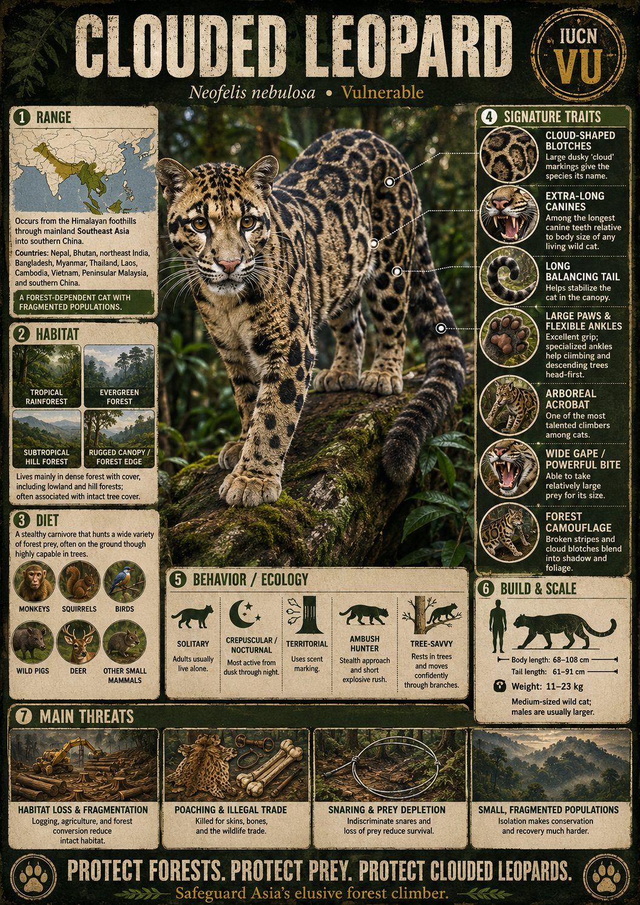
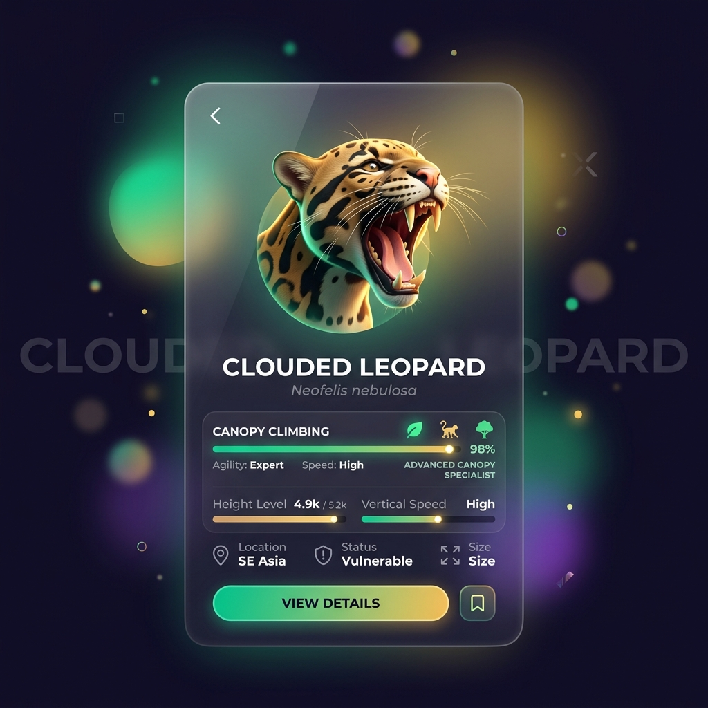
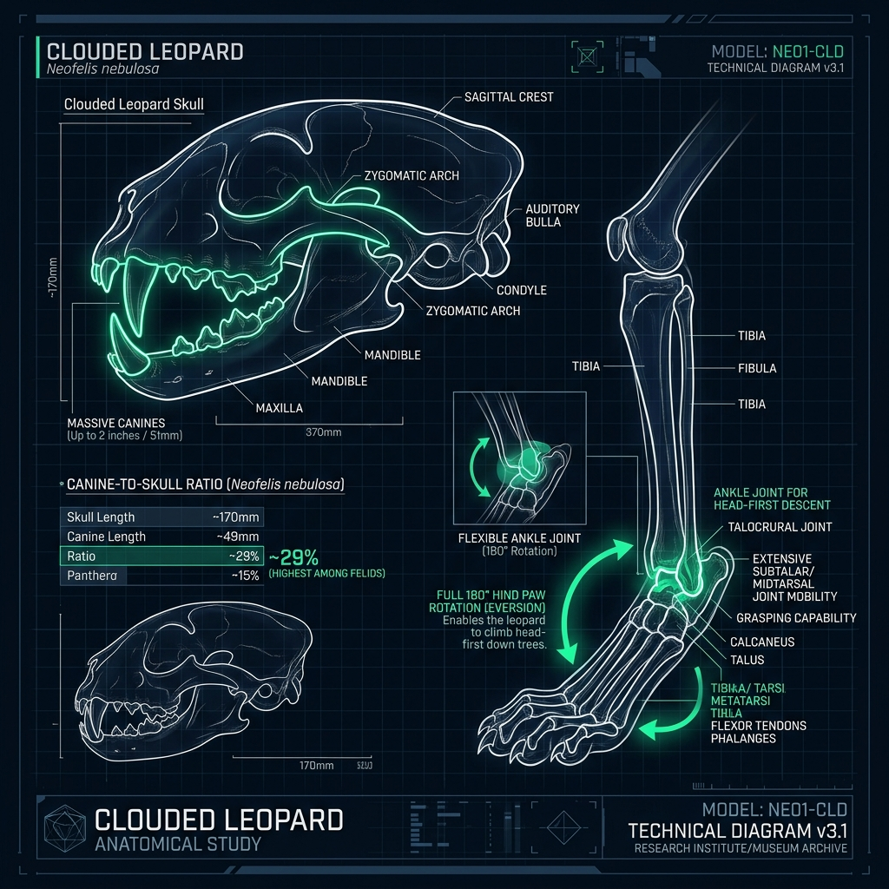
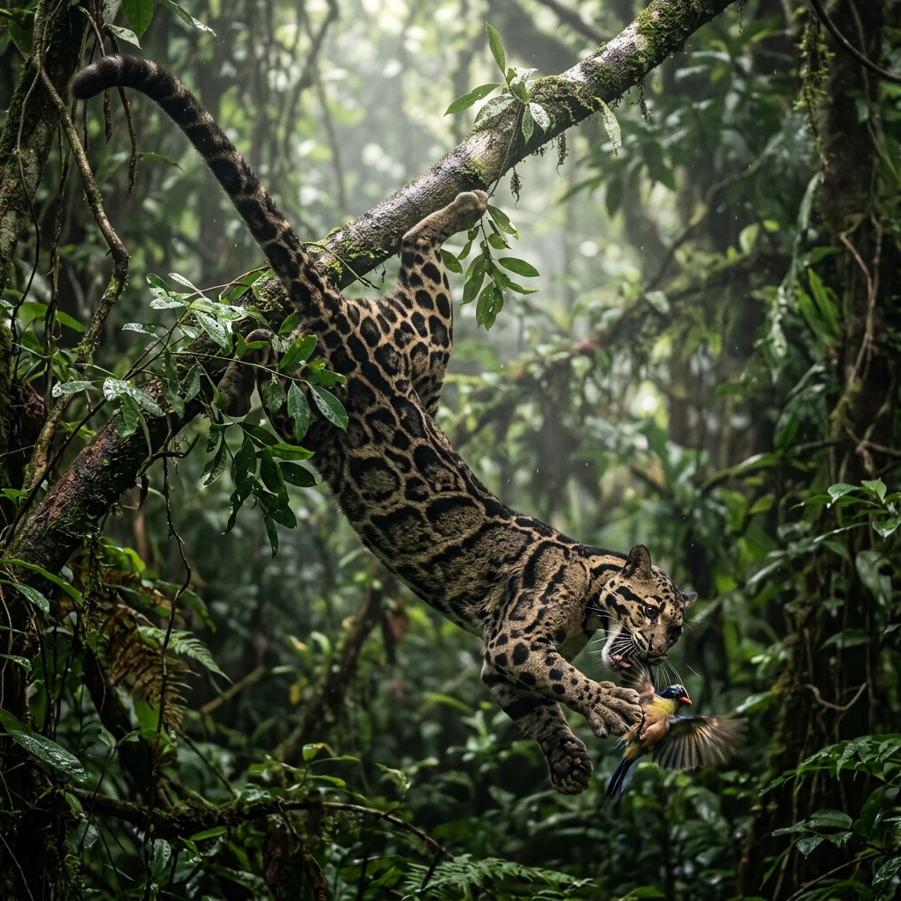
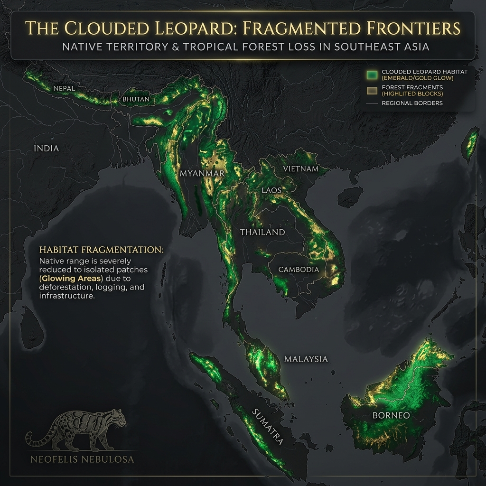

# Clouded Leopard

> **The modern saber-tooth of the treetops, climbing headfirst through the ancient canopy of Southeast Asia**

## 1. Core Identity

- **Common name:** Clouded leopard
- **Alternative names:** Mainland clouded leopard
- **Scientific name:** _Neofelis nebulosa_
- **Taxonomic group:** Subfamily _Pantherinae_; genus _Neofelis_
- **Lineage:** Clouded leopard lineage within Pantherinae
- **Exhibit role:** Forest cat exhibit
- **Main biome:** Tropical and subtropical forests of Southeast Asia
- **Main hunting style:** Arboreal ambush and pouncing

## 2. Museum Summary

Deep within the dark, humid canopies of Southeast Asia's tropical rainforests, an extraordinarily agile acrobat glides through the mossy branches. This is the **clouded leopard**, a highly secretive and mesmerizing predator named for the large, cloud-like dark blotches that drape its golden coat. Though classified among the "big cats," this unique animal is actually a distinct evolutionary bridge between small and large felines, boasting physical adaptations that make it the undisputed master of life in the trees.

To look into the mouth of a clouded leopard is to step back in time. It possesses the longest upper canine teeth relative to skull size of any extant (living today) feline, a striking proportion reminiscent of the ancient, extinct saber-toothed cats. These fearsome teeth are supported by a wide-opening jaw designed to take down large prey. In the branches, this cat performs physics-defying stunts: with short, powerful limbs, broad paws, and specialized ankle joints that can rotate a full 180 degrees, it is one of only two feline species capable of descending tree trunks completely headfirst or hanging upside down by its hind claws. As the primary forests of Asia disappear under logging and agriculture, this exquisite tree-dweller faces a silent threat to its survival.

## 3. Range

- **Continents:** Asia
- **Countries/regions:** Extends from the foothills of the Himalayas in Nepal, Bhutan, and northeastern India, through Myanmar, Thailand, Laos, Cambodia, and Vietnam, into southern China.
- **Range type:** Increasingly fragmented pockets, tightly bound to remaining tropical forest cover.
- **Range notes:** The genus _Neofelis_ was split in 2006 into two distinct species: the mainland clouded leopard (_N. nebulosa_) covered here, and the Sunda clouded leopard (_N. diardi_), which is confined to Sumatra and Borneo.

## 4. Habitat

- **Primary habitat:** Lowland tropical evergreen rainforests and seasonally flooded montane (mountainous) forests.
- **Secondary habitat:** Dry deciduous woodlands, coastal mangroves, and secondary scrublands near forest borders.
- **Climate adaptation:** Their cloud-blotched coat serves as spectacular camouflage in the high-contrast dappled light of dense forest canopies.
- **Terrain preference:** High-canopy forests with thick, interconnected branches; they rarely descend to the forest floor unless traveling or hunting terrestrial prey.

## 5. Diet

- **Main prey:** Primates (such as macaques and gibbons) and small forest ungulates (hoofed mammals) like barking deer and wild pigs.
- **Secondary prey:** Large rodents, civets, birds, squirrels, and occasionally domestic poultry near forest villages.
- **Hunting method:** Canopy ambush. The clouded leopard stalks prey through the branches, using its extraordinary balance to pounce downward, or drops onto terrestrial animals from above, using its long canines to deliver a lethal bite.
- **Feeding ecology:** Strictly solitary hunter; will carry smaller kills up into the safety of tree forks to feed away from ground scavengers.

## 6. Behaviour / Ecology

- **Social structure:** Solitary and highly elusive. Their wild behavior remains largely unstudied due to their secretive habits; they communicate via scent-marking tree trunks.
- **Activity rhythm:** Primarily nocturnal (night-active) and crepuscular (active at dawn and dusk), spending the hot daylight hours resting on horizontal branches.
- **Territory:** Establish large individual home ranges that they defend against members of the same sex, though density remains low.
- **Ecological role:** Primary arboreal apex predator, playing a key role in controlling primate and herbivorous populations in the forest canopy.

## 7. Build & Scale

- **Body size:** **60–90 cm** (2–3 ft) in body length; tail adds an impressive **60–90 cm** (2–3 ft).
- **Weight range:** **15–23 kg** (33–50 lb), with males being significantly larger than females.
- **Key proportions:** Short, sturdy legs; huge paw pads; exceptionally long tail that matches its body length; canines up to **4 cm** (1.5 in) long.
- **Movement style:** Unmatched climbing agility; moves along the undersides of branches, leaps wide canopy gaps, and climbs down trunks headfirst.

## 8. Signature Traits

1. **Saber-tooth canines:** Proportionally the longest upper canine teeth of any living feline, ideal for gripping struggling prey in trees.
2. **Rotating ankles:** Highly specialized hind ankle joints that rotate inward, allowing the cat to descend tree trunks headfirst.
3. **Clouded camouflage:** Spectacular coat marked with large, dark-edged, cloud-like patches that mimic the play of forest light and shadow.
4. **The canopy balancing pole:** An exceptionally long, heavy tail that provides flawless balance when walking along narrow branches.

## 9. Conservation

- **IUCN status:** Vulnerable.
- **Population trend:** Decreasing; populations are declining rapidly across Southeast Asia.
- **Main threats:** Severe deforestation due to palm oil expansion, agricultural encroachment, illegal poaching for its beautiful skin, and traditional medicine demand.
- **Conservation notes:** Conservation efforts focus on protecting large blocks of primary forest, creating protected ecological bridges between reserves, and combatting wildlife trafficking.

## 10. Visual Production Notes

- **Hero poster concept:** A clouded leopard moving headfirst down a thick, mossy tree trunk in a misty tropical rainforest, its long tail curved in the air.
- **Preview card concept:** Close-up of the clouded leopard yawn, revealing its spectacular canine teeth; icons for canopy climbing and vulnerability.
- **Anatomy/trait image:** Diagram of the skull comparing its canine-to-skull ratio with other big cats, alongside an illustration of the flexible ankle joint.
- **Range map:** Map of Southeast Asia highlighting the severe fragmentation of the remaining tropical forest blocks.
- **Hunting video poster:** Storyboard showing a clouded leopard hanging by its hind paws to snatch a bird from a nearby branch.
- **3D model placeholder:** 3D model highlighting the low-slung, long-tailed body shape and broad paws.
- **Conservation panel:** Infographic showing the rate of palm oil expansion and its direct impact on forest corridors.
- **AI prompt (Midjourney/DALL-E style):** _A stunning clouded leopard creeping headfirst down a mossy, fern-covered tree trunk in a tropical rainforest, mist in the background, soft morning light catching the cloud-like patterns on its fur. Extremely long tail arched for balance, green forest canopy, photorealistic, cinematic composition, high-detail texture._

## 11. Visual Production Exhibits

This section showcases the native Antigravity AI generations for the Visual Production.

### 🪪 Preview Card

### 🧬 Anatomy Traits

### 🎬 Hunting Scene

### 🗺️ Range Map

## 12. Internal Links

- [[../01_Taxonomy_and_Evolution/Felidae_Overview.md|Felidae]]
- [[../05_Ecology_Comparisons/Arboreal_Cats.md|Arboreal Cats]]
- [[../05_Ecology_Comparisons/Speed_vs_Stealth.md|Speed vs Stealth]]
- [[../05_Ecology_Comparisons/Mountain_Cats.md|Mountain Cats]]
- [[06_Snow_Leopard.md|Snow Leopard]]
