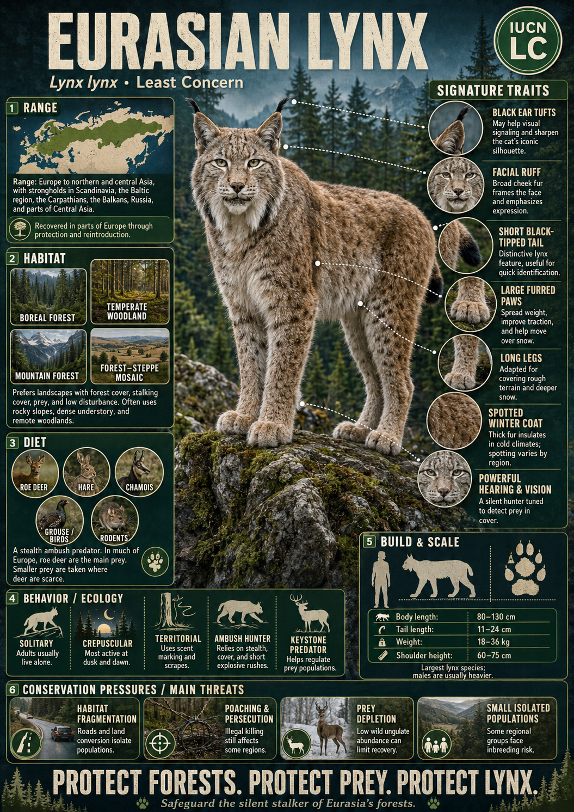

# Eurasian Lynx

> **The forest phantom, gliding silently across the snow on outsized paws to surprise unsuspecting deer**

## 1. Core Identity

- **Common name:** Eurasian lynx
- **Alternative names:** European lynx
- **Scientific name:** _Lynx lynx_
- **Taxonomic group:** Subfamily _Felinae_; genus _Lynx_
- **Lineage:** Lynx lineage
- **Exhibit role:** Lynx exhibit
- **Main biome:** Boreal forests, mixed forests and mountains of Europe and Asia
- **Main hunting style:** Ambush predator

## 2. Museum Summary

Deep within the silent, snow-cloaked forests of the northern hemisphere, a ghost of gray and reddish-gold pads effortlessly across the frozen ground. This is the **Eurasian lynx**, the absolute heavyweight of the lynx lineage. Unlike its smaller North American cousins, this formidable forest hunter is large enough to dominate its environment, possessing the power and stealth to comfortably bring down hoofed mammals several times its own size.

The Eurasian lynx is a masterpiece of winter engineering. It features exceptionally long limbs and massive, heavily furred paws that act as natural snowshoes, spreading its weight so it can float over deep snowdrifts where heavy-hoofed prey would flounder and sink. With a short, bobbed tail, a spectacular flared facial ruff of whiskers, and high-set ears topped with long, black hair tufts, this cat looks both regal and mysterious. Operating as a silent, solitary stalker, it waits patiently behind logs or boulders before launching an explosive pounce, keeping wild deer populations healthy and balanced across the ancient woodlands of Europe and Asia.

## 3. Range

- **Continents:** Europe and Asia.
- **Countries/regions:** Widespread across Scandinavia, Russia, Siberia, and northern China, with small, isolated populations in the mountains of Central Europe and the Tibetan Plateau.
- **Range type:** Expansive but increasingly fragmented in western and central territories due to human encroachment.
- **Range notes:** Intensive reintroduction programs (programs that breed and release animals back into areas where they once lived) have successfully brought the lynx back to Switzerland, France, Slovenia, and other parts of Central Europe.

## 4. Habitat

- **Primary habitat:** Boreal (taiga) coniferous forests and temperate deciduous (leaf-shedding) mixed woodlands with dense undergrowth.
- **Secondary habitat:** Rugged, rocky mountain scrublands and high alpine meadows up to the tree line.
- **Climate adaptation:** Extremely dense, woolly fur that thickens significantly in winter; a pale, spotted coat that provides spectacular camouflage against granite cliffs and dry forest floors.
- **Terrain preference:** Heavily wooded, uneven terrain containing plenty of fallen logs, boulder fields, and ravines that serve as hunting cover.

## 5. Diet

- **Main prey:** Small ungulates (hoofed mammals) such as roe deer, chamois, and young red deer.
- **Secondary prey:** European hares, rabbits, large forest rodents, and game birds like grouse.
- **Hunting method:** Stalk-and-pounce ambush. The lynx uses forest cover to creep within a few leaps of its target, then bursts forward in an explosive sprint, using its heavy forelimbs to secure the catch.
- **Feeding ecology:** Strictly solitary diner; it will drag kills into thick brush or cover them with dry leaves and soil, returning to feed over several days.

## 6. Behaviour / Ecology

- **Social structure:** Strictly solitary, except when mating in late winter. Females raise their litters of 1–4 kittens alone in hollow logs or rocky caves.
- **Activity rhythm:** Primarily nocturnal (night-active) and crepuscular (active at dawn and dusk), coinciding with the high-activity hours of deer.
- **Territory:** Establish large individual home ranges (ranging from 100 to over 400 square kilometres) that are heavily scent-marked with urine and cheek-rubbing.
- **Ecological role:** Primary predator of forest ungulates, shaping deer behavior and preventing overgrazing to allow healthy forest regeneration.

## 7. Build & Scale

- **Body size:** **70–130 cm** (27.5–51 in) in body length; shoulder height up to **60–65 cm** (24–25.5 in).
- **Weight range:** **18–36 kg** (40–80 lb), with males regularly being larger than females.
- **Key proportions:** Long, powerful legs; stocky torso with a short, black-tipped bobtail less than 20 cm long; large ears topped with tufts.
- **Movement style:** Slow, silent stalking walk; impressive vertical and horizontal jumping capacity; strong runner but lacks long-distance stamina.

## 8. Signature Traits

1. **Hear-tufted ears:** Tall ears capped with black hair tufts up to 4 cm long that act like hearing aids, channeling subtle forest sounds.
2. **Built-in snowshoes:** Outsized paws that spread out when stepping, acting as snowshoes to keep the cat from sinking into deep snow.
3. **Flared facial ruff:** A beautiful collar of long fur around the cheeks that acts like a parabolic dish to funnel high-frequency sounds into the ears.
4. **Ungulate hunter:** The only lynx species large and powerful enough to specialize in hunting wild deer rather than small lagomorphs (hares and rabbits).

## 9. Conservation

- **IUCN status:** Least Concern globally, though critically endangered or near threatened in many isolated Central and Western European sub-populations.
- **Population trend:** Stable overall, but decreasing in fragmented European regions.
- **Main threats:** Habitat fragmentation by highways, illegal poaching due to livestock conflict, and collisions with vehicles.
- **Conservation notes:** Protecting large, continuous forest blocks and building vegetated wildlife overpasses over highways are vital to reconnecting isolated populations.

## 10. Visual Production Notes

- **Hero exhibit poster:** [View Exhibit Poster](../04_Visual_Production/Hero_Posters/08_eurasian_lynx_general.png)

- **Hero poster concept:** A Eurasian lynx standing alert on a massive mossy fallen tree trunk in a snowy pine forest, its black ear tufts silhouetted against the winter sun.
- **Preview card concept:** Close-up of the lynx's face, spotlighting the flared ruff, ear tufts, and intense amber eyes; icons for snowshoe paws and weight.
- **Anatomy/trait image:** Diagram showing how the bones of the paw splay out to distribute weight on snow compared with other felines.
- **Range map:** Map of Eurasia highlighting the wide Russian range contrasted with the tiny, isolated reintroduction pockets in Western Europe.
- **Hunting video poster:** Storyboard showing a lynx leaping from a rocky ledge onto a running roe deer.
- **3D model placeholder:** 3D model highlighting the long limbs, short body, and distinctive ruff geometry.
- **Conservation panel:** Infographic showing how wildlife corridors over highways help lynx disperse to new territories safely.
- **AI prompt (Midjourney/DALL-E style):** _A large Eurasian lynx standing alert on a massive fallen log in a snowy pine forest, thick winter fur dusted with frost, long black ear tufts fully erect, massive paws planted firmly on the bark. Golden morning sun filtering through the snowy branches, photorealistic, cinematic lighting, ultra-sharp detail._

## 11. Deep Dive Exhibits

- [[../03_Exhibit_Modules/Behavior_and_Ecology/08_Eurasian_Lynx_Behavior_and_Ecology.md|Behavior and Ecology]]
- [[../03_Exhibit_Modules/Build_and_Scale/08_Eurasian_Lynx_Build_and_Scale.md|Build and Scale]]
- [[../03_Exhibit_Modules/Conservation/08_Eurasian_Lynx_Conservation.md|Conservation]]
- [[../03_Exhibit_Modules/Diet_and_Hunting/08_Eurasian_Lynx_Diet_and_Hunting.md|Diet and Hunting]]
- [[../03_Exhibit_Modules/Range_and_Habitat/08_Eurasian_Lynx_Range_and_Habitat.md|Range and Habitat]]
- [[../03_Exhibit_Modules/Signature_Traits/08_Eurasian_Lynx_Signature_Traits.md|Signature Traits]]

## 12. Internal Links

- [[../01_Taxonomy_and_Evolution/Felidae_Overview.md|Felidae]]
- [[../05_Ecology_Comparisons/Mountain_Cats.md|Mountain Cats]]
- [[../05_Ecology_Comparisons/Arboreal_Cats.md|Arboreal Cats]]
- [[../05_Ecology_Comparisons/Speed_vs_Stealth.md|Speed vs Stealth]]
- [[10_Cheetah.md|Cheetah]]
