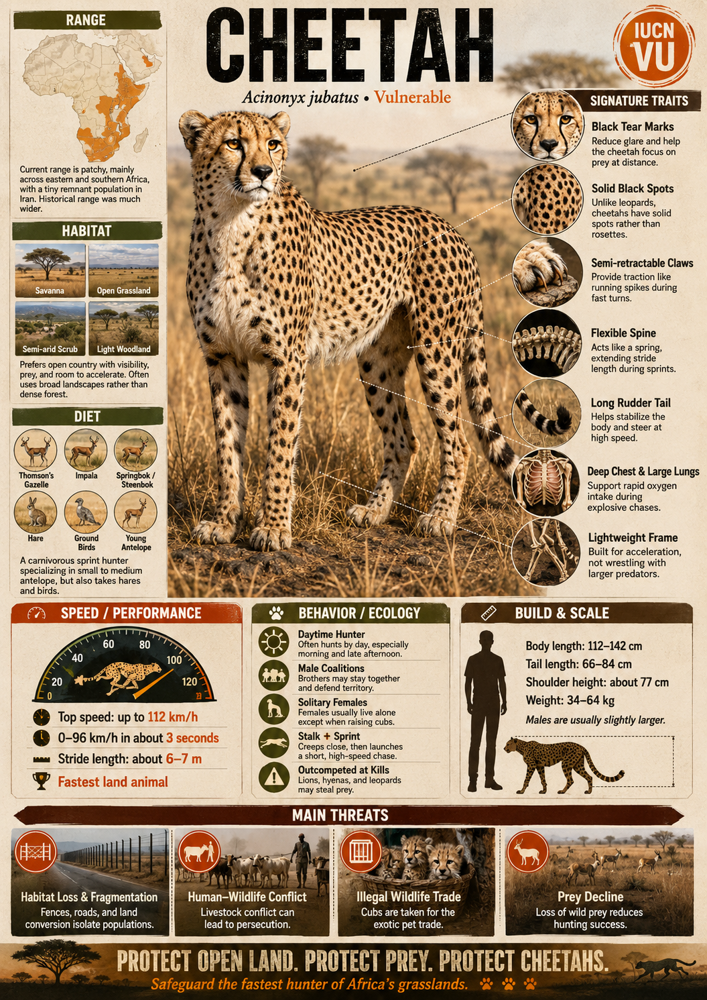
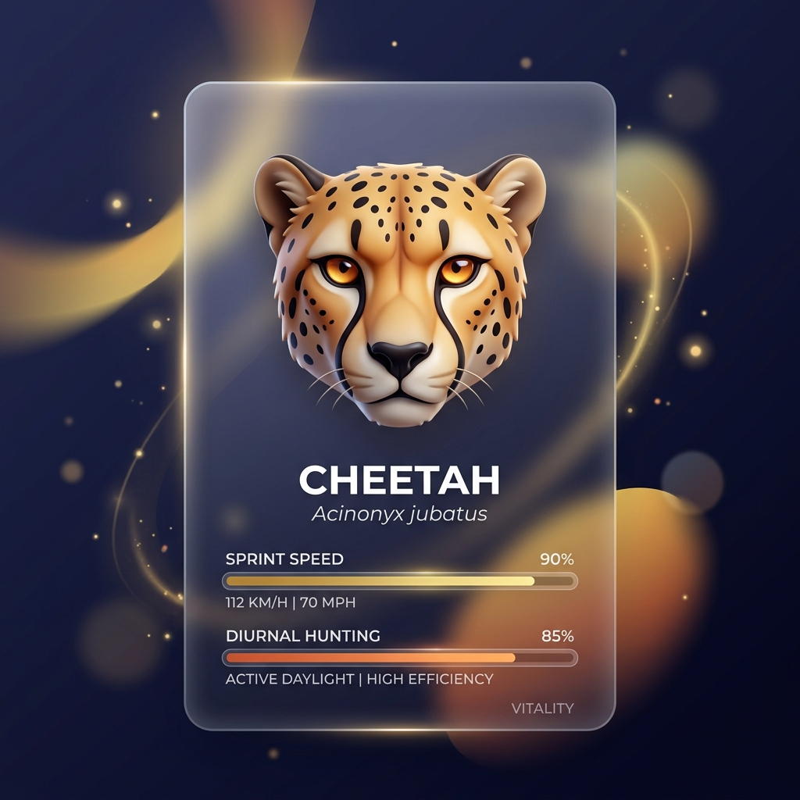
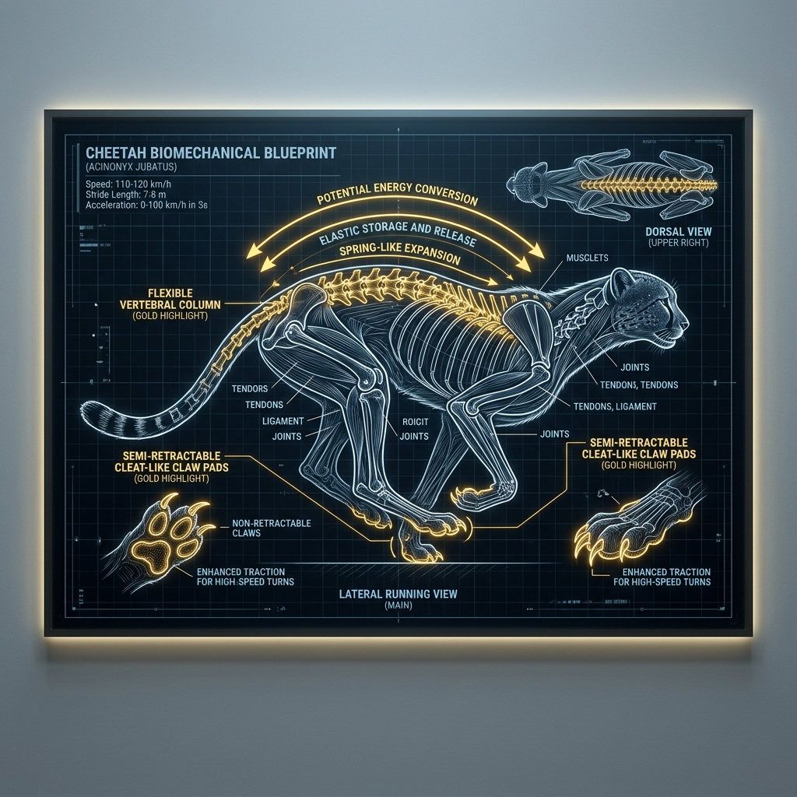
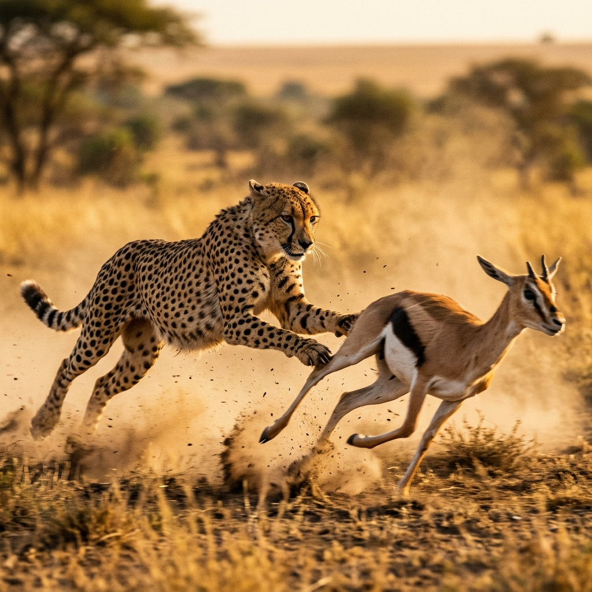
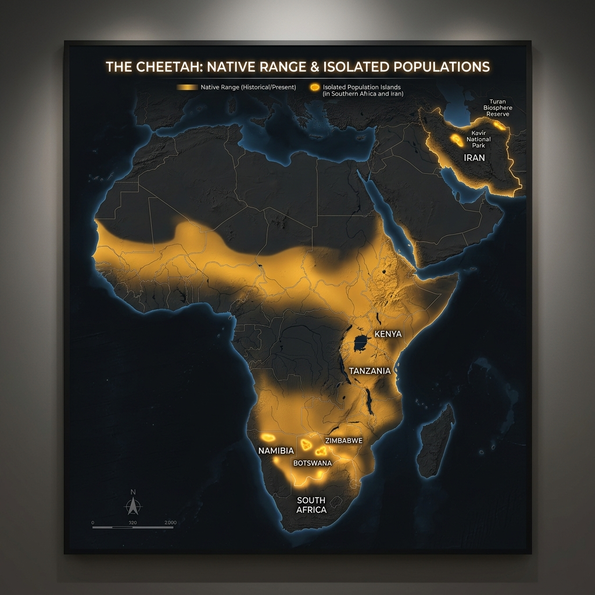

# Cheetah

> **The ultimate velocity machine, accelerating across the open savanna like a firing piston**

## 1. Core Identity

- **Common name:** Cheetah
- **Alternative names:** None
- **Scientific name:** _Acinonyx jubatus_
- **Taxonomic group:** Subfamily _Felinae_; genus _Acinonyx_
- **Lineage:** Puma lineage
- **Exhibit role:** Speed specialist exhibit
- **Main biome:** Open savannas and grasslands
- **Main hunting style:** Pursuit predator using extreme speed

## 2. Museum Summary

Crouched low in the golden grass of the open savanna, a slender, spotted silhouette locks its amber eyes on a distant herd of gazelles. With a sudden explosion of movement, the **cheetah** transforms from a static statue into the absolute pinnacle of terrestrial speed. Engineered from snout to tail-tip for aerodynamic perfection, this spectacular sprint specialist can accelerate from 0 to 72 km/h (45 mph) in a staggering **2.5 seconds**—effortlessly out-accelerating modern high-performance sports cars.

To achieve speeds up to **113 km/h** (70 mph), the cheetah sacrificed the heavy skeletal armor of other big cats in favor of a lightweight, highly flexible frame. Its spine operates like a powerful metal spring, expanding and contracting to lengthen its stride to a massive 7 metres, while its semi-retractable claws act like athletic cleats to grip the dry savanna dirt during high-speed turns. Unlike nocturnal big cats, the cheetah hunts by day to avoid direct competition with larger, stronger predators. However, its specialized, slender build leaves it vulnerable: it is frequently bullied by kleptoparasites (animals that steal food caught by other animals) like lions and hyenas, and its wild populations are currently facing the threat of extinction due to a prehistoric genetic bottleneck (a sharp reduction in population size that leaves the species with dangerously low genetic diversity).

## 3. Range

- **Continents:** Africa (with a critically endangered relict population in Iran).
- **Countries/regions:** Strongholds exist in Namibia, Botswana, Kenya, and Tanzania; critically low numbers persist in North Africa and the desert regions of central Iran.
- **Range type:** Deeply fragmented and declining, with isolated populations struggling to connect.
- **Range notes:** Historically ranged across almost all of Africa, the Middle East, and India; now extirpated (locally wiped out) from over 90% of its former range.

## 4. Habitat

- **Primary habitat:** Open, flat savannas and dry grasslands with clear, unobstructed running room.
- **Secondary habitat:** Semi-desert scrublands, arid plains, and light, open acacia woodlands.
- **Climate adaptation:** Short, coarse fur that dissipates heat rapidly, and oversized nasal passages that maximize oxygen flow during intense sprints.
- **Terrain preference:** Flat, dry, and open ground with minimal rock cover or thick brush that would obstruct high-speed pursuits.

## 5. Diet

- **Main prey:** Small-to-medium-sized antelopes, particularly Thomson's gazelles, springbok, and impalas.
- **Secondary prey:** Hares, young wildebeest calves, and the offspring of larger savanna ungulates (hoofed mammals).
- **Hunting method:** Visual pursuit. The cheetah stalks within 100 metres of its target, then bursts into a blinding chase. It uses its heavy dewclaw (the inner claw on its front leg) to trip the running prey at high speed, then secures a suffocating clamp on the throat.
- **Feeding ecology:** Because a sprint exhausts its energy reserves, the cheetah must catch its breath before eating. It feeds rapidly and nervously, frequently losing its fresh kills to dominant scavengers.

## 6. Behaviour / Ecology

- **Social structure:** Females are solitary, raising litters of 2–6 cubs in hidden dens. In contrast, males often live in lifelong **coalitions** (usually brothers) that coordinate to defend territories and hunt larger prey.
- **Activity rhythm:** Diurnal (day-active), focusing their hunts in the early morning and late afternoon when lions and hyenas are asleep.
- **Territory:** Females roam enormous, non-defended home ranges following prey migrations; male coalitions actively defend smaller, resource-rich territories.
- **Ecological role:** Primary pursuit predator, keeping gazelle herds active and preventing local overgrazing on the grassy plains.

## 7. Build & Scale

- **Body size:** **1.1–1.4 m** (3.6–4.6 ft) in body length; tail adds **66–84 cm** (2.2–2.75 ft).
- **Weight range:** **34–64 kg** (75–140 lb), representing a lightweight, slender skeletal build.
- **Key proportions:** Deep, narrow chest cavity; exceptionally long, slender legs; a small, rounded head that minimizes wind resistance; a long, flat tail that acts as a counterweight.
- **Movement style:** High-speed pursuit sprinter, reaching peak speeds in a few strides but exhausting its stamina after 300–400 metres.

## 8. Signature Traits

1. **Cleat claws:** Semi-retractable claws that remain exposed to act like running spikes, providing exceptional traction during tight turns.
2. **The spring spine:** A highly flexible backbone that flexes and arches with each stride, allowing the feet to cross under the body.
3. **Glare tear marks:** Black tear-like facial stripes running from the inner eyes to the mouth that absorb blinding sunlight, helping the cat focus on fast prey.
4. **The tail rudder:** A muscular, flat-sided tail that acts like an aerodynamic rudder, allowing the cheetah to execute sharp turns at full speed.

## 9. Conservation

- **IUCN status:** Vulnerable.
- **Population trend:** Decreasing; fewer than **7,000** individuals remain in the wild.
- **Main threats:** Habitat loss from agricultural expansion, conflict with livestock farmers, high cub mortality from lions, and the illegal pet trade.
- **Conservation notes:** Conservation groups work to distribute livestock guardian dogs (such as Anatolian Shepherds) to farmers, which deters cheetahs without harm and reduces retaliatory killings.

## 10. Visual Production Notes

- **Hero poster concept:** A cheetah captured mid-sprint across a dusty savanna, its body fully extended parallel to the ground, with a dramatically blurred background.
- **Preview card concept:** Close-up of the cheetah's face, spotlighting the sharp black tear marks and amber eyes; icons for sprint speed and day-active hunting.
- **Anatomy/trait image:** Diagram illustrating the spring-like expansion of the spine and the claw pads compared with domestic cats.
- **Range map:** Map of Africa and the Middle East, highlighting today's isolated population islands in southern Africa and Iran.
- **Hunting video poster:** A dramatic sequence showing the exact moment a cheetah uses its paw to trip a fleeing gazelle.
- **3D model placeholder:** 3D model highlighting the deep chest cavity, narrow hips, and long tail geometry.
- **Conservation panel:** Graphic explaining the prehistoric genetic bottleneck and how modern research centers are working to preserve genetic health.
- **AI prompt (Midjourney/DALL-E style):** _A sleek cheetah frozen mid-stride at full speed across the dusty Serengeti plain, body fully extended, muscles rippling under its spotted coat, dust kicked up in a cloud behind it. Extremely low angle, high-speed shutter freeze, motion-blurred yellow grass background, hot sun, photorealistic wildlife action photography._

## 11. Visual Production Exhibits

This section showcases the native Antigravity AI generations for the Visual Production.

### 🪪 Preview Card

### 🧬 Anatomy Traits

### 🎬 Hunting Scene

### 🗺️ Range Map

## 12. Internal Links

- [[../01_Taxonomy_and_Evolution/Felidae_Overview.md|Felidae]]
- [[../05_Ecology_Comparisons/Speed_vs_Stealth.md|Speed vs Stealth]]
- [[../05_Ecology_Comparisons/Wetland_and_Grassland_Cats.md|Wetland and Grassland Cats]]
- [[../05_Ecology_Comparisons/Solitary_vs_Social_Cats.md|Solitary vs Social Cats]]
- [[11_Puma_Cougar_Mountain_Lion.md|Puma / Cougar / Mountain Lion]]
