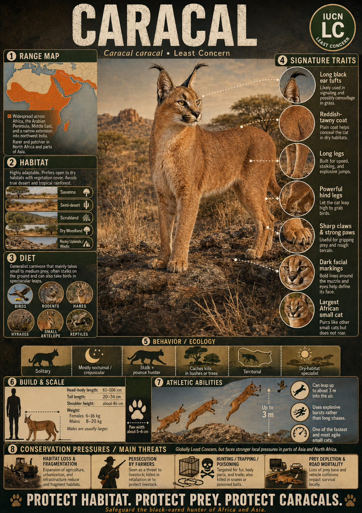

# Caracal

> **Black‑eared dryland jumper/hunter**

## 1. Core Identity

- **Common name:** Caracal
- **Alternative names:** Desert lynx (misleading; caracal is not a lynx)
- **Scientific name:** _Caracal caracal_
- **Taxonomic group:** Subfamily _Felinae_; genus _Caracal_
- **Lineage:** Caracal lineage
- **Exhibit role:** Dryland cat exhibit
- **Main biome:** Savannas, semi‑deserts and arid mountains
- **Main hunting style:** Ambush and pounce; impressive jumping ability

## 2. Museum Summary

Picture a tawny rocket erupting from a sun-baked African scrubland. A flock of guineafowl bursts skyward — and the **caracal** launches after them, twisting in mid-air with a casual athleticism that makes a four-metre vertical leap look effortless. Long before it lands, it has already made its catch.

The caracal is Africa and Asia's great aerial ambusher: a medium-sized wildcat wearing a pair of jet-black ear tufts like the feathers of a tiny crown. Adults grow up to **1 m** (3.3 ft) in body length and tip the scales at **8–18 kg** (18–40 lb). They can sprint at **80 km/h** (50 mph) and launch vertically up to **3–4 m** to snatch birds directly from the air — a feat no other cat pulls off with such routine precision.

Caracals patrol a sweeping empire that stretches from the savannas and semi-deserts of sub-Saharan Africa through the Middle East all the way to north-western India. Solitary by instinct, they hunt rodents, hares, _hyraxes_ (small, rabbit-sized mammals distantly related to elephants), and small antelope, regularly taking prey far heavier than logic would suggest. Their IUCN conservation status is **Least Concern**, though localised threats from habitat loss and conflict with farmers put pressure on populations in North Africa and Asia.

## 3. Range

- **Continents:** Africa and Asia.
- **Countries/regions:** Sub‑Saharan Africa, North Africa, Arabian Peninsula, Iran, Afghanistan, Pakistan and north‑west India.
- **Range type:** Broad and continuous across much of Africa; fragmented in Asia.
- **Range notes:** Absent from true rainforests and extreme deserts. Occasionally inhabits highland plateaus.

## 4. Habitat

- **Primary habitat:** Savannas, dry woodlands and semi‑deserts.
- **Secondary habitat:** Rocky hills and arid mountains; thrives near farmland if prey is available.
- **Climate adaptation:** Dense fur on the ear tufts may shield against blowing sand; the caracal can go long periods without drinking, pulling moisture from its kills instead.
- **Terrain preference:** Prefers patches of bush or tall grass that it uses as cover for stalking; avoids dense rainforest.

## 5. Diet

- **Main prey:** Rodents, hares and hyraxes.
- **Secondary prey:** Birds (snatched mid-flight), small antelopes and, occasionally, poultry and livestock.
- **Hunting method:** Stalks silently through cover before exploding into an ambush pounce; stands upright on its powerful hind legs to scan the sky and track birds before launching its signature aerial strike.
- **Feeding ecology:** Devours small prey whole and caches (stores and hides) leftover portions for later. Drinks infrequently, obtaining most of its moisture from prey.

## 6. Behaviour / Ecology

- **Social structure:** Solitary except when mating or when a mother is raising cubs.
- **Activity rhythm:** Primarily _nocturnal_ (night-active) or _crepuscular_ (twilight-active, hunting at dawn and dusk); may hunt by day in areas with little human disturbance.
- **Territory:** Males patrol large territories that overlap the smaller home ranges of several females; females remain more sedentary.
- **Ecological role:** Keeps _rodent_ and small _ungulate_ (hoofed animal) populations in check; serves as prey for larger carnivores such as lions and hyenas.

## 7. Build & Scale

- **Body size:** Length up to **1 m** (3.3 ft) excluding tail; tail adds 20–34 cm.
- **Weight range:** **8–18 kg** (18–40 lb).
- **Key proportions:** Long legs, slender body, short tail; large pointed ears capped with black tufts up to 5 cm long.
- **Movement style:** Agile sprinter with an explosive jump; reaches speeds up to **80 km/h** (50 mph).

## 8. Signature Traits

1. **Black ear tufts:** Flash signals to other caracals and may help camouflage the silhouette in dappled light.
2. **Spectacular vertical leap:** Springs up to 3–4 m to pluck birds clean out of the air.
3. **Black tail tip:** The tail's dark tip contrasts sharply with the warm tawny body.
4. **Remarkable adaptability:** Thrives across an enormous diversity of dryland habitats from Cape Point to the Thar Desert.

## 9. Conservation

- **IUCN status:** Least Concern.
- **Population trend:** Stable overall but declining in parts of North Africa and Asia.
- **Main threats:** Habitat loss, persecution for poultry and livestock predation, hunting for pelts, road mortality and occasional hybridisation with domestic cats.
- **Conservation notes:** Listed in CITES Appendix II; protected across many of its range countries. Livestock-protection programmes and community education help reduce human–caracal conflict.

## 10. Visual Production Notes

- **Hero poster concept:** Caracal frozen at the apex of a mid-air leap in a golden grassland, ears folded forward, eyes locked on a flying bird just out of frame.
- **Preview card concept:** Close-up head portrait spotlighting the iconic black ear tufts; icons for speed and vertical jump height.
- **Anatomy/trait image:** Labelled illustration of ear tufts, elongated hind legs and muscular hindquarters that power the leap.
- **Range map:** Map of Africa and southwest Asia highlighting the species' broad, continuous distribution.
- **Hunting video poster:** Storyboard sequence of a caracal clearing three metres of air to intercept guineafowl.
- **3D model placeholder:** Model emphasising the slender, long-legged silhouette against a scrubland backdrop.
- **Conservation panel:** Infographic on human–caracal conflict zones and mitigation success stories.
- **AI prompt (Midjourney/DALL-E style):** _A sleek tawny caracal exploding upward from dry African savanna scrub, black ear tufts fully erect, body twisted mid-leap, claws extended toward a blur of guineafowl wings. Golden-hour backlight, dramatic shadow on red laterite soil, photorealistic wildlife photography style, 85mm telephoto compression, ultra-sharp fur detail._

## 11. Internal Links

- [[../01_Taxonomy_and_Evolution/Felidae_Overview.md|Felidae]]
- [[../05_Ecology_Comparisons/Desert_and_Dryland_Cats.md|Desert and Dryland Cats]]
- [[../05_Ecology_Comparisons/Speed_vs_Stealth.md|Speed vs Stealth]]
- [[13_Serval.md|Serval]]
- [[08_Eurasian_Lynx.md|Eurasian Lynx]]
