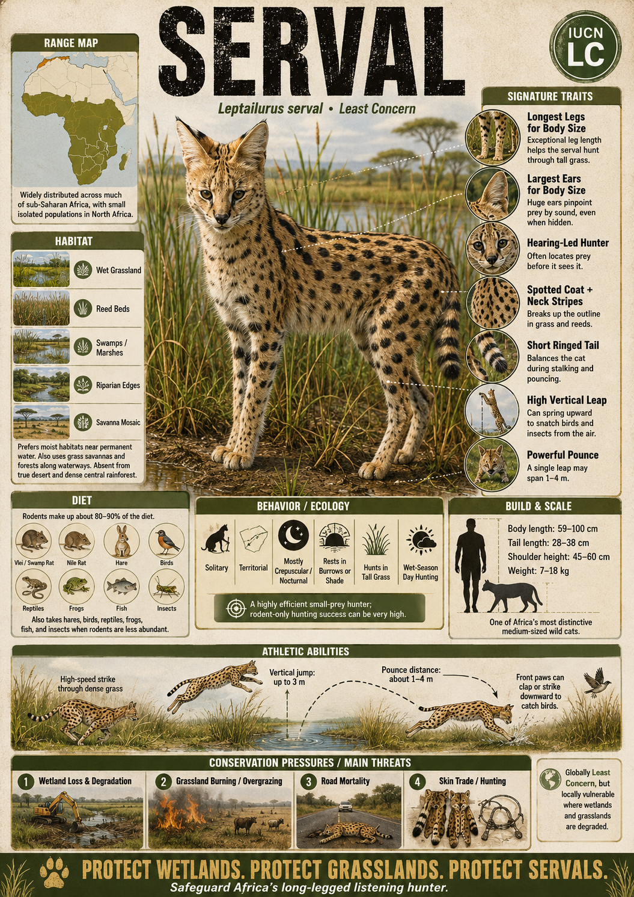

# Serval

> **Long‑legged wetland/grassland listening hunter**

## 1. Core Identity

- **Common name:** Serval
- **Alternative names:** Giraffe cat
- **Scientific name:** _Leptailurus serval_
- **Taxonomic group:** Subfamily _Felinae_; genus _Leptailurus_
- **Lineage:** Caracal lineage (includes caracal, serval and African golden cat)
- **Exhibit role:** Grassland/wetland cat exhibit
- **Main biome:** African savannas and wetlands
- **Main hunting style:** Sit‑and‑listen hunter with explosive leaps

## 2. Museum Summary

Stand at the edge of a moonlit African wetland. The reed bed is silent — until it isn't. Beneath the surface of that darkness, a mouse stirs in its grass tunnel, three metres away and completely invisible to the naked human eye. Yet in the darkness above, a pair of radar-dish ears swivel and lock on. The **serval** freezes, reads every rustling microsecond, then launches its rangy body straight into the air. It comes down on the exact patch of grass — both front paws together, perfectly aimed — and the hunt is over in a heartbeat.

Standing up to **1 m** (3.3 ft) tall on the continent's longest legs relative to body size, and wearing satellite-dish ears on a head so small it looks borrowed from a much tinier cat, the serval cuts a silhouette like no other feline. Adults measure **73–100 cm** in body length with a **tail 26–41 cm**, weighing **7–15.5 kg** in males and **6.6–11.3 kg** in females. That improbable body plan exists for one purpose: detecting, locating, and striking prey hidden deep inside tall grass and reed beds — a hunting approach so effective that servals succeed on roughly **50% of hunting attempts**, a strike rate most cats can only envy.

Servals roam wet savannas and _riparian_ (riverbank and lakeside) grasslands throughout sub-Saharan Africa. The species is classified as **Least Concern**, though the North African subspecies teeters on the edge of extinction.

## 3. Range

- **Continents:** Africa.
- **Countries/regions:** Widespread in sub‑Saharan Africa except dense rainforest and desert regions.
- **Range type:** Extensive but patchy; absent from North Africa except for a remnant, critically endangered subspecies.
- **Range notes:** Requires tall grasses and wetlands; absent from very open terrain and densely forested environments.

## 4. Habitat

- **Primary habitat:** Wet savannas, _reed beds_ (dense stands of reeds and papyrus along waterways), and marshes near rivers and streams.
- **Secondary habitat:** Grasslands, lightly wooded savannas and agricultural margins; avoids true desert and closed-canopy forest.
- **Climate adaptation:** Long legs allow the serval to see over tall grasses and wade through flooded ground; those outsized ears radiate excess body heat like fins, doubling as a cooling system.
- **Terrain preference:** Mixed landscape of tall-grass cover for stalking and open patches for pouncing.

## 5. Diet

- **Main prey:** Small rodents — primarily rats and mice.
- **Secondary prey:** Birds, reptiles, frogs, insects, crabs and occasional fish.
- **Hunting method:** Stands motionless, rotating its ears independently to _triangulate_ (calculate the exact position of) hidden prey by sound alone; then launches straight into the air and drops directly onto the target with both front paws outstretched.
- **Feeding ecology:** Servals make multiple kills across a single night, sometimes eating prey on the spot and sometimes tucking leftovers into dense vegetation to retrieve later.

## 6. Behaviour / Ecology

- **Social structure:** Solitary; males and females meet only to mate; females raise 1–3 kittens alone.
- **Activity rhythm:** Mostly _nocturnal_ (night-active) or _crepuscular_ (twilight-active, hunting at dawn and dusk); hunts by day in areas with little human disturbance.
- **Territory:** Home ranges vary between 10 and 20 km²; males hold larger territories that overlap those of several females.
- **Ecological role:** Controls populations of rodents and small vertebrates; serves as prey for larger predators such as leopards and hyenas.

## 7. Build & Scale

- **Body size:** **73–100 cm** body length; **tail 26–41 cm**.
- **Weight range:** **6.6–11.3 kg** (females); **7–15.5 kg** (males).
- **Key proportions:** Longest legs relative to body size of any cat species; large oval ears; slim body and disproportionately small head — the combination that earned it the nickname "giraffe cat."
- **Movement style:** Glides gracefully through tall grass; leaps vertically up to **2.7 m** (9 ft) from a standing start; agile but not built for sustained high-speed chases.

## 8. Signature Traits

1. **Long legs and neck:** Elevate the head above tall grass for both vision and sound-gathering, and allow the serval to spring upward with remarkable force.
2. **Oversized oval ears:** Provide exceptional hearing capable of detecting the rustle of a mouse underground or inside a sealed grass stem.
3. **Bold spotted coat:** Golden to tawny background overlaid with solid black spots and broken bands — both beautiful and effective camouflage in dappled savanna light.
4. **High pouncing accuracy:** Leaps vertically into the air and pins prey with surgical precision, landing with both paws on exactly the right spot.

## 9. Conservation

- **IUCN status:** Least Concern overall; North African subspecies is endangered.
- **Population trend:** Stable across most of its range; declining where wetlands are drained or converted to agriculture.
- **Main threats:** Habitat loss through wetland drainage, persecution for poultry predation, hunting for pelts, capture for the exotic pet trade and road mortality.
- **Conservation notes:** Protected in many countries; maintaining healthy wetlands and promoting farmer coexistence are the highest conservation priorities. Captive breeding programmes are limited because wild populations remain relatively healthy across most of sub-Saharan Africa.

## 10. Visual Production Notes

- **Hero poster concept:** Serval suspended at the apex of a vertical leap above a moonlit reed bed, ears laid back, paws outstretched downward toward invisible prey.
- **Preview card concept:** Head-on profile emphasising the enormous oval ears and bold spotted coat; icons for pouncing height and wetland habitat.
- **Anatomy/trait image:** Annotated diagram illustrating the extreme leg-to-body ratio and ear dimensions compared with other small cats.
- **Range map:** Map of Africa showing serval distribution with wetland hotspots highlighted in blue.
- **Hunting video poster:** Storyboard of the full pounce sequence — ears locking on, launch, airborne hang-time, and contact.
- **3D model placeholder:** Model emphasising the tall, slender silhouette and outsized ear geometry.
- **Conservation panel:** Graphic illustrating wetland habitat loss over time and the critically small North African subspecies range.
- **AI prompt (Midjourney/DALL-E style):** _A serval cat suspended mid-air above a moonlit African reed bed, both front paws extended downward, huge oval ears flat against its skull, spotted golden coat catching silver moonlight. Long grass blurs below, stars visible through a break in the clouds, motion-blur on the grass tips from the leap, photorealistic wildlife photography, high-speed shutter freeze, dramatic low-angle perspective._

## 11. Deep Dive Exhibits

- [[../03_Exhibit_Modules/Behavior_and_Ecology/13_Serval_Behavior_and_Ecology.md|Behavior and Ecology]]
- [[../03_Exhibit_Modules/Build_and_Scale/13_Serval_Build_and_Scale.md|Build and Scale]]
- [[../03_Exhibit_Modules/Conservation/13_Serval_Conservation.md|Conservation]]
- [[../03_Exhibit_Modules/Diet_and_Hunting/13_Serval_Diet_and_Hunting.md|Diet and Hunting]]
- [[../03_Exhibit_Modules/Range_and_Habitat/13_Serval_Range_and_Habitat.md|Range and Habitat]]
- [[../03_Exhibit_Modules/Signature_Traits/13_Serval_Signature_Traits.md|Signature Traits]]

## 12. Internal Links

- [[../01_Taxonomy_and_Evolution/Felidae_Overview.md|Felidae]]
- [[../05_Ecology_Comparisons/Wetland_and_Grassland_Cats.md|Wetland and Grassland Cats]]
- [[../05_Ecology_Comparisons/Desert_and_Dryland_Cats.md|Desert and Dryland Cats]]
- [[12_Caracal.md|Caracal]]
- [[05_African_Leopard.md|African Leopard]]
