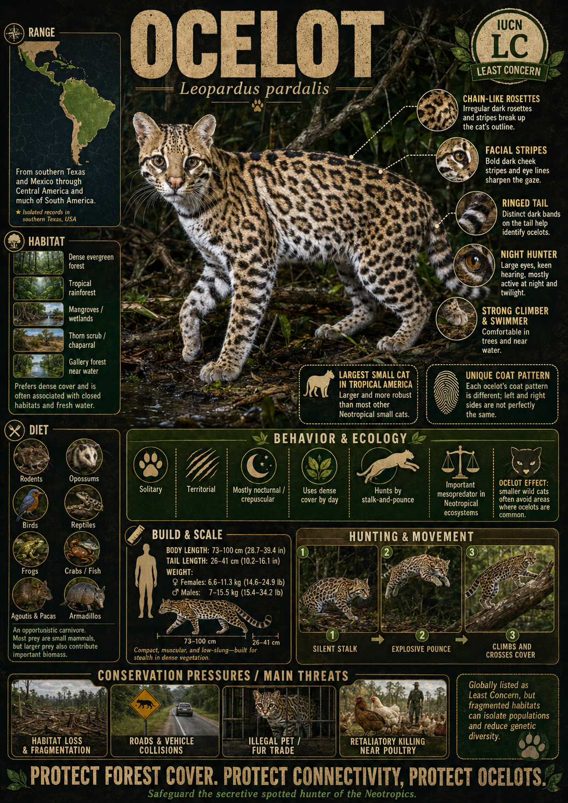

# Ocelot

> **The painted cat of the shadows, blending into the dappled brushwood of the neotropical forest**

## 1. Core Identity

- **Common name:** Ocelot
- **Alternative names:** Painted leopard, dwarf leopard
- **Scientific name:** _Leopardus pardalis_
- **Taxonomic group:** Subfamily _Felinae_; genus _Leopardus_
- **Lineage:** Ocelot lineage (includes margay and oncilla)
- **Exhibit role:** Neotropical cat exhibit
- **Main biome:** Tropical and subtropical forests, dense chaparral
- **Main hunting style:** Stealthy stalking and ambush

## 2. Museum Summary

Melted into the dense, tangled undergrowth of the Central American brush, a beautifully patterned hunter pauses, its large, rounded ears twisting to detect the faint rustle of a forest mouse. This is the **ocelot**, often celebrated as the most intricately painted feline in the Western Hemisphere. Operating primarily under the cover of ink-black nights, this medium-sized predator is a master of survival in the neotropical (referring to the tropical regions of the Americas) forests and dense thorn scrublands.

The ocelot's coat is a breathtaking work of natural art, patterned with bold, dark chains of elongated rosettes and elegant stripes that break up its outline in the leaf-filtered moonlight. Unlike many smaller felines that are strictly ground-dwellers or arboreal climbers, the ocelot is highly versatile: it is an agile climber that will readily scale tree trunks to rest or hunt, and a capable swimmer that will cross rivers in search of prey. Tragically, its beautiful fur made it the prime target of intense fashion-industry hunting in the 20th century. While the wider species has stabilized under strict international protections, the tiny, isolated population in southern Texas remains on the absolute edge of survival.

## 3. Range

- **Continents:** North America and South America.
- **Countries/regions:** Ranges from the extreme southern tip of Texas in the United States, down through Mexico and Central America, and across South America to northern Argentina.
- **Range type:** Relatively continuous across Central and South America; critically small and highly fragmented in the United States.
- **Range notes:** The United States population is confined to a tiny, isolated pocket in the Lower Rio Grande Valley of Texas, numbering fewer than 100 individuals.

## 4. Habitat

- **Primary habitat:** Lowland tropical rainforests, dense gallery forests (forests growing along river corridors), and coastal mangroves.
- **Secondary habitat:** Semi-arid chaparral (dense shrubland), thorn scrub, and dry tropical forests.
- **Climate adaptation:** Highly adaptable to hot, humid, and semi-arid environments; requires extremely dense canopy or brush cover to feel secure.
- **Terrain preference:** Low-lying areas with thick, impenetrable undergrowth; they strictly avoid open grasslands or cleared agricultural land.

## 5. Diet

- **Main prey:** Small terrestrial rodents, particularly spiny pocket mice, rice rats, and cane mice.
- **Secondary prey:** Opposums, rabbits, iguanas, frogs, land crabs, roosting birds, and occasionally young white-tailed deer.
- **Hunting method:** Slow, deliberate stalking. The ocelot moves quietly through the underbrush, utilizing its acute hearing and excellent low-light vision to locate prey, then pounces from close range.
- **Feeding ecology:** Strictly solitary hunter; will drag larger prey into deep brush and cover it with forest litter, returning to feed the next night.

## 6. Behaviour / Ecology

- **Social structure:** Solitary and highly territorial. Adults actively defend territories, though a male's territory will typically overlap those of several breeding females.
- **Activity rhythm:** Strongly nocturnal (night-active), though they may show crepuscular (active at dawn and dusk) activity in remote areas undisturbed by humans.
- **Territory:** Home ranges vary based on vegetation density, spanning 2 to 30 square kilometres, with territory boundaries defended through scent-marking.
- **Ecological role:** Key mesopredator (mid-sized predator) controlling rodent and small mammal populations, serving as an indicator of dense forest health.

## 7. Build & Scale

- **Body size:** **73–100 cm** (28.5–39.5 in) in body length; tail adds **26–41 cm** (10–16 in).
- **Weight range:** **7–15.5 kg** (15–34 lb) for males; **6.6–11.3 kg** (14.5–25 lb) for females.
- **Key proportions:** Sleek, low-slung body with relatively large paws; short, rounded ears marked with a white spot on the back; a moderately long tail.
- **Movement style:** Silent, low-profile stalking walk; highly skilled at climbing vertical tree trunks and swimming across deep channels.

## 8. Signature Traits

1. **The painted coat:** A stunning pattern of dark parallel bands on the neck, dark-edged rosettes on the sides, and solid black spots on the legs.
2. **Night-vision eyes:** Exceptionally large eyes equipped with a highly reflective tapetum lucidum (a mirror-like membrane that increases light capture), providing superb nocturnal vision.
3. **Impenetrable brush reliance:** An absolute ecological requirement for dense, thick cover; the cat will not cross open fields wider than a few dozen metres.
4. **White ear spots:** Large white spots on the back of its black ears, which are believed to serve as "follow-me" signals for kittens traveling behind their mother in the dark.

## 9. Conservation

- **IUCN status:** Least Concern globally; listed as Endangered in the United States.
- **Population trend:** Decreasing overall, primarily due to habitat loss.
- **Main threats:** Extreme habitat loss from agriculture, vehicle strikes on highways in fragmented Texas ranges, and historic fur trapping.
- **Conservation notes:** In Texas, conservationists are building specialized wildlife underpasses beneath busy roads and planting native thorn scrub to restore safe travel corridors.

## 10. Visual Production Notes

- **Hero poster concept:** An ocelot crouching on a thick, horizontal vine in a moonlit tropical rainforest, its beautifully patterned coat illuminated by dappled light filtering through the leaves.
- **Preview card concept:** Close-up of the ocelot's face, highlighting the parallel cheek stripes and large dark eyes; icons for nocturnal hunting and brush reliance.
- **Anatomy/trait image:** Diagram illustrating the reflective structure of the eye and the pattern of rosettes.
- **Range map:** Map of the Americas showing the wide Latin American distribution contrasted with the tiny, isolated dot at the tip of southern Texas.
- **Hunting video poster:** Storyboard showing an ocelot silently stalking a pocket mouse through thick chaparral.
- **3D model placeholder:** 3D model focusing on the sleek, low-slung body shape and elaborate spot pattern.
- **Conservation panel:** Infographic detailing the construction of highway underpasses and thorn scrub restoration in Texas.
- **AI prompt (Midjourney/DALL-E style):** _A stunning ocelot perched on a mossy branch in a tropical rainforest at night, soft moonlight filtering through the dense green canopy and casting dappled shadows on its beautiful spotted coat. Intense dark eyes looking forward, lush ferns in the background, photorealistic, cinematic composition, ultra-sharp detail._

## 11. Internal Links

- [[../01_Taxonomy_and_Evolution/Felidae_Overview.md|Felidae]]
- [[../05_Ecology_Comparisons/Arboreal_Cats.md|Arboreal Cats]]
- [[../05_Ecology_Comparisons/Solitary_vs_Social_Cats.md|Solitary vs Social Cats]]
- [[../05_Ecology_Comparisons/Cats_by_Hunting_Style.md|Cats by Hunting Style]]
- [[04_Jaguar.md|Jaguar]]
