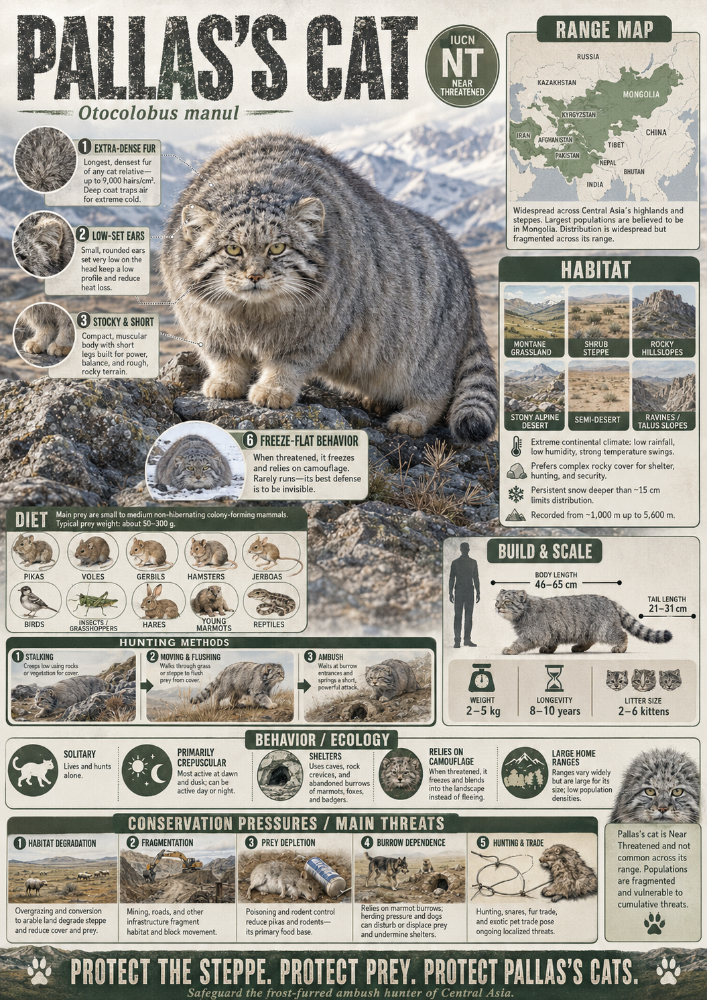

# Pallas’s Cat / Manul

> **The ultimate round-bodied master of the frozen steppes, turning flat ears and a grumpy face into a survival masterpiece**

## 1. Core Identity

- **Common name:** Pallas’s cat, Manul
- **Alternative names:** Steppe cat
- **Scientific name:** _Otocolobus manul_
- **Taxonomic group:** Subfamily _Felinae_; genus _Otocolobus_
- **Lineage:** Pallas’s cat lineage (distinct within Felinae)
- **Exhibit role:** Steppe/mountain small cat exhibit
- **Main biome:** Central Asian steppes, shrublands and rocky deserts
- **Main hunting style:** Ambush and stalk of small mammals

## 2. Museum Summary

Huddled like a grumpy, windswept boulder on the frozen grasslands of Central Asia, a wonderfully round feline peers over a rocky ledge. This is the **Pallas’s cat**, or **manul**, a highly specialized survivor of the high-altitude, cold deserts. Outfitted with the thickest, densest fur of any small wildcat, this stocky creature looks much larger than it actually is—a plush, heavy coat shielding a body that is actually no bigger than a typical domestic cat.

To thrive in a land of extreme temperatures and minimal cover, the manul evolved a suite of unique physical traits. Its ears are set remarkably low and flat on the sides of its broad head, allowing the cat to peek over boulders without breaking its silhouette and alerting prey. Unlike almost all other small felines that have vertical slit-like pupils, the manul possesses round pupils that dilate wide in the low light of dawn and dusk. Operating as a slow, patient hunter, it stalks pikas and voles across the steppes or waits for hours outside active rodent burrows. Tragically, these charming cats face localized declines due to habitat degradation and secondary poisoning from rodenticide (chemical poisons used by farmers to kill grain-stealing rodents, which then poison the cats that eat them).

## 3. Range

- **Continents:** Asia.
- **Countries/regions:** Distributed across Central Asia, including Mongolia, western and northern China (especially the Tibetan Plateau), Kazakhstan, Kyrgyzstan, Tajikistan, Uzbekistan, and northern Iran.
- **Range type:** Broad but highly fragmented and patchy, divided by rugged mountain ranges.
- **Range notes:** Primarily occupies elevations between 1,000 and 5,000 metres above sea level, strictly avoiding areas with deep, persistent snow or dense forests.

## 4. Habitat

- **Primary habitat:** Dry steppe grasslands, cold semi-deserts, and montane (mountainous) shrublands.
- **Secondary habitat:** Stony hillsides, rocky ravines, and scree slopes; they rely heavily on abandoned burrows dug by marmots, badgers, and foxes for shelter.
- **Climate adaptation:** Unmatched coat density featuring long, white-tipped guard hairs that provide a frosted look, serving as perfect camouflage against gravelly soils and frozen grass.
- **Terrain preference:** Rough, rocky terrains that offer abundant hiding spots; they are poor runners and require immediate cover to escape predators.

## 5. Diet

- **Main prey:** Small steppe rodents, especially pikas (small, egg-shaped relatives of rabbits) and various species of voles, gerbils, and hamsters.
- **Secondary prey:** Small ground-nesting birds, lizards, and large insects.
- **Hunting method:** Stalk-and-ambush. The cat crawls slowly using low cover, or waits patiently like a stone near a burrow exit, executing a quick, short pounce when the prey emerges.
- **Feeding ecology:** Highly specialized predator; their breeding success and population levels are closely tied to the natural population cycles of steppe pikas.

## 6. Behaviour / Ecology

- **Social structure:** Strictly solitary, actively avoiding other cats. Litters of 2–6 fuzzy kittens are raised inside secluded rock crevices or deep burrows.
- **Activity rhythm:** Primarily crepuscular (active at dawn and dusk) to nocturnal (night-active) to avoid daytime aerial predators like eagles.
- **Territory:** Home ranges are surprisingly large for their size, spanning 7 to 12 square kilometres in Mongolia's barren plains.
- **Ecological role:** Primary small-scale predator in steppe ecosystems, acting as a crucial control on herbivorous rodent populations.

## 7. Build & Scale

- **Body size:** **51–61 cm** (20–24 in) in body length; tail adds **20–25 cm** (8–10 in).
- **Weight range:** **1.8–5 kg** (4–11 lb), with the illusion of bulk created entirely by its spectacular coat.
- **Key proportions:** Stocky, low-slung frame with short legs; a broad, flat-topped head; thick, heavy tail ringed in black.
- **Movement style:** Slow, low-profile crawl; capable of quick dashes but tires rapidly due to its compact skeletal structure.

## 8. Signature Traits

1. **Low-set ears:** Ears positioned low on the sides of the skull, preventing detection when peeking over rocky edges.
2. **Round pupils:** A rare feature in small cats, giving the manul a highly expressive, human-like gaze.
3. **Frosted winter coat:** Long, dense fur with white-tipped guard hairs that mimic frost on dry grasses.
4. **Burrow dependence:** Relies entirely on the abandoned underground homes of other animals to survive the brutal Central Asian winters.

## 9. Conservation

- **IUCN status:** Least Concern (previously Near Threatened, downlisted in 2020, though many regional populations are declining).
- **Population trend:** Decreasing.
- **Main threats:** Secondary poisoning from agricultural rodenticides, habitat loss from overgrazing by domestic livestock, and accidental capture in traps set for wolves and foxes.
- **Conservation notes:** Key conservation projects focus on banning broad rodenticide spraying, protecting natural grasslands, and working with local herders to prevent dog attacks on the cats.

## 10. Visual Production Notes

- **Hero poster concept:** A Pallas's cat with fluffed-up fur crouching behind a weathered gray boulder on a windswept steppe, its intense round eyes staring forward.
- **Preview card concept:** Front-facing headshot highlighting the grumpy, flat-faced expression and wide ears; icons for coat thickness and cold tolerance.
- **Anatomy/trait image:** Diagram illustrating its low ear placement on the skull compared with a domestic cat.
- **Range map:** Map of Central Asia highlighting the high-altitude grasslands of Mongolia and Tibet.
- **Hunting video poster:** Storyboard showing a Pallas's cat waiting motionless near a pika burrow under a dawn sky.
- **3D model placeholder:** 3D model emphasizing the spherical body shape, thick tail, and short, sturdy limbs.
- **Conservation panel:** Infographic showing the food web link between pikas, rodenticides, and manul population health.
- **AI prompt (Midjourney/DALL-E style):** _A round, exceptionally fluffy Pallas's cat crouching on a frosty, rocky outcrop in the Mongolian steppe at dawn, its long fur dusted with frost, flat-set ears, grumpy face, intense round yellow eyes staring directly at the camera. Soft golden dawn light, vast barren grassland in the background, photorealistic, cinematic wildlife portrait._

## 11. Internal Links

- [[../01_Taxonomy_and_Evolution/Felidae_Overview.md|Felidae]]
- [[../05_Ecology_Comparisons/Mountain_Cats.md|Mountain Cats]]
- [[../05_Ecology_Comparisons/Desert_and_Dryland_Cats.md|Desert and Dryland Cats]]
- [[../05_Ecology_Comparisons/Solitary_vs_Social_Cats.md|Solitary vs Social Cats]]
- [[12_Caracal.md|Caracal]]
