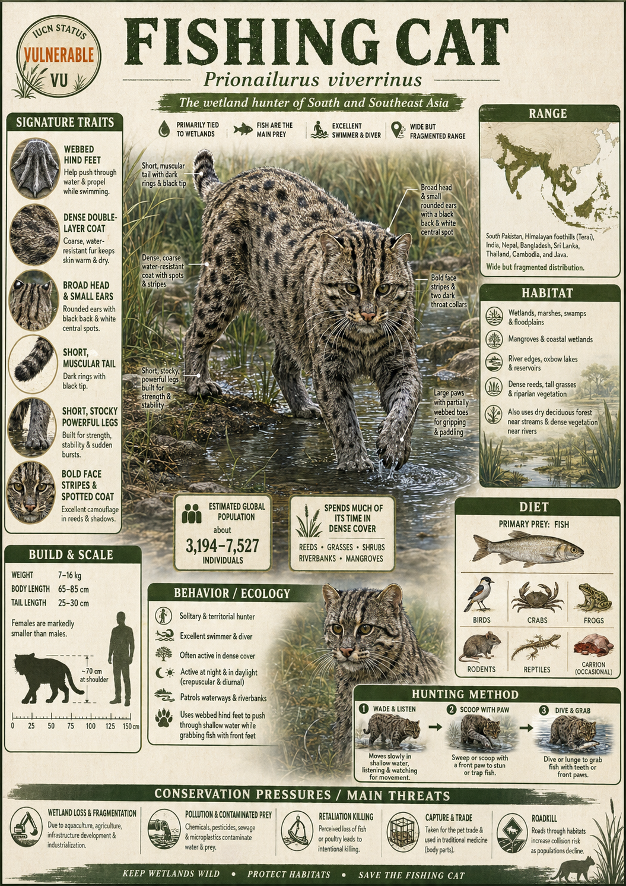

# Fishing Cat

> The river ghost — a stocky, fearless wetland predator that plunges headfirst into murky water while other cats politely avoid puddles.

## 1. Core Identity

- **Common name:** Fishing Cat
- **Alternative names:** Bagh-mach (Bengali, meaning "tiger-fish"), Handun Diviya (Sinhala)
- **Scientific name:** _Prionailurus viverrinus_
- **Taxonomic group:** Family Felidae, Subfamily Felinae, Genus _Prionailurus_
- **Lineage:** Leopard cat lineage (_Prionailurus_ clade), closely allied to the Leopard Cat (_P. bengalensis_) and Flat-headed Cat (_P. planiceps_)
- **Exhibit role:** Semi-aquatic specialist; Ambassador of wetland conservation in South and Southeast Asia
- **Main biome:** Tropical and subtropical wetlands — mangroves, reed beds, tidal creeks, oxbow lakes, and marshes
- **Main hunting style:** Active aquatic pursuit — paw-tapping the water surface to lure fish upward, then diving or snatching with lightning-fast strikes

## 2. Museum Summary

Picture a moonlit mangrove creek at the edge of the Sundarbans — the largest delta on Earth. The water is black and still, reeking of brine and rotting leaf litter. Then a shadow crouches at the bank. Compact, powerful, double-coated in smoky olive-grey fur etched with dark spots, the Fishing Cat leans over the surface and begins to tap the water with one paw — a deliberate, rhythmic motion that mimics a struggling insect. A silver flash rises from below. In the same heartbeat, the cat plunges its entire foreleg into the water and hauls out a catfish as long as its own skull. This is no accidental splash; this is a hunter who has turned a habitat most cats flee into an ambush arena it rules completely.

The Fishing Cat (_Prionailurus viverrinus_) is built for water in ways that are immediately visible and deeply structural. Its fur consists of two layers: a dense, waterproof underlayer (the equivalent of a wetsuit liner) and longer, spotted guard hairs on top. Its paws carry partial webbing between the toes — not as extensive as a duck's, but enough to power a determined underwater lunge. Its tail, shorter and stouter than most felids (cats of the family Felidae), functions like a rudder when swimming, allowing tight directional control in current. Even its claws are only semi-retractable (partially sheathed, unlike a domestic cat's fully retractable claws), keeping them perpetually sharp and gripped like crampons on slippery riverbank mud.

Found across South and Southeast Asia — from Pakistan's Indus Valley wetlands through the floodplains of India and Sri Lanka to the rice-paddy corridors of Thailand and Indonesia — the Fishing Cat is classified as Vulnerable (at genuine risk of extinction without conservation action) by the IUCN (International Union for Conservation of Nature). Its fate is bound entirely to the fate of wetlands, one of the world's fastest-disappearing ecosystems. As mangroves are cleared for shrimp farms and rivers are drained for agriculture, the Fishing Cat loses not just habitat but the food web it depends on. Protecting this cat means protecting an entire aquatic ecosystem — water, fish, bird, and delta alike.

## 3. Range

- **Continents:** Asia
- **Countries/regions:** India (primary stronghold in the Ganges-Brahmaputra delta and Eastern Ghats), Sri Lanka, Bangladesh (Sundarbans), Nepal (Terai lowlands), Pakistan (Indus Valley marshes), Myanmar, Thailand, Cambodia, Vietnam, Java (Indonesia), possibly Sumatra
- **Range type:** Fragmented and patchy; wetland-dependent with significant range contraction from historical extent
- **Range notes:** Historically reported across a wider arc of Southeast Asia; now largely absent from much of the Indio-Chinese peninsula interior and many island populations. Sri Lanka and India's Eastern Ghats represent significant refugia (refuge habitats where populations persist).

## 4. Habitat

- **Primary habitat:** Mangrove forests, tidal creeks, freshwater marshes, swamps, oxbow lakes (crescent-shaped lakes formed when a river meander is cut off), and seasonally flooded reedbeds
- **Secondary habitat:** Rice paddies, river margins, and humid forest edges near water bodies; occasionally scrub forest adjacent to wetlands
- **Climate adaptation:** Adapted to hot-humid tropical climates with high rainfall; tolerates brackish (mildly salty) water and the tidal flooding cycles of mangrove habitats
- **Terrain preference:** Flat to gently undulating lowland terrain; strongly associated with elevation below 150 m, though individuals have been recorded at higher elevations in Nepal's Terai

## 5. Diet

- **Main prey:** Fish (catfish, murrels, gobies, and tilapia species constitute the core diet)
- **Secondary prey:** Frogs, crustaceans (crabs and crayfish), water snakes, water birds, small mammals (rodents and mongooses), molluscs
- **Hunting method:** The Fishing Cat uses a multi-strategy approach: (1) _paw-tapping_ — patting the water surface to simulate the vibrations of a struggling insect, drawing curious fish upward; (2) _plunge-hunting_ — diving directly into shallow water to grab fish; (3) _shoreline stalking_ — ambushing prey from low overhanging roots or mud banks. It can also swim underwater in pursuit of fleeing fish.
- **Feeding ecology:** An opportunistic apex wetland carnivore (a top predator within its aquatic niche); ecologically important for controlling fish and frog populations and recycling aquatic nutrients onto land through its scat (droppings)

## 6. Behaviour / Ecology

- **Social structure:** Solitary; adults maintain individual home ranges except during mating. Females occupy smaller ranges (~4–6 km²) than males (~16–22 km²). Males may overlap multiple female ranges.
- **Activity rhythm:** Primarily nocturnal (active at night) and crepuscular (twilight-active, hunting at dawn and dusk), with some daytime activity recorded near less-disturbed waterways
- **Territory:** Territories are marked with scent (urine spraying and cheek-rubbing) along water's edge trails and root tangles. Vocalisations include a distinctive _chittering_ call distinct from most other small felids.
- **Ecological role:** Keystone wetland predator (a species whose removal causes disproportionate ecosystem disruption); acts as an indicator species (a species whose health signals the overall health of its ecosystem) for the condition of freshwater and mangrove systems. Its presence reliably predicts a functioning wetland food web.

## 7. Build & Scale

- **Body size:** Head-body length 57–78 cm; tail 25–33 cm (notably short and stout relative to body)
- **Weight range:** 5–16 kg; males substantially larger than females (pronounced sexual dimorphism — size difference between sexes)
- **Key proportions:** Robust, stocky build with a broad, flattened head, short legs, and an unusually deep chest. Smaller ears relative to skull size compared to other _Prionailurus_ species. Partially webbed forepaws.
- **Movement style:** Low-slung, deliberate ground movement; powerful swimmer; capable of short explosive lunges. Moves with the purposeful, unhurried confidence of an animal that owns its ecosystem.

## 8. Signature Traits

1. **Paw-tap luring:** The Fishing Cat deliberately taps the water surface with one paw to create ripple patterns that mimic a flailing insect or small fish — drawing prey fish upward where they can be seized. This is a learned, culturally transmitted hunting behaviour documented by field researchers in Bengal and Sri Lanka.
2. **Double-layer waterproofing:** The coat features a dense, insulating woolly undercoat topped by longer spotted guard hairs. Together they trap air and repel water, functioning like a diver's wetsuit — keeping the cat warm and buoyant even during extended swims.
3. **Semi-retractable claws:** Unlike most felids whose claws fully retract into sheaths, the Fishing Cat's claws remain partially exposed at all times, providing constant grip on slippery mud, wet rocks, and riverbank roots — the equivalent of built-in cleats.
4. **Rudder tail:** The tail is proportionally shorter and thicker than in other similarly-sized felids, and the cat uses it actively as a steering organ while swimming — adjusting direction mid-current with subtle sweeping motions.

## 9. Conservation

- **IUCN status:** Vulnerable (VU) — assessed 2016, under review
- **Population trend:** Decreasing; no reliable global population estimate exists, though significant local declines are documented across Southeast Asia
- **Main threats:** Wetland drainage and conversion to aquaculture (fish and shrimp farms), rice agriculture expansion, hunting for bushmeat and retaliatory killing by fishermen who see the cat as a competitor, water pollution degrading fish stocks, and sea-level rise threatening low-lying mangrove habitats
- **Conservation notes:** Protected under CITES Appendix II (international trade regulated but not banned) and under national wildlife laws in most range countries. Key strongholds include Chilika Lake (India), Point Calimere Wildlife Sanctuary (India), and the Sundarbans Biosphere Reserve (India/Bangladesh). The Fishing Cat Conservation Alliance runs community-based coexistence programs with fishing communities. Zoo breeding programmes maintain a small ex-situ (captive, outside the natural habitat) population as insurance.

## 10. Visual Production Notes

- **Hero poster:** Full-body action shot of a Fishing Cat mid-plunge into a dark mangrove creek at night, water exploding around its forelegs, a silver fish just visible in the splash. Low-angle shot. Atmospheric moonlight filtering through mangrove roots.
- **Preview card:** Close-up portrait of the broad, flat-skulled face — piercing yellow-green eyes, mottled olive-grey fur, droplets of water on the whiskers. Dark, moody background suggesting a riverbank at dusk.
- **Anatomy/trait image:** Split infographic panel — left side shows the partially webbed paw in detail (toe anatomy diagram); right side shows the double-layer coat cross-section and the stubby rudder tail. Clean line art over a warm teal background.
- **Range map:** Hand-illustrated-style map of South and Southeast Asia with wetland habitats highlighted in deep teal; Fishing Cat range shown as fragmented amber polygons over India, Sri Lanka, Bangladesh, and Southeast Asian lowlands.
- **Hunting scene poster:** Moonlit reed-bed scene: the cat crouches on a half-submerged root, one paw mid-tap on still water, concentric rings spreading outward, a pale fish shape rising below the surface. Impressionist oil-painting aesthetic.
- **AI prompt (Midjourney/DALL-E style):** _"A Fishing Cat (Prionailurus viverrinus) crouching on a mossy mangrove root at night, tapping the dark water surface with one webbed paw, a large silver fish visibly rising below the surface, moonlight reflecting off the disturbed water, smoky olive-grey spotted fur glistening with moisture, hyper-realistic wildlife photography style, Canon EF 500mm lens, f/4, ISO 3200, dramatic chiaroscuro lighting, rich teal and charcoal color palette, Sundarbans mangrove backdrop"_
- **Conservation panel:** Split-panel design — left: thriving mangrove creek habitat with the cat hunting; right: the same creek drained and converted to a shrimp farm. Text overlay: _"When wetlands disappear, so do their guardians."_ Muted desaturated palette on the degraded side.

## 11. Deep Dive Exhibits

- [[../03_Exhibit_Modules/Behavior_and_Ecology/16_Fishing_Cat_Behavior_and_Ecology.md|Behavior and Ecology]]
- [[../03_Exhibit_Modules/Build_and_Scale/16_Fishing_Cat_Build_and_Scale.md|Build and Scale]]
- [[../03_Exhibit_Modules/Conservation/16_Fishing_Cat_Conservation.md|Conservation]]
- [[../03_Exhibit_Modules/Diet_and_Hunting/16_Fishing_Cat_Diet_and_Hunting.md|Diet and Hunting]]
- [[../03_Exhibit_Modules/Range_and_Habitat/16_Fishing_Cat_Range_and_Habitat.md|Range and Habitat]]
- [[../03_Exhibit_Modules/Signature_Traits/16_Fishing_Cat_Signature_Traits.md|Signature Traits]]

## 12. Internal Links

- [[../01_Taxonomy_and_Evolution/Felidae_Overview.md|Felidae Overview]]
- [[../01_Taxonomy_and_Evolution/Pantherinae_vs_Felinae.md|Pantherinae vs Felinae]]
- [[../02_Species_Profiles/23_Leopard_Cat.md|Leopard Cat — Prionailurus bengalensis (Prionailurus lineage cousin)]]
- [[../02_Species_Profiles/24_Flat_Headed_Cat.md|Flat-headed Cat — Prionailurus planiceps (fellow semi-aquatic specialist)]]
- [[../05_Ecology_Comparisons/Wetland_and_Grassland_Cats.md|Ecology Comparison: Wetland Specialists]]
