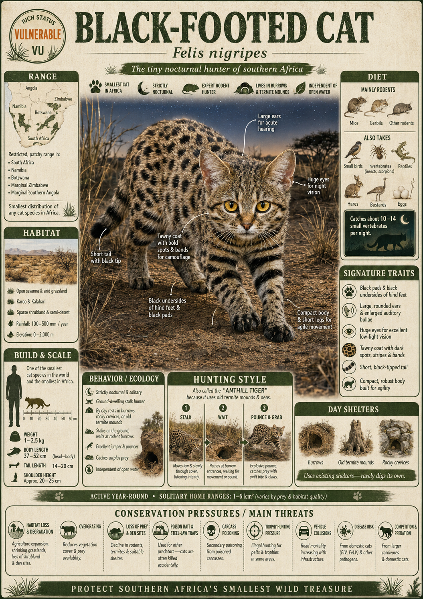

# Black-footed Cat

> Africa's deadliest cat fits in your lap — and hunts with a ferocity that shames animals ten times its size.

## 1. Core Identity

- **Common name:** Black-footed Cat
- **Alternative names:** Small-spotted Cat, Miershooptier (Afrikaans, meaning "anthill tiger")
- **Scientific name:** _Felis nigripes_
- **Taxonomic group:** Family Felidae, Subfamily Felinae, Genus _Felis_
- **Lineage:** _Felis_ lineage, the same genus as the domestic cat (_F. catus_) and Wildcat (_F. silvestris_); most closely related to the Sand Cat (_F. margarita_)
- **Exhibit role:** Africa's smallest wild felid; living proof that lethality has nothing to do with body size
- **Main biome:** Arid and semi-arid short-grass plains, karoo scrubland, and open savanna of southern Africa
- **Main hunting style:** Relentless nocturnal pursuit and ambush — a metabolic sprinter that must hunt almost every hour of the night to survive

## 2. Museum Summary

In the Karoo of South Africa, under a sky so thick with stars it seems close enough to touch, a small spotted cat no bigger than a large house cat slips out of an abandoned springhare burrow. In the next six hours, it will cover up to 16 kilometres. It will attempt a hunt every 30 minutes. It will succeed six times out of ten. Before dawn, it will have killed and consumed the equivalent of 14 mice or three sparrows — nearly one-fifth of its own body weight in a single night. Per kilogram of predator, no cat on Earth kills more efficiently. The Bushmen of the Kalahari called it _miershooptier_ — "anthill tiger" — a name that captures something science took decades to confirm: this tiny spotted ghost of the dry plains is, kill-for-kill, the most lethal cat in the world.

The Black-footed Cat (_Felis nigripes_) is Africa's smallest felid (cat family member), with adults rarely exceeding 1.6 kg in females and 2.4 kg in males. Yet evolution has packed extraordinary predatory hardware into that minimal frame. Its auditory bullae (the bony, air-filled chambers at the base of the skull that amplify sound) are enormously enlarged relative to skull size — so oversized they give the head a slightly swollen, wide-cheeked appearance. This isn't aesthetic. In the dark scrub of the Karoo, where sounds carry the difference between a meal and starvation, the Black-footed Cat hears the rustle of a mouse under 10 centimetres of grass. Combined with eyes calibrated to squeeze every photon from a moonless night and a metabolism that runs hot enough to demand constant refuelling, this cat hunts with the discipline of a machine — no night off, no missed opportunity.

The species takes its name from the distinctive black-soled paws and black undersides of the feet, a feature that contrasts dramatically with the warm tawny-buff coat dappled in dark brown spots and bars. It occupies a small, specialised range across Botswana, Namibia, and South Africa — wherever the short-grass karoo (a semi-desert shrubland ecosystem unique to southern Africa) and open plains offer the clear sightlines and abundant small-mammal prey it depends on. Despite its fierce reputation in local folklore — some Kalahari stories claim it can kill a giraffe by severing its jugular — the Black-footed Cat is classified as Vulnerable (genuinely threatened by extinction without active conservation) by the IUCN. Disease, drought, and the creeping transformation of open grassland into farmland are steadily shrinking the stage on which this tiny titan performs.

## 3. Range

- **Continents:** Africa
- **Countries/regions:** South Africa (Northern Cape, Free State, Eastern Cape — primary stronghold), Botswana (Kalahari and surrounding semi-arid regions), Namibia (southern and central regions). Unconfirmed reports from Zimbabwe and extreme southern Angola.
- **Range type:** Restricted; endemic (found nowhere else on Earth) to the semi-arid biomes of southern Africa
- **Range notes:** The species has one of the smallest natural ranges of any wild cat. It is rarely seen due to its nocturnal, fossorial (burrowing-using) lifestyle and cryptic colouration. The Benfontein Nature Reserve in South Africa hosts a key long-term study population monitored since the 1990s.

## 4. Habitat

- **Primary habitat:** Short open grassland and karoo shrubland (dry, low-shrub scrubland unique to South Africa's interior plateau) with sparse tree cover and abundant termite mounds and springhare burrows
- **Secondary habitat:** Arid savanna (open grassland with scattered trees), dry thornbush, and low succulent karoo where sparse vegetation allows visual hunting
- **Climate adaptation:** Highly adapted to extreme aridity; derives most of its water requirements from prey fluids rather than drinking — a critical adaptation in habitats where surface water is seasonal or absent
- **Terrain preference:** Flat to gently rolling plains; avoids dense bush and tall grassland that impedes its small-body hunting strategy. Strongly associated with termite mounds and aardvark burrows used as daytime shelters.

## 5. Diet

- **Main prey:** Small mammals — multimammate mice (_Mastomys_ spp.), gerbils, and shrews constitute the numerical majority of kills. Also takes birds up to the size of korhaans (small bustards).
- **Secondary prey:** Large invertebrates (beetles, locusts, scorpions), spiders, geckos, and small snakes. Will opportunistically take hares and young ground-nesting birds.
- **Hunting method:** Employs two strategies adaptively: (1) _fast hunting_ — a rapid, coursing pursuit through open grassland, flushing prey from cover and running it down in short explosive sprints; (2) _stalking ambush_ — slow, belly-flat stalking in vegetation, freezing at intervals and then pouncing (using its oversize ears to pinpoint exact prey position underground before striking). Prey is dispatched with a precise, swift bite to the back of the skull.
- **Feeding ecology:** A hyper-carnivore (an animal deriving virtually all nutrition from animal prey) operating at an extraordinary metabolic intensity. Must consume approximately 250–300 g of prey per night — roughly 18–20% of body weight. This need drives its record-breaking kill rate of approximately 60%, the highest hunting success rate documented in any wild cat (cheetahs average ~40%, lions ~25%).

## 6. Behaviour / Ecology

- **Social structure:** Strictly solitary; among the most solitary of all felids. Males range widely in search of females during breeding season but do not associate with females outside mating. No pair-bonding or cooperative rearing.
- **Activity rhythm:** Strictly nocturnal (active only at night); spends daylight hours sheltering in the burrows of aardvarks, porcupines, and springhares, or inside large termite mounds (hence the Afrikaans name _miershooptier_). Exits shelter only after full dark.
- **Territory:** Home ranges are small but energetically intense — females typically 8–10 km², males up to 20 km². Males mark extensively with urine and gland secretions on grass stems and rocks. The cat covers its entire home range every few nights, maintaining a mental map of the most productive hunting patches.
- **Ecological role:** A keystone small-predator (a predator of small mammals whose activity suppresses rodent population booms); important controller of rodent populations in agricultural border zones. Also suppresses invertebrate populations including scorpions and large beetles.

## 7. Build & Scale

- **Body size:** Head-body length 33–52 cm; tail 15–20 cm (short relative to body, consistent with a ground-specialist hunter)
- **Weight range:** Females 1.0–1.6 kg; males 1.5–2.5 kg. The smallest wild felid in Africa and one of the smallest on Earth.
- **Key proportions:** Compact, muscular body with strikingly large, rounded ears (housing those oversized auditory bullae); long, powerful hind legs relative to body size; large dark eyes positioned for maximum light capture; black-soled paws distinctive at close range.
- **Movement style:** Ground-hugging, rapid, and purposeful; capable of explosive short sprints and sudden directional changes. Walks with a low, focused stride that leaves virtually no audible footfall on dry soil.

## 8 Signature Traits

1. **Lethal efficiency — ~60% kill success rate:** The Black-footed Cat succeeds in approximately 60% of hunt attempts — the highest confirmed success rate of any wild cat species. This is not a luxury but a survival necessity: its small body loses heat rapidly and requires near-constant caloric replenishment. Every missed hunt has metabolic consequences.
2. **Outsized auditory bullae:** The bony chambers at the base of the skull that house the inner ear are proportionally enormous — so enlarged they are visible as distinct bulges on either side of the skull at the jaw joint. This amplification system allows the cat to detect the rustle of prey beneath several centimetres of soil or grass, hunting effectively without visual confirmation of prey location.
3. **Water independence:** In one of the most extreme physiological adaptations of any felid, the Black-footed Cat obtains virtually all its water from the body fluids of prey. It can survive indefinitely in its arid habitat without access to any surface water source — a critical survival trait in an environment where standing water may be absent for months.
4. **Termite mound sheltering:** The cat relies entirely on pre-made burrows and cavities for daytime refuge — primarily the excavated passages of aardvarks and the hardened mound chambers of termites. It does not dig its own burrows. This dependence on other species' constructions means the Black-footed Cat's survival is partly tied to the health of aardvark and termite populations in its range.

## 9. Conservation

- **IUCN status:** Vulnerable (VU) — assessed 2019
- **Population trend:** Decreasing; estimated fewer than 10,000 mature individuals remain, with no single subpopulation exceeding 1,000 adults
- **Main threats:** Habitat degradation through overgrazing (which eliminates the short-grass structure the cat requires), secondary poisoning from rodenticides and predator-control poisons laid for jackals and caracals, snaring by subsistence hunters, disease (particularly Feline Infectious Peritonitis and amyloidosis, a protein-deposition disease seen at high frequency in captive individuals), and drought intensification under climate change
- **Conservation notes:** Protected under CITES Appendix I (the highest level — commercial international trade banned) and under South African national law. The Black-footed Cat Working Group coordinates research and conservation. Captive populations are maintained at a small number of specialist institutions; captive breeding is complicated by the species' sensitivity to stress-related amyloidosis (a disease where abnormal protein deposits damage organs). In-situ (in the wild) camera-trap monitoring and GPS telemetry (GPS tracking collars) studies are ongoing at Benfontein Nature Reserve.

## 10. Visual Production Notes

- **Hero poster:** Low-angle night photograph aesthetic: the Black-footed Cat mid-stalk across bare Karoo soil, its enormous ears swivelled forward, eyes reflecting green in near-infrared light, a termite mound silhouetted against a star-saturated sky behind it. Warm ochre and cold midnight blue palette.
- **Preview card:** Tight close-up portrait of the face — enormous amber eyes, bold dark-brown spots, rounded oversized ears, whiskers catching starlight. Background: blurred dry grass and dark sky. Intimate, almost domestic appearance belying its lethality.
- **Anatomy/trait image:** Scientific-style infographic panel showing: (1) skull cross-section highlighting the enlarged auditory bullae compared to a domestic cat skull at the same scale; (2) paw underside showing the distinctive black sole and toe pads; (3) body-weight caloric need diagram — small cat silhouette with "~20% bodyweight per night" annotation.
- **Range map:** Southern Africa map with Karoo, Kalahari, and open grassland biomes shaded in warm ochre-tan; Black-footed Cat range outlined in deep terracotta with core strongholds marked. Minimal, elegant cartographic style.
- **Hunting scene poster:** Freeze-frame action panel: the cat launching its final pounce onto a mouse in short dry grass, perfectly suspended mid-air, forelegs extended, whiskers fanned forward, prey visible just below. Hyper-realistic gouache painting style. Dramatic raking moonlight.
- **AI prompt (Midjourney/DALL-E style):** _"A Black-footed Cat (Felis nigripes) mid-pounce in the South African Karoo at night, leaping over sparse dry grass toward a small mouse, enormous round ears forward, large amber eyes wide open reflecting moonlight, warm tawny-spotted fur, black-soled paws visible mid-leap, dramatic low-angle perspective, photorealistic wildlife photography style, Nikon D6, 600mm lens, natural starlight and low moon, ochre and midnight blue colour palette, National Geographic quality"_
- **Conservation panel:** Diptych design — left panel: thriving short-grass Karoo landscape at dusk with the cat in the foreground hunting; right panel: the same landscape overgrazed to bare soil, a poison bait station visible in the middle distance. Text: _"The world's deadliest cat hunts by night — and faces threats it cannot see."_ Desaturated palette on the degraded panel.

## 11. Deep Dive Exhibits

- [[../03_Exhibit_Modules/Behavior_and_Ecology/17_Black_Footed_Cat_Behavior_and_Ecology.md|Behavior and Ecology]]
- [[../03_Exhibit_Modules/Build_and_Scale/17_Black_Footed_Cat_Build_and_Scale.md|Build and Scale]]
- [[../03_Exhibit_Modules/Conservation/17_Black_Footed_Cat_Conservation.md|Conservation]]
- [[../03_Exhibit_Modules/Diet_and_Hunting/17_Black_Footed_Cat_Diet_and_Hunting.md|Diet and Hunting]]
- [[../03_Exhibit_Modules/Range_and_Habitat/17_Black_Footed_Cat_Range_and_Habitat.md|Range and Habitat]]
- [[../03_Exhibit_Modules/Signature_Traits/17_Black_Footed_Cat_Signature_Traits.md|Signature Traits]]

## 12. Internal Links

- [[../01_Taxonomy_and_Evolution/Felidae_Overview.md|Felidae Overview]]
- [[../01_Taxonomy_and_Evolution/Pantherinae_vs_Felinae.md|Pantherinae vs Felinae]]
- [[../02_Species_Profiles/22_Sand_Cat.md|Sand Cat — Felis margarita (closest living relative, fellow arid specialist)]]
- [[../05_Ecology_Comparisons/Desert_and_Dryland_Cats.md|Ecology Comparison: Small Felid Hunters]]
- [[../05_Ecology_Comparisons/Wetland_and_Grassland_Cats.md|Wetland and Grassland Cats]]
