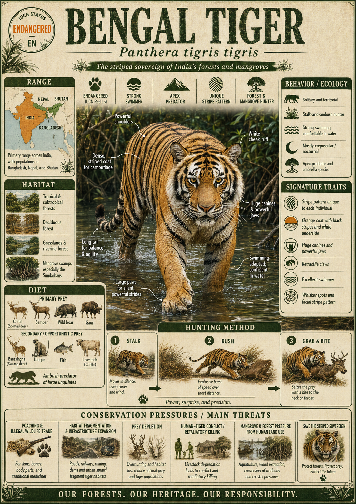

# Bengal Tiger

> The striped sovereign of South Asia — a 200-kilogram ambush predator that swims tidal rivers, commands miles of jungle, and carries the weight of an entire continent's wild heritage on its shoulders.

## 1. Core Identity

- **Common name:** Bengal Tiger
- **Alternative names:** Indian Tiger, Royal Bengal Tiger
- **Scientific name:** _Panthera tigris tigris_
- **Taxonomic group:** Family Felidae → Subfamily Pantherinae → Genus _Panthera_
- **Lineage:** Pantherinae (the roaring cats), diverged from the common tiger ancestor approximately 72,000–108,000 years ago; the nominate subspecies and the most numerous of all surviving tiger subspecies
- **Exhibit role:** Apex predator (the top hunter in its ecosystem with no natural enemies) and keystone species (a species whose presence shapes the entire structure of its habitat)
- **Main biome:** Tropical and subtropical moist broadleaf forest; mangrove delta
- **Main hunting style:** Nocturnal and crepuscular (twilight-active) stalk-and-ambush predator

## 2. Museum Summary

Imagine standing on the bank of a tidal creek in the Sundarbans — the largest mangrove forest on Earth — at dusk. The water is the colour of tea. The air smells of salt and rotting leaves. Then, with almost no warning, a 200-kilogram cat slides into the river, barely disturbing the surface, and swims powerfully across the current toward the opposite bank. This is the Bengal Tiger: not just a forest animal, but a creature equally at home in burning heat, waist-deep mud, and open water. It is a giant that moves like a whisper.

The Bengal Tiger (_Panthera tigris tigris_) is the most numerous of the remaining tiger subspecies (distinct geographic populations recognized as separate breeding groups), yet it still teeters on the edge. Fewer than 2,500 mature individuals survive in the wild — roughly the population of a small town — scattered across the Indian subcontinent from the Terai grasslands of Nepal to the tidal estuaries of Bangladesh. Each adult male patrols a home range (the total area an animal regularly uses) of up to 100 square kilometres, marking trees and rocks with scent to broadcast ownership. Females carve out smaller, overlapping territories within that mosaic, each raising cubs largely alone.

What makes the Bengal Tiger biologically extraordinary is its versatility. Most big cats specialize — but the Bengal thrives from the Himalayan foothills at 3,000 metres to sea-level mangrove swamps where it actively hunts chital deer and sambar, swims between islands, and occasionally takes prey as large as young gaur (wild Indian bison). Its coat — a deep amber canvas of dark vertical stripes — does not make it conspicuous; in filtered forest light, it performs the same visual trick as vertical shadows, rendering a 200-kilogram cat nearly invisible until the last three metres.

## 3. Range

- **Continents:** Asia
- **Countries/regions:** India (primary stronghold), Bangladesh (Sundarbans), Nepal (Terai Arc), Bhutan (Royal Manas), small remnant populations in Myanmar and possibly China
- **Range type:** Fragmented; isolated protected reserves separated by agricultural and urban land
- **Range notes:** India holds approximately 70–75% of the global wild Bengal Tiger population. The Sundarbans population in Bangladesh and India is unique in occupying a tidal mangrove ecosystem and is subject to regular flooding and saltwater intrusion.

## 4. Habitat

- **Primary habitat:** Tropical and subtropical moist deciduous forest (forest that sheds leaves seasonally in a warm, humid climate), tall grassland (Terai), and mangrove swamp
- **Secondary habitat:** Dry deciduous forest, subtropical hill forest, riparian (river-edge) forest corridors
- **Climate adaptation:** Highly heat-tolerant; frequently enters water bodies to cool down. Capable of withstanding monsoon flooding; the Sundarbans population has adapted to living in a tidally inundated (regularly flooded by tides) landscape.
- **Terrain preference:** Dense vegetation with water nearby; tolerates a wide range of terrain provided cover and prey are sufficient

## 5. Diet

- **Main prey:** Chital deer (_Axis axis_), sambar deer (_Rusa unicolor_), wild boar (_Sus scrofa_)
- **Secondary prey:** Gaur (Indian bison), barasingha (swamp deer), nilgai (the largest Asian antelope), water buffalo calves, langur monkeys, hog deer; fish and smaller prey in the Sundarbans
- **Hunting method:** Stalk-and-ambush — the tiger uses dense vegetation for concealment, approaches prey from downwind (moving so that its scent blows away from the target), and launches a short explosive rush typically ending within 10–20 metres; kills are delivered via a crushing throat bite (suffocation) or a powerful nape bite (cervical dislocation, breaking the neck) depending on prey size
- **Feeding ecology:** Solitary hunter; large kills (e.g., gaur) may be consumed over 3–5 days, with the tiger resting between feeding bouts. Drags carcasses into cover — showing remarkable strength for a terrestrial mammal (land-dwelling animal).

## 6. Behaviour / Ecology

- **Social structure:** Solitary; adults interact primarily during mating. Females tolerate cubs from previous litters on the periphery of their territory.
- **Activity rhythm:** Primarily nocturnal (night-active) and crepuscular (twilight-active); rests in shade or near water during peak daylight hours, especially in the dry season
- **Territory:** Males hold large territories (40–100 km²) overlapping several female home ranges (10–40 km²); territory boundaries are maintained through scent marking (spraying urine, dragging paws, rubbing glands against trees) and roaring
- **Ecological role:** Apex predator and trophic regulator (a species that controls prey populations and thus prevents overgrazing); its presence maintains the structure of prey herbivore communities and protects vegetation through a trophic cascade (a chain of ecological effects rippling through the food web)

## 7. Build & Scale

- **Body size:** Head-body length 190–220 cm in males, 150–175 cm in females; tail 85–110 cm
- **Weight range:** Males 180–260 kg (record individuals exceed 300 kg); females 100–160 kg
- **Key proportions:** Massive forelimbs and shoulders built for pinning large prey; retractile claws (claws that can be drawn back into sheaths, staying sharp) up to 10 cm; large padded paws enabling near-silent movement; relatively short, powerful neck for delivering killing bites
- **Movement style:** Stealthy walk interspersed with explosive short sprints (up to 65 km/h over short distances); strong swimmer — can cross rivers more than 6 km wide

## 8. Signature Traits

1. **Unique stripe fingerprint:** Every Bengal Tiger carries a completely unique pattern of dark stripes on its amber coat — no two tigers share the same design, functioning like a fingerprint for field researchers conducting camera-trap (motion-triggered wildlife camera) censuses.
2. **Unexpected swimming ability:** Unlike most large felids (members of the cat family), Bengal Tigers actively seek out water, readily entering rivers, lakes, and even tidal estuaries. In the Sundarbans they hunt prey on islands accessible only by swimming.
3. **Extreme territorial roar:** The tiger's roar — a deep, pulsed vocalisation produced by the elastic ligament (a flexible band of tissue) in its larynx — can carry more than 3 kilometres through forest, broadcasting territorial ownership to rivals without physical confrontation.
4. **Heat-management behaviour:** During India's scorching summers, Bengal Tigers spend hours partially submerged in pools or streams, reducing body temperature. This behaviour (called thermoregulatory immersion) is an active survival strategy in an ecosystem where midday temperatures can exceed 45°C.

## 9. Conservation

- **IUCN status:** Endangered (EN) — faces a very high risk of extinction in the wild
- **Population trend:** Recovering slowly in India (Project Tiger launched 1973); declining or unknown in Bangladesh, Myanmar, and China
- **Main threats:** Habitat loss and fragmentation (conversion of forest to agriculture and infrastructure); prey depletion (poaching of deer and wild boar for bushmeat); direct poaching for skin, bones, and organs sold on the illegal wildlife trade market; human-wildlife conflict (tigers occasionally prey on livestock and, rarely, humans, prompting retaliatory killing)
- **Conservation notes:** India's national tiger count (using camera-trap surveys) reached approximately 3,682 tigers in 2022, the highest since surveys began — a genuine recovery story. However, genetic isolation (inbreeding among small, disconnected populations) remains a long-term threat. Tiger corridors (strips of habitat connecting reserves) and community-based coexistence programmes are critical to long-term survival.

## 10. Visual Production Notes

- **Hero poster:** Bengal Tiger wading chest-deep through a golden-lit Sundarbans tidal creek at dusk, gaze locked on viewer, mangrove roots framing the composition, warm amber and deep blue tones
- **Preview card:** Tight face portrait, intense amber eyes, whisker detail prominent, dark stripe pattern asymmetrical across the muzzle, shallow depth of field blurring jungle background
- **Anatomy/trait image:** Side-profile anatomical illustration highlighting retractile claws, shoulder muscle mass, and proportional stripe density across the flank; labels in clean serif museum typography
- **Range map:** Illustrated topographic map of the Indian subcontinent with fragmented range patches in deep saffron-orange, darker shading for stronghold reserves (Sundarbans, Corbett, Bandhavgarh, Ranthambore, Kaziranga), faded corridors shown as dotted lines
- **Hunting scene poster:** Tiger mid-charge through tall elephant grass toward a sambar deer, motion blur on grass stems, paws fully extended, photographed from a low angle to emphasize scale against sunset sky
- **AI prompt (Midjourney/DALL-E style):** "A Royal Bengal Tiger swimming powerfully across a wide tidal river at golden hour in the Sundarbans mangrove forest, water rippling around its chest, amber eyes focused ahead, lush green mangrove roots visible on both banks, cinematic wildlife photography style, soft rim lighting, Nat Geo editorial quality, 16:9 aspect ratio"
- **Conservation panel:** Split-panel infographic: left side shows historical range (pre-1900 across all of Asia, shown in faded orange) versus current fragmented range (shown in vivid saffron); right side shows Project Tiger reserve network and corridor system with cub silhouettes illustrating population milestones

## 11. Deep Dive Exhibits

- [[../03_Exhibit_Modules/Behavior_and_Ecology/18_Bengal_Tiger_Behavior_and_Ecology.md|Behavior and Ecology]]
- [[../03_Exhibit_Modules/Build_and_Scale/18_Bengal_Tiger_Build_and_Scale.md|Build and Scale]]
- [[../03_Exhibit_Modules/Conservation/18_Bengal_Tiger_Conservation.md|Conservation]]
- [[../03_Exhibit_Modules/Diet_and_Hunting/18_Bengal_Tiger_Diet_and_Hunting.md|Diet and Hunting]]
- [[../03_Exhibit_Modules/Range_and_Habitat/18_Bengal_Tiger_Range_and_Habitat.md|Range and Habitat]]
- [[../03_Exhibit_Modules/Signature_Traits/18_Bengal_Tiger_Signature_Traits.md|Signature Traits]]

## 12. Internal Links

- [[../01_Taxonomy_and_Evolution/Felidae_Overview.md|Felidae Overview]]
- [[../01_Taxonomy_and_Evolution/Pantherinae_vs_Felinae.md|Pantherinae vs Felinae]]
- [[../03_Exhibit_Modules/Signature_Traits/Pseudo_Melanism_and_Similipal_Tigers.md|Tiger Subspecies Comparison]]
- [[../05_Ecology_Comparisons/Apex_Predators.md|Apex Predators of Asia]]
- [[19_Asiatic_Lion.md|Asiatic Lion — India's Other Great Cat]]
