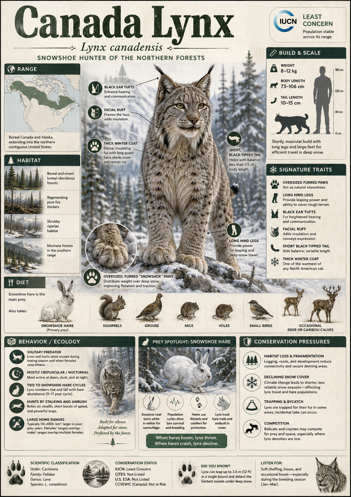

# Canada Lynx

> The boreal ghost — a long-legged, silver-furred cat that runs on top of snow that would swallow any other predator, locked in one of nature's most dramatic boom-and-bust dances with its only true prey.

## 1. Core Identity

- **Common name:** Canada Lynx
- **Alternative names:** Canadian Lynx, North American Lynx
- **Scientific name:** _Lynx canadensis_
- **Taxonomic group:** Family Felidae → Subfamily Felinae → Genus _Lynx_
- **Lineage:** Felinae (the non-roaring cats); the genus _Lynx_ diverged from the ancestral felid lineage approximately 3.2–3.8 million years ago; the Canada Lynx colonised North America from Eurasia during Pleistocene glacial cycles (periods of repeated ice age expansion approximately 2.6 million to 11,700 years ago) when land bridges connected the continents
- **Exhibit role:** Specialist mesopredator (a predator that sits in the middle of the food web, above small prey but below apex predators) and keystone ecological regulator in boreal forest systems
- **Main biome:** Boreal forest (taiga — the vast northern conifer forest belt stretching across Canada, Alaska, and parts of the northern United States)
- **Main hunting style:** Stealthy ground stalker; patient still-hunter ambushing prey from dense shrub cover

## 2. Museum Summary

Picture a winter forest in northern Canada. The temperature is minus 30°C. Half a metre of fresh snow blankets the ground. A white-tailed deer would punch through that crust and flounder. A wolf would exhaust itself postholing through the drifts. But there, moving at a confident trot, is the Canada Lynx — its enormous, broadly spreading feet acting like built-in snowshoes, distributing its weight so effectively that it barely sinks at all. This cat does not just survive winter; winter is its competitive advantage.

The Canada Lynx (_Lynx canadensis_) is one of the most ecologically unusual wild cats on Earth, because its entire existence is orchestrated by a single prey species: the snowshoe hare (_Lepus americanus_). Hare populations across the boreal zone explode on roughly 10-year cycles (oscillating boom periods driven by vegetation and predation dynamics), and lynx populations faithfully follow — peaking one to two years behind the hare peak, then crashing when hares become scarce. During a hare crash, a Canada Lynx may travel hundreds of kilometres through the forest, searching for food. Researchers have documented individual lynx crossing entire Canadian provinces in a single winter. This species is not just a predator; it is a biological clock synchronized to the boreal heartbeat.

In the United States, the Canada Lynx clings to existence in a handful of isolated mountain forests in Montana, Idaho, Washington, and Maine — populations so small and fragmented that the U.S. Fish & Wildlife Service lists the species as federally threatened south of the Canadian border. Climate change is rewriting the conditions these lynx evolved to exploit: as snowpacks become shallower and less reliable, the deep-snow advantage that the lynx's extraordinary paws provide begins to erode, and competing predators like bobcats and coyotes — better adapted to bare ground — push northward into former lynx territory.

## 3. Range

- **Continents:** North America
- **Countries/regions:** Canada (primary range — virtually all forested provinces and territories from Newfoundland to British Columbia and Yukon); Alaska (USA); isolated relict populations (small, geographically cut-off remnant populations) in Washington, Idaho, Montana, Minnesota, and Maine (USA)
- **Range type:** Continuous in Canada and Alaska; highly fragmented and restricted in the contiguous United States
- **Range notes:** The Canada Lynx's U.S. range has contracted dramatically over the past century due to trapping, habitat loss, and the northward advance of competitors such as the bobcat. Canada holds the global stronghold. The species is listed as Threatened under the U.S. Endangered Species Act south of the Canadian border.

## 4. Habitat

- **Primary habitat:** Dense boreal forest (taiga) dominated by spruce (_Picea_ spp.) and fir (_Abies_ spp.) with a thick shrub understory (the layer of shrubs and small trees beneath the forest canopy) — specifically the dense stands of young conifers and shrubs where snowshoe hares shelter and breed
- **Secondary habitat:** Subalpine forest (high-altitude conifer forest approaching treeline), mixed conifer-hardwood forest, boreal peatlands (wetlands dominated by sphagnum moss in cool climates), and riparian (river-edge) corridors used for movement between forest patches
- **Climate adaptation:** Profoundly cold-adapted: dense, insulating fur; large, furry paws with spreading toes that function as natural snowshoes; long legs relative to body length raise the body above deep snow; very thick underfur provides passive insulation to below minus 40°C
- **Terrain preference:** Areas with consistently deep, persistent snowpack (the Canada Lynx's snowshoe-foot advantage is maximised in snow over 20 cm deep); dense shrub thickets for hunting snowshoe hare

## 5. Diet

- **Main prey:** Snowshoe hare (_Lepus americanus_) — in Canada, hares represent 35–97% of annual diet depending on season and hare cycle phase
- **Secondary prey:** Red squirrel (_Tamiasciurus hudsonicus_), grouse and ptarmigan (ground-dwelling northern birds), voles, beaver, and deer fawns taken during hare scarcity phases; the lynx becomes significantly more generalist (eating a broader range of prey) during hare population crashes
- **Hunting method:** Patient still-hunting — the lynx sits motionless for long periods near hare runs (established trails through dense shrub that hares habitually travel) and launches a short pounce-and-grab attack at point-blank range; also uses slow, careful stalking through dense vegetation, relying on large ear tufts (tufts of long black hairs on the ear tips that may enhance directional hearing) to pinpoint prey movement beneath snow or inside shrub thickets
- **Feeding ecology:** Solitary feeder; caches (hides and returns to) large kills beneath snow or in dense brush. During hare scarcity, lynx are known to fast for extended periods or travel enormous distances seeking alternative prey — documented crossings of 400–1,000 km in a single dispersal event are among the longest known movements of any small to medium wild cat.

## 6. Behaviour / Ecology

- **Social structure:** Solitary except during the breeding season (February–March) and while raising kittens; females raise litters of 1–5 kittens alone with no male involvement post-mating
- **Activity rhythm:** Primarily crepuscular (most active at dawn and dusk) to nocturnal (night-active), timing its activity to match snowshoe hare movement patterns; may be active at any hour during prey scarcity
- **Territory:** Home ranges are large relative to body size — males maintain areas of 100–500 km², females 50–200 km² — but territories are held loosely, with neighbours' ranges overlapping considerably compared to more rigorously territorial cats; range boundaries shift seasonally and with hare abundance
- **Ecological role:** Primary regulator of snowshoe hare populations in the boreal zone; lynx predation is one of the two key forces driving the hare population cycle (the other being vegetation recovery from hare overgrazing); the lynx-hare cycle is one of the most studied predator-prey oscillations (rhythmic rise and fall in interacting species numbers) in all of ecology

## 7. Build & Scale

- **Body size:** Head-body length 67–107 cm; tail short and stubby, 5–13 cm; notably long legs relative to body — the hind legs are significantly longer than the forelegs, producing a characteristic rump-high silhouette
- **Weight range:** Males 8–14 kg; females 5–10 kg — roughly the size of a large domestic cat, though the long legs and thick fur create an impression of greater bulk
- **Key proportions:** Paw size is disproportionately large for body weight — the hindfeet spread to approximately 15–18 cm in width when weight-bearing, rivalling paws found on cats twice the lynx's mass; distinctive black-tipped tail (entirely black, unlike the bobcat's banded tail); prominent black ear tufts; wide, flat facial ruff (a collar of longer fur around the face, possibly aiding directional sound collection)
- **Movement style:** Stealthy trotting gait on soft snow at speeds of approximately 10–15 km/h for sustained travel; capable of short bursts over snow-covered terrain; high-stepping deliberate walk in dense shrub; strong swimmer

## 8. Signature Traits

1. **Snowshoe feet:** The Canada Lynx's most famous feature is the sheer size of its furry, spreading paws. Dense inter-digital fur (hair growing between the toe pads) and splaying toes create a snow-walking surface similar in function to a manufactured snowshoe, giving the lynx a foot-load (pressure per unit area on snow surface) comparable to a far lighter animal and allowing it to run on crusted snow where competing predators flounder.
2. **The hare-cycle lock:** No wild cat in the world shows a tighter demographic coupling (a population response so strong it mirrors another species' numbers) to a single prey animal. When snowshoe hare populations crash, Canada Lynx survival rates plummet, litter sizes fall, and juvenile dispersal becomes extreme. When hares rebound, lynx populations recover within 1–2 years — a rhythmic ecological pulse documented continuously for over a century through fur-trade records.
3. **Long-distance dispersal:** During hare crashes, lynx engage in some of the most spectacular long-distance movements recorded for any mid-sized felid — individual animals have been tracked crossing 400–1,000 km of wilderness, crossing provincial boundaries and mountain ranges in search of prey. These movements seed new populations in marginal habitats and maintain genetic connectivity (the flow of genes between otherwise separated populations) across enormous landscapes.
4. **Facial ruff and ear tufts:** The Canada Lynx's broad, flat facial ruff and prominent black ear tufts are not merely decorative — both are hypothesised (considered likely based on current evidence, though not fully proven) to serve acoustic functions, with the ruff acting as a parabolic reflector (a curved surface that focuses sound) funnelling sound toward the ears and the tufts potentially helping the cat detect the direction of sounds above and behind it — critical for locating hares moving under snow.

## 9. Conservation

- **IUCN status:** Least Concern (LC) globally — stable and relatively abundant across Canada and Alaska
- **Population trend:** Stable in Canada; declining or chronically depressed in the contiguous United States
- **Main threats:** Habitat loss from logging of mature boreal forest; trapping (legal in Canada, regulated, but illegal harvest does occur); road mortality (vehicle collisions are a documented mortality cause in fragmented U.S. populations); climate change — reduced snowpack depth and duration diminishes the lynx's competitive advantage over bobcats and coyotes that move northward as winters moderate; prey cycle vulnerability — entire U.S. sub-populations may periodically near local extinction during hare crashes
- **Conservation notes:** Listed as Threatened under the U.S. Endangered Species Act for the contiguous United States population. Conservation efforts include protecting old-growth and mature second-growth boreal forest, maintaining wildlife corridors between fragmented mountain populations, and monitoring the northward range expansion of the competing bobcat (_Lynx rufus_). Snowpack modelling suggests the lynx's effective range in the U.S. could contract significantly under high-emissions climate scenarios by 2100.

## 10. Visual Production Notes

- **Hero poster:** Canada Lynx running full-tilt across a frozen boreal lake at dawn, enormous rear paws propelling it forward, frost mist rising from the snow surface, dark spruce forest wall in background, pale blue-white winter light, low-angle rear-quarter perspective showing leg length and paw spread
- **Preview card:** Face portrait — wide, round facial ruff in winter coat, black ear tufts prominent and erect, pale green-yellow eyes, snow crystals caught in the ruff fur, shallow depth of field blurring spruce branches behind
- **Anatomy/trait image:** Detailed anatomical diagram of a Canada Lynx paw — dorsal (top) and plantar (bottom) views — showing inter-digital fur spreading pattern, toe spread radius, paw pad arrangement, and retractile claw position; compared at same scale to a bobcat paw
- **Range map:** North American map with Canada Lynx range shown in icy blue-white across boreal Canada and Alaska; contiguous U.S. isolated populations shown as small vivid dots in the northern Rockies and New England; historical range loss shown in faded grey; hare density gradient shown as a warming colour overlay
- **Hunting scene poster:** Lynx crouching motionless at the edge of a dense spruce thicket in deep snow, ears forward, eyes locked on a snowshoe hare moving along a trail in the foreground, soft blue moonlight, long shadows, photographic stillness capturing the tension before the pounce
- **AI prompt (Midjourney/DALL-E style):** "A Canada Lynx with enormous furry paws standing in deep powder snow in a dense boreal spruce forest in winter, its silver-grey fur contrasting against the white snow, prominent black ear tufts, wide facial ruff, pale yellow-green eyes, soft diffuse winter light filtering through snow-laden branches, wildlife photography style, Nat Geo quality, 16:9 aspect ratio"
- **Conservation panel:** Side-by-side comparison of Canada Lynx and Bobcat range maps showing northward range shift of the bobcat as a warming indicator; inset graph showing 90-year snowshoe hare and lynx population cycle data; icons showing key threats including logging, climate (snowpack loss), and road fragmentation

## 11. Deep Dive Exhibits

- [[../03_Exhibit_Modules/Behavior_and_Ecology/20_Canada_Lynx_Behavior_and_Ecology.md|Behavior and Ecology]]
- [[../03_Exhibit_Modules/Build_and_Scale/20_Canada_Lynx_Build_and_Scale.md|Build and Scale]]
- [[../03_Exhibit_Modules/Conservation/20_Canada_Lynx_Conservation.md|Conservation]]
- [[../03_Exhibit_Modules/Diet_and_Hunting/20_Canada_Lynx_Diet_and_Hunting.md|Diet and Hunting]]
- [[../03_Exhibit_Modules/Range_and_Habitat/20_Canada_Lynx_Range_and_Habitat.md|Range and Habitat]]
- [[../03_Exhibit_Modules/Signature_Traits/20_Canada_Lynx_Signature_Traits.md|Signature Traits]]

## 12. Internal Links

- [[../01_Taxonomy_and_Evolution/Felidae_Overview.md|Felidae Overview]]
- [[../01_Taxonomy_and_Evolution/Pantherinae_vs_Felinae.md|Pantherinae vs Felinae]]
- [[../03_Exhibit_Modules/Signature_Traits/Melanism_and_Black_Panther.md|Lynx Genus Overview]]
- [[../05_Ecology_Comparisons/Mountain_Cats.md|Boreal Forest Predator Guild]]
- [[21_Bobcat.md|Bobcat — The Canada Lynx's Southern Competitor]]
