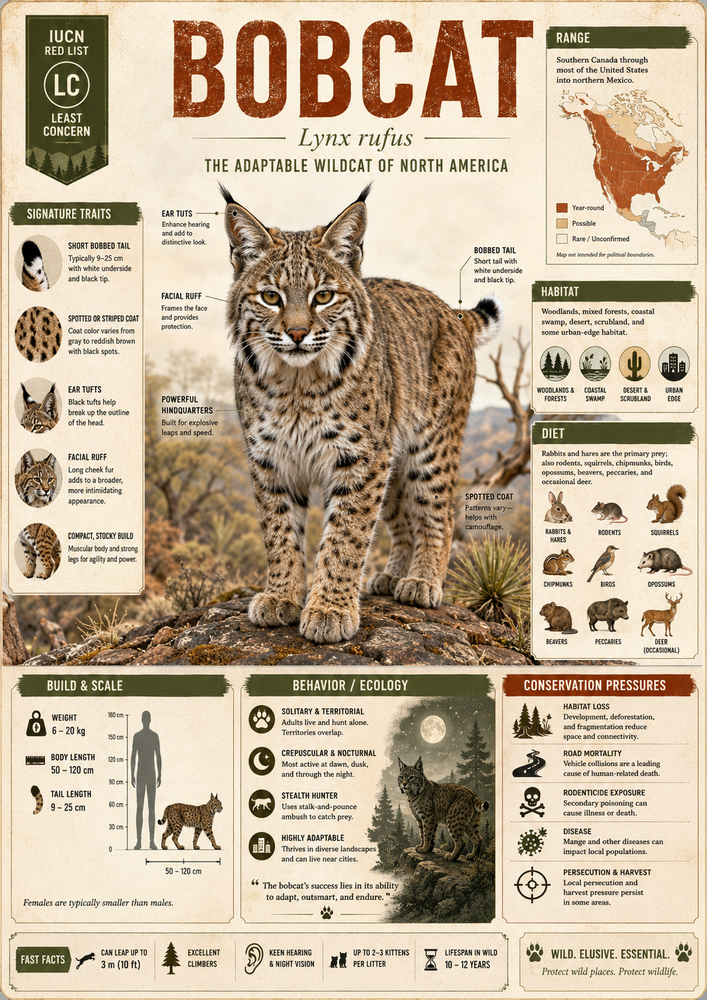

# Bobcat

> North America's ultimate wildcat survivor — the adaptable, bob-tailed phantom that hunts in the desert at noon and stalks suburban backyards at midnight with equal ease.

## 1. Core Identity

- **Common name:** Bobcat
- **Alternative names:** Red Lynx, Bay Lynx, Wildcat (colloquial in parts of the American South)
- **Scientific name:** _Lynx rufus_
- **Taxonomic group:** Family Felidae → Subfamily Felinae → Genus _Lynx_
- **Lineage:** Felinae (the non-roaring cats); diverged from the Canada Lynx (_Lynx canadensis_) approximately 1.8–2.4 million years ago after the ancestral Lynx lineage crossed into North America from Eurasia; the most widespread wild cat in North America and the most abundant wild cat by total population in the Western Hemisphere
- **Exhibit role:** Mesopredator (a predator sitting in the middle of the food web) and ecological generalist (a species capable of thriving in a wide variety of habitats and on a wide variety of prey) — the textbook example of wild cat adaptability
- **Main biome:** Generalist across biomes — forest, shrubland, grassland, wetland, desert, and urban edge
- **Main hunting style:** Stalking and short-distance ambush; sit-and-wait hunting from elevated perches

## 2. Museum Summary

Most wild cats demand something specific — a particular forest, a certain prey, a precise climate. The Bobcat demands almost nothing. Give it a brushy hillside in New Mexico or a swamp edge in Louisiana or a wooded ravine behind a California suburb, and the Bobcat will make it work. This is the wildcat as champion generalist: a compact, spotted, bob-tailed predator that thrives where other carnivores either never lived or have long since disappeared. While the mountain lion retreated, the wolf was exterminated, and the jaguar was pushed to the borderlands, the Bobcat quietly multiplied. There are now an estimated 3.5 to 4 million of them across North America — more wild cats of a single species than anywhere else in the Western Hemisphere.

The Bobcat (_Lynx rufus_) is a medium-sized felid (member of the cat family) weighing 6–18 kg, roughly the size of a large domestic cat but built with an athleticism and lethality that size alone doesn't suggest. Its most distinctive physical feature is its stubby, "bobbed" tail — typically 9–20 cm long, compared to the long tails of most cats — which gives the species its name. The coat is a beautifully variable tawny rufous (reddish-brown) with dark spots and streaks that camouflage it equally well in rocky desert terrain and dense forest understorey. Across its vast range, the Bobcat shifts its colouration subtly — paler and more spotted in the arid southwest, darker and more streaked in the wet forests of the southeast — a geographic variation (measurable difference in a trait across a species' range) that has led taxonomists to recognize up to thirteen subspecies (distinct regional populations within the species), though genetic studies suggest fewer clear boundaries.

What earns the Bobcat its museum standing is not rarity but mastery — the mastery of living everywhere, eating nearly anything, and refusing to be displaced. As America's large predators were systematically eliminated through the 19th and 20th centuries, the Bobcat filled ecological space left behind. Today, in a strange ecological reversal, it is the Bobcat that is pushing northward into Canada, expanding its range as climate change moderates winters and reduces the deep snowpacks that once gave the Canada Lynx a competitive edge — effectively trading range with its larger cousin.

## 3. Range

- **Continents:** North America
- **Countries/regions:** United States (throughout, including all 48 contiguous states and extending into southern Canada and Mexico); Canada (southern British Columbia, Alberta, Saskatchewan, Ontario, Quebec, and the Maritime provinces — range expanding northward); Mexico (northern states from Baja California to Tamaulipas and south through the Sierra Madre)
- **Range type:** Continuous and expanding; the Bobcat has the largest range of any wild cat in the Western Hemisphere
- **Range notes:** The Bobcat was eliminated or severely reduced in parts of the Midwest and Great Plains during the 20th century due to intensive agriculture and persecution, but has substantially recovered across most of its former range following fur trapping regulation and suburban habitat expansion. Its northward range expansion into formerly exclusive Canada Lynx territory is documented and accelerating.

## 4. Habitat

- **Primary habitat:** No single primary habitat — the Bobcat's defining ecological characteristic is habitat generalism; it thrives in coniferous forest, mixed hardwood forest, chaparral (dense drought-adapted shrubland), pinyon-juniper woodland, desert scrub, coastal marsh, bottomland swamp, agricultural field margins, and suburban edge habitat
- **Secondary habitat:** Urban and peri-urban (at the edge of cities) environments — Bobcats have been confirmed living, hunting, and successfully raising kittens in suburban parks, golf courses, cemetery woodlots, and drainage corridors within major metropolitan areas including Los Angeles, Dallas, and Atlanta
- **Climate adaptation:** Extremely broad thermal tolerance — active year-round from the heat of Sonoran Desert summers to cold continental winters across Montana and the Great Lakes; the Bobcat lacks the Canada Lynx's deep-snow paw adaptation and struggles in persistent deep snowpacks, which is why boreal Canada remains lynx-dominated
- **Terrain preference:** Prefers terrain with patchy vegetation structure — areas where open hunting ground alternates with dense cover for resting and kitten-rearing; rocky terrain with ledge outcrops is frequently used for den sites

## 5. Diet

- **Main prey:** Cottontail rabbit (_Sylvilagus_ spp.) and jackrabbit (_Lepus_ spp.) — rabbits and hares typically comprise 50–75% of diet across most of the range
- **Secondary prey:** Rodents (mice, voles, squirrels, pocket gophers), white-tailed deer (_Odocoileus virginianus_) and mule deer (especially fawns and winter-weakened adults), wild turkey, ground-nesting birds, reptiles, and occasionally domestic poultry or small livestock — the Bobcat is one of the most prey-diverse wild cats in the world, with documented prey lists exceeding 50 species across its range
- **Hunting method:** Slow, deliberate stalking followed by a short explosive rush and pounce; uses elevated perches (boulders, fallen logs, tree branches) for sit-and-wait ambush hunting; delivers kills with a cervical bite (a bite to the back of the neck that breaks the spine) on small prey, and suffocation throat-bites on larger prey like deer
- **Feeding ecology:** Primarily solitary hunter; caches (buries or conceals) large kills under leaf litter, snow, or brush and returns repeatedly to feed; one Bobcat killing a deer may feed from that carcass for several days, representing a significant caloric investment

## 6. Behaviour / Ecology

- **Social structure:** Solitary; adults maintain individual home ranges with only brief tolerant overlap at territorial boundaries between male and female neighbours; females raise kittens entirely alone; adult male ranges frequently overlap those of multiple females
- **Activity rhythm:** Primarily crepuscular (most active at dawn and dusk) with significant nocturnal (night-active) activity, particularly near human habitation; one of few wild cats that regularly hunts during daylight hours in undisturbed areas, especially in winter
- **Territory:** Home ranges vary enormously — 2–40 km² depending on habitat productivity, prey abundance, and sex (males hold larger ranges than females); territories are marked with scent posts (urine spray marks, faecal deposits, scrape mounds — piles of leaves and debris scratch-marked and scent-deposited), and maintained by occasional direct confrontation and vocalisation
- **Ecological role:** Critical mesopredator across North American ecosystems; the Bobcat's primary ecological function is rabbit and rodent population regulation — in the absence of larger predators across much of its range, it serves as the dominant small-mammal regulator, preventing prey species from reaching ecologically damaging densities (overabundances that cause habitat degradation)

## 7. Build & Scale

- **Body size:** Head-body length 65–105 cm; tail 9–20 cm (notably shorter than the body — the bobbed silhouette is unmistakeable); shoulder height 30–40 cm
- **Weight range:** Males 6–18 kg (exceptionally up to 20 kg); females 4–11 kg; significant geographic variation — Bobcats in the northern extent of the range are larger than those in the southern subtropics (consistent with Bergmann's Rule — the ecological principle that individuals of the same species are larger in colder climates)
- **Key proportions:** Smaller paws than the Canada Lynx — less inter-digital fur (hair between the toes) and less toe spread; slightly shorter legs relative to body length; characteristic white-spotted back of the ear (a feature used by mothers to help kittens track them through vegetation — the white patch visible from behind creates a following signal in low light); body spotted and streaked in tawny-rufous coloration
- **Movement style:** Agile and versatile — climbs trees readily, swims when necessary, navigates rocky terrain with ease; capable of leaping up to 3 metres horizontally from a standing position; top sprint speed approximately 55–60 km/h over short distances

## 8. Signature Traits

1. **The bobbed tail:** The Bobcat's short, stubby tail — only 9–20 cm long, compared to the long tails of most felids — is its namesake and its most immediate field identification feature. The tail is white underneath with a black tip on the upper surface only (contrasting with the Canada Lynx's entirely black tail tip), allowing field identification even in fleeting glimpses. The evolutionary origin of the shortened tail is not fully understood, but it appears in both North American lynx lineages, suggesting it confers some advantage in dense vegetation hunting.
2. **White ear-back patches:** The Bobcat's ears carry conspicuous white patches on the back surface — a feature shared with many felids including the serval and the ocelot. In the Bobcat, these patches serve as visual following signals (markers visible to kittens tracking their mother through dense vegetation at low light), allowing cubs to maintain visual contact with the mother without vocalising and betraying their location to predators.
3. **Ecological superadaptability:** No other wild cat in North America occupies as many distinct habitat types, eats as many prey species, or lives as successfully in modified human-dominated landscapes as the Bobcat. Documented cases of Bobcats raising kittens in storm drain networks, suburban greenbelts, airport perimeters, and city park remnants demonstrate a behavioural flexibility (the ability to adjust behaviour in response to novel environmental conditions) unmatched among North American felids.
4. **Deer predation by a "small" cat:** Despite weighing as little as 6 kg — the size of a large house cat — Bobcats regularly kill white-tailed deer, which can weigh 60–90 kg. They accomplish this through a high-leap ambush, landing on the deer's back and delivering a killing cervical bite (a bite crushing the neck vertebrae) from above. Documented winter kills of adult deer by Bobcats represent prey that outweighs the predator by up to 15:1 — among the highest predator-to-prey weight ratios of any wild cat.

## 9. Conservation

- **IUCN status:** Least Concern (LC) globally — abundant and widespread with a stable to growing total population
- **Population trend:** Stable to increasing across most of the range; recovering in historically depleted Midwestern states; expanding northward in Canada
- **Main threats:** Habitat fragmentation in urbanising landscapes (road networks creating population barriers within otherwise suitable habitat); legal trapping and hunting (the Bobcat is legally hunted and trapped in most U.S. states; fur is exported to international markets); vehicle collisions in fragmented suburban ranges; rodenticide poisoning — Bobcats hunting rodents in suburban areas ingest anticoagulant rat poisons through their prey (secondary poisoning or bioaccumulation), which has been documented as a significant mortality source in southern California urban wildland interface areas
- **Conservation notes:** Despite its Least Concern status, several localised populations — particularly in coastal California, the Florida peninsula, and parts of the Midwest — face significant pressure from habitat loss and secondary rodenticide poisoning. The Bobcat's expanding northern range overlap with the Canada Lynx raises interspecific competition concerns (competition between two different species for the same resource) that may disadvantage the more specialised lynx in marginal boreal zones. In some areas, the Bobcat and Canada Lynx hybridize (interbreed), producing "blynx" offspring of reduced fertility.

## 10. Visual Production Notes

- **Hero poster:** Bobcat crouched on a granite boulder in chaparral at dusk, spotted coat glowing amber and charcoal in sunset light, ears erect, short tail hooked slightly upward, rocky Sonoran desert hillside receding behind it
- **Preview card:** Close-up face portrait — asymmetric tawny spots on white muzzle, distinctive facial ruffs (tufts of long hair on the cheeks below the ears), intense amber eyes, slight tilt of head suggesting alertness, shallow focus blurring autumn-leaf background
- **Anatomy/trait image:** Comparative silhouette diagram of Bobcat vs. Canada Lynx — highlighting tail length, ear tuft size, paw proportion, and leg length differences; colour-coded labels in clean museum typography on a warm cream background
- **Range map:** North America map with Bobcat range filled in rich amber, shading intensity representing population density; arrows showing documented northward range expansion corridor in Canada; overlay comparison contour showing Canada Lynx range in ice blue, demonstrating range overlap zones
- **Hunting scene poster:** Bobcat mid-leap from a moss-covered log in a hardwood forest, targeting a cottontail rabbit below, front paws extended, spotted belly visible, dappled light through bare winter branches, photographic stop-motion energy
- **AI prompt (Midjourney/DALL-E style):** "A Bobcat standing on a rocky granite ledge in a California chaparral hillside at golden hour, spotted tawny-rufous coat, distinctive short bobbed tail raised slightly, alert amber eyes, tufted cheek ruffs, dry California oak brush in background with warm evening light raking across the scene, wildlife documentary photography style, Nat Geo editorial quality, 16:9"
- **Conservation panel:** Urban wildlife infographic showing a Bobcat home range overlaid on a suburban map — illustrating how the cat navigates parks, golf courses, drainage channels, and road crossings; inset showing rodenticide bioaccumulation chain from rat to Bobcat; call-to-action panel for rodenticide alternatives

## 11. Deep Dive Exhibits

- [[../03_Exhibit_Modules/Behavior_and_Ecology/21_Bobcat_Behavior_and_Ecology.md|Behavior and Ecology]]
- [[../03_Exhibit_Modules/Build_and_Scale/21_Bobcat_Build_and_Scale.md|Build and Scale]]
- [[../03_Exhibit_Modules/Conservation/21_Bobcat_Conservation.md|Conservation]]
- [[../03_Exhibit_Modules/Diet_and_Hunting/21_Bobcat_Diet_and_Hunting.md|Diet and Hunting]]
- [[../03_Exhibit_Modules/Range_and_Habitat/21_Bobcat_Range_and_Habitat.md|Range and Habitat]]
- [[../03_Exhibit_Modules/Signature_Traits/21_Bobcat_Signature_Traits.md|Signature Traits]]

## 12. Internal Links

- [[../01_Taxonomy_and_Evolution/Felidae_Overview.md|Felidae Overview]]
- [[../01_Taxonomy_and_Evolution/Pantherinae_vs_Felinae.md|Pantherinae vs Felinae]]
- [[../02_Species_Profiles/20_Canada_Lynx.md|Lynx Genus Overview]]
- [[../05_Ecology_Comparisons/Mountain_Cats.md|North American Predator Guild]]
- [[20_Canada_Lynx.md|Canada Lynx — The Bobcat's Boreal Cousin]]
