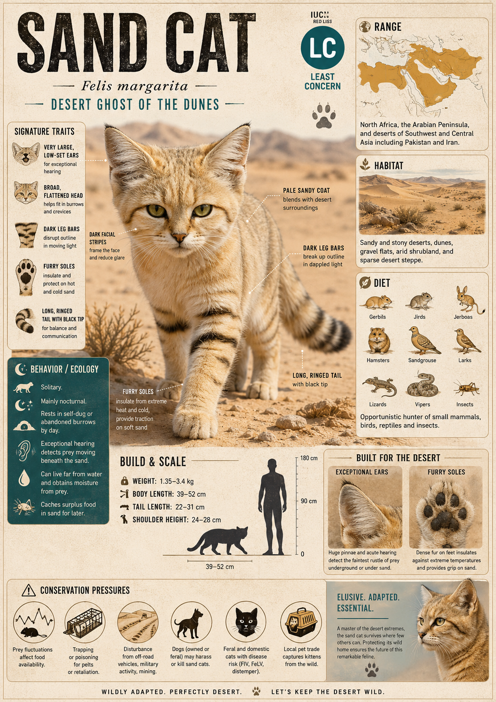

# Sand Cat

> The desert's most unlikely conqueror — a small, wide-eared cat that walks on burning sand no other felid can cross, survives without drinking a single drop of water, and vanishes so completely it eluded researchers for decades.

## 1. Core Identity

- **Common name:** Sand Cat
- **Alternative names:** Sand Dune Cat, Saharan Sand Cat
- **Scientific name:** _Felis margarita_
- **Taxonomic group:** Family Felidae → Subfamily Felinae → Genus _Felis_
- **Lineage:** Felinae (the non-roaring cats); _Felis margarita_ is one of the basal (early-diverging, representing an ancestral branch) members of the _Felis_ genus, sharing a common ancestor with the domestic cat (_Felis catus_) and wildcat (_Felis silvestris_) approximately 3.4–5 million years ago; the earliest fossil evidence of the Sand Cat lineage dates to the Pliocene epoch (5.3–2.6 million years ago)
- **Exhibit role:** Extreme habitat specialist (a species evolved exclusively for one of Earth's harshest environments) and ecological indicator species (a species whose presence reflects the health of an intact, undisturbed desert ecosystem)
- **Main biome:** Extreme desert — sandy, stony, and rocky desert including the Sahara, Arabian Peninsula, and Central Asian sandy deserts (the Karakum and Kyzylkum)
- **Main hunting style:** Nocturnal acoustic (sound-guided) hunter; low-profile stalk with explosive short-range pounce

## 2. Museum Summary

The Sahara by day is a furnace. Sand surface temperatures reach 80°C — hot enough to cook an egg. No water for hundreds of kilometres. No shade but a thin shadow of rock. And yet, resting in a shallow scrape (a body-sized depression dug into the sand) just below the surface, sleeping through the solar peak, lies the Sand Cat: the smallest wild cat in the world of arid extremes, and perhaps the most perfectly engineered predator for conditions that would kill most mammals within hours.

The Sand Cat (_Felis margarita_) is compact and pale — creamy, sandy-buff fur with faint tabby markings that blends so completely into desert terrain that early researchers struggled to locate specimens even standing metres away. Its most immediately striking feature, viewed from the front, is an almost comically wide, flat head dominated by enormous, low-set ears — ears placed so far down the sides of the skull that they broaden the head's apparent width by nearly a third. These ears are not decorative. They are precision instruments: large, funnel-shaped, and capable of detecting the faint subsurface movements of rodents, lizards, and snakes moving beneath the sand — prey that would be invisible and inaudible to any other predator in its environment.

But the Sand Cat's most extraordinary adaptation is beneath the feet, not above the ears. Dense mats of stiff hair cover the entire sole of each paw, creating an insulating barrier between the cat and sand surfaces that reach 80°C in full sun. This same fur layer acts as a grip pad on loose, shifting sand — preventing the cat from sinking and slipping during pursuit. It also erases the cat's tracks nearly completely, leaving only faint brush-marks rather than identifiable paw prints. In combination with a diet-derived water strategy — the Sand Cat extracts virtually all its hydration from the body fluids of its prey and does not need to drink free-standing water at all — these adaptations make the Sand Cat genuinely independent of any surface water source, capable of colonising and persisting in the deepest, driest core of the Sahara and Arabian deserts where no other wild cat can survive.

## 3. Range

- **Continents:** Africa, Asia
- **Countries/regions:** Africa — Morocco, Algeria, Tunisia, Libya, Egypt, Mauritania, Mali, Niger, Chad, Sudan; Middle East — Israel (historical, status uncertain), Jordan, Saudi Arabia, Kuwait, UAE, Oman, Yemen, Iraq; Central Asia — Iran, Afghanistan, Pakistan, Uzbekistan, Turkmenistan, Kazakhstan
- **Range type:** Patchy and discontinuous across an enormous geographic area — the Sand Cat occupies isolated populations in sandy and rocky desert habitats across the Sahara, Arabian Peninsula, and the Central Asian sandy deserts
- **Range notes:** Despite a very wide geographic distribution, the Sand Cat is extremely cryptic (difficult to detect due to secretive behaviour and excellent camouflage) and rarely seen or trapped. Accurate population assessments are almost nonexistent. A 2015–2019 camera-trap study in Morocco documented the first photographic evidence of Sand Cat kittens in the wild — indicating the species was reproducing in study areas where its presence was not even confirmed for decades.

## 4. Habitat

- **Primary habitat:** Sandy desert and erg (vast sea of sand dunes — the Arabic word for a large area of desert dunes) — specifically areas of sparse desert scrub with low sandy ridges and interdune (between-dune) corridors providing prey and shelter
- **Secondary habitat:** Rocky desert (reg — Arabic for stony desert plains), semi-arid stony plateau (hammada — flat, barren rocky desert pavement), desert wadis (seasonal riverbeds, dry for most of the year but supporting patches of vegetation in their banks that attract prey), and edges of arid scrubland at desert margins
- **Climate adaptation:** Extreme thermoregulation (the body's ability to maintain a safe internal temperature) through behavioural means — burrows or occupies natural crevices during the hottest daylight hours; pale sandy coat reflects solar radiation; the dense fur on the paw soles provides critical thermal insulation against superheated sand; the Sand Cat's kidneys produce very concentrated urine (reducing water loss), and it meets its water needs entirely from prey body fluids — a water-independence unique among felids
- **Terrain preference:** Open desert with some low vegetation for concealment during hunting; terrain must support populations of rodents, lizards, and snakes as prey; the species avoids consolidated (compacted, hard-packed) soils that lack burrowing prey and concealment opportunities

## 5. Diet

- **Main prey:** Desert rodents — jirds (_Meriones_ spp.), gerbils (_Gerbillus_ spp.), sand voles, and other small desert-adapted rodents; these provide the primary caloric and hydration intake
- **Secondary prey:** Reptiles — lizards (_Acanthodactylus_ spp., _Uromastyx_ spp.) and snakes including venomous species (the Sand Cat is documented to hunt and kill horned vipers and other venomous desert snakes); insects and arthropods (scorpions, beetles) during periods of prey scarcity; hares (_Lepus capensis_)
- **Hunting method:** Nocturnal acoustic (sound-guided) hunting — the Sand Cat moves slowly and silently across the desert surface, using its low-set, wide-funnel ears to detect the faint vibrations of burrowing and moving prey; upon sound-locating prey, it pinpoints the underground position, digs rapidly with its forepaws (excavation bursts), and delivers a lightning pounce-and-bite; against snakes, it immobilizes the head with rapid, repeated strikes before delivering a killing bite to the skull or neck
- **Feeding ecology:** Solitary hunter and feeder; consumes prey rapidly in the field with little caching behaviour observed; the Sand Cat's ability to extract all required water from prey is an absolute ecological prerequisite for surviving in waterless desert cores — it cannot persist long-term in areas where prey populations are too low to sustain hydration through food alone

## 6. Behaviour / Ecology

- **Social structure:** Solitary; encounters between adults outside the breeding season are brief and typically avoided; males and females occupy overlapping home ranges without territorial aggression during mating season
- **Activity rhythm:** Strictly nocturnal (night-active) and crepuscular (most active at dusk and dawn) in summer; may shift to more diurnal (daytime) activity in winter when surface temperatures are tolerable; spends peak daylight hours resting in burrows (natural or self-excavated), rock crevices, or deep shade
- **Territory:** Home ranges of 16–65 km² have been documented via radio-telemetry (tracking animals using radio-transmitting collars); males' ranges are larger and often overlap multiple female ranges; territorial marking involves scent spraying and cheek rubbing on vegetation and rocks, but confrontation between adults is rarely observed
- **Ecological role:** Desert mesopredator (mid-level predator) regulating small rodent and reptile populations in hyper-arid (extremely dry, receiving less than 25 mm rainfall per year) ecosystems; by suppressing rodent numbers, Sand Cats indirectly protect the sparse desert vegetation (which rodents would otherwise overgraze), making them a genuine trophic regulator (a species that controls the food web below it) in one of Earth's most fragile ecosystems

## 7. Build & Scale

- **Body size:** Head-body length 39–52 cm; tail 23–31 cm; notably low profile — the cat crouches close to the ground; the flat, wide head gives a broader appearance than the body length suggests
- **Weight range:** 1.5–3.4 kg — among the smallest wild cats in the world by weight, though heavily built for its size relative to domestic cats
- **Key proportions:** Extraordinarily wide, flat head — the width from ear tip to ear tip can exceed the head length; ears placed very low on the skull, angled sideways and forward rather than upright; paws covered in dense stiff fur on all surfaces including the sole; body coat uniformly pale buff to sandy grey with faint darker tabby striping on the limbs and face; relatively short, thick tail with 2–3 dark ring bands
- **Movement style:** Low-crouching walk and trot across desert terrain; capable of rapid short-distance sprint (up to approximately 40 km/h) over sandy ground; digs with great speed and efficiency using the front paws; does not climb trees (desert offers little opportunity) but navigates rocky terrain and boulder fields with agility

## 8. Signature Traits

1. **Fur-soled paws:** The Sand Cat possesses one of the most remarkable paw adaptations of any felid — the entire plantar surface (sole and underside of the toes) is covered with a dense mat of stiff, bristle-like fur approximately 1–2 cm thick. This fur provides thermal insulation from sand surfaces reaching 80°C, acts as grip pads on loose unstable sand, and almost completely erases the cat's footprint tracks — a combination of heat protection, locomotion assistance, and near-perfect track erasure found in no other cat species.
2. **Water-free survival:** The Sand Cat is functionally waterless — it does not need to drink free-standing water under normal desert conditions. All required hydration is obtained from the body fluids of prey. This is achieved through a combination of highly efficient kidney function (producing very concentrated urine with minimal water loss), reduced respiratory water loss, and a metabolic water capacity (production of water as a byproduct of metabolising fats and proteins) that sustains the cat in absolute desert with zero standing water sources.
3. **Low-set acoustic ears:** The Sand Cat's dramatically low-set, wide ears — visible from the front as giving the head an almost round, flattened appearance — are positioned to maximise detection of low-frequency ground vibrations produced by prey moving in sand and through burrow tunnels. The large ear pinnae (outer ear structures that collect sound) funnel these vibrations with exceptional precision, allowing the cat to locate and excavate prey it has never seen or smelled — hunting entirely by sound.
4. **Near-perfect camouflage and track erasure:** The Sand Cat's pale, uniformly sandy coat provides visual camouflage (matching background coloration) that is so effective that camera-trap researchers in Morocco described failing to see the cats in photographs even when they knew they were there. Combined with the fur-soled paws that sweep away tracks, the Sand Cat is arguably the most invisible felid in the world in its natural environment — a ghost of the dune fields.

## 9. Conservation

- **IUCN status:** Least Concern (LC) — however, the assessment is severely limited by data deficiency (insufficient population data to accurately assess true status); many authorities consider the Sand Cat significantly data deficient and potentially more threatened than the classification suggests
- **Population trend:** Unknown — no reliable global population estimate exists; likely declining due to habitat degradation, prey depletion, and human encroachment but the data to confirm this are lacking
- **Main threats:** Habitat degradation from overgrazing by domestic livestock (which destroys desert vegetation and collapses prey populations); human persecution (trapping for illegal pet trade — Sand Cats are widely kept illegally due to their appealing appearance); unregulated hunting; prey depletion through rodent poisoning programmes targeting agricultural pests; introduced domestic dogs and cats (which compete with and directly kill Sand Cats); oil infrastructure and military activity disturbing desert habitats in the Arabian Peninsula and Central Asia
- **Conservation notes:** The Sand Cat's extreme crypticity (secretiveness and difficulty of detection) means most surveys simply fail to find it, leading to systematic underdetection (recording fewer individuals than actually exist) in population assessments. A dedicated Sand Cat research programme in Morocco using camera traps began yielding unprecedented population data after 2013. The species' survival in captivity is well documented — Sand Cats breed readily in zoological facilities — but wild population management remains severely hampered by lack of baseline data. The Sand Cat is listed on CITES Appendix II (the Convention on International Trade in Endangered Species — Appendix II means trade is controlled but not prohibited) across its entire range.

## 10. Visual Production Notes

- **Hero poster:** Sand Cat standing on a wind-rippled pale orange sand dune at dusk, its wide flat head prominent in a direct-facing portrait composition, the enormous low-set ears catching the last horizontal slant of sunlight, a vast empty desert horizon receding behind it in ochre and purple twilight
- **Preview card:** Overhead portrait shot from above, showing the Sand Cat's round, flat, wide head with both ears fanned outward — the distinctive head shape that immediately separates it from all other felids; pale buff coat with faint tabby forehead streaks, wide-set amber eyes looking directly upward into the camera
- **Anatomy/trait image:** Detailed scientific illustration of the Sand Cat's paw — lateral (side), plantar (sole), and dorsal (top) views — with labels showing fur mat depth, toe spread capability, and claw position; scale comparison against a domestic cat paw; desert surface temperature annotation showing 80°C sand vs. insulated 37°C paw surface
- **Range map:** Illustrated map spanning North Africa, the Middle East, and Central Asia with the Sand Cat's fragmented range patches shown in pale sandy amber across the Sahara, Arabian Desert, and Karakum/Kyzylkum basins; individual confirmed study sites shown as small vivid gold markers; vast empty grey areas between patches illustrating genuine range uncertainty
- **Hunting scene poster:** Sand Cat mid-excavation in moonlight, front paws blurred in rapid digging motion, pale dune terrain in all directions, a jird (gerbil-like rodent) silhouette visible in the disturbed sand; low angle emphasises the flat body profile pressed close to the sand surface
- **AI prompt (Midjourney/DALL-E style):** "A Sand Cat with enormous wide-set low ears sitting on a pale golden sand dune in the Sahara Desert at night under a star-filled sky, its creamy spotted fur luminous in moonlight, wide flat head facing directly toward the viewer, vast dark desert horizon behind it, cinematic wildlife photography, hyper-detailed fur texture, Nat Geo editorial quality, 16:9 aspect ratio"
- **Conservation panel:** Illustrated infographic showing the Sand Cat's survival stack — five stacked adaptive icons representing: fur-soled paws (heat), water-free diet (hydration), low ears (sound hunting), pale coat (camouflage), and nocturnal schedule (heat avoidance) — each with a brief label; secondary panel showing the gap between IUCN LC classification and true data uncertainty, with icons representing threats

## 11. Internal Links

- [[../01_Taxonomy_and_Evolution/Felidae_Overview.md|Felidae Overview]]
- [[../01_Taxonomy_and_Evolution/Pantherinae_vs_Felinae.md|Pantherinae vs Felinae]]
- [[../03_Exhibit_Modules/Signature_Traits/Melanism_and_Black_Panther.md|Desert Felids Overview]]
- [[../05_Ecology_Comparisons/Desert_and_Dryland_Cats.md|Extreme Habitat Specialists — Desert, Ice, and Cloud Forest Cats]]
- [[../02_Species_Profiles/17_Black_Footed_Cat.md|The Felis Genus — Domestic Relatives in the Wild]]
