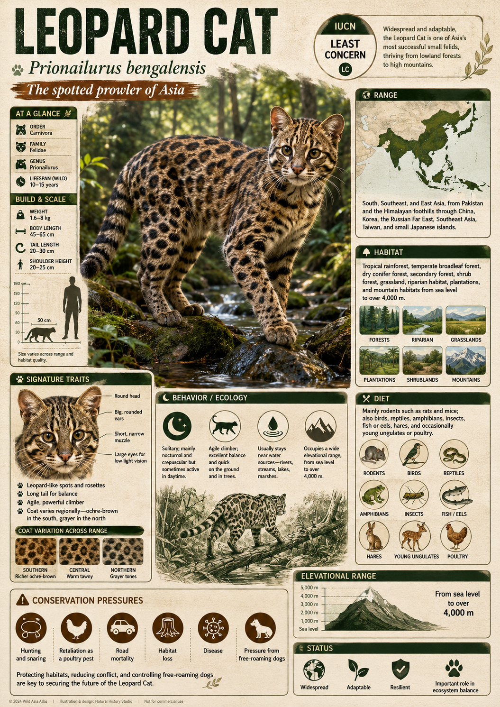
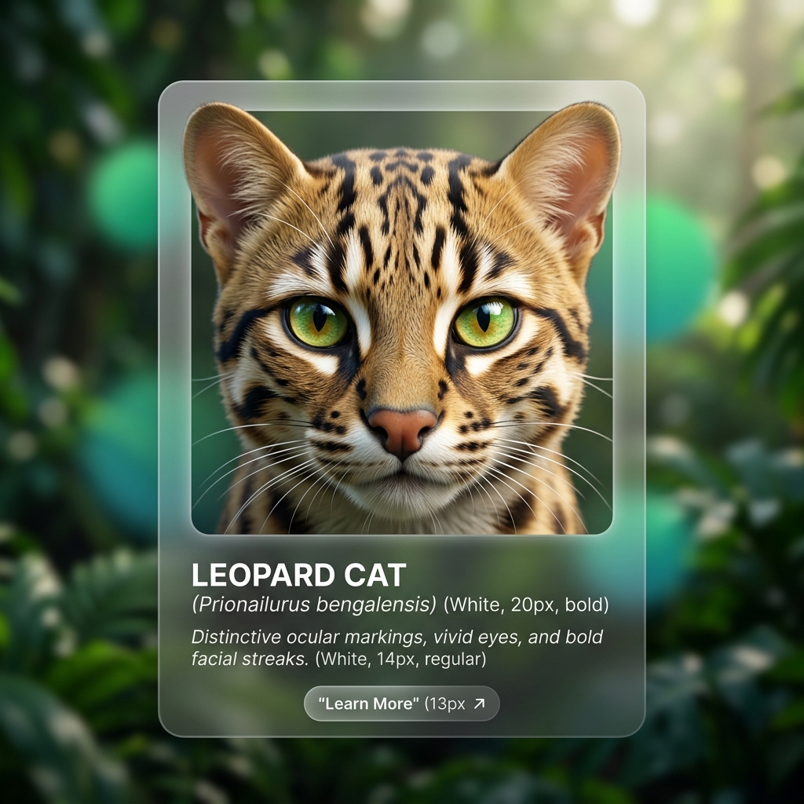
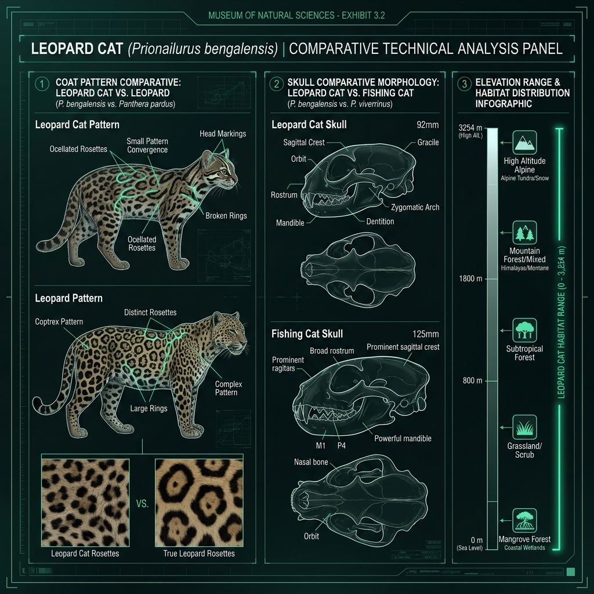
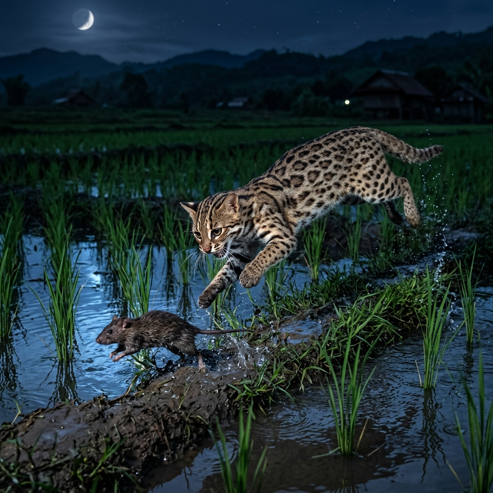
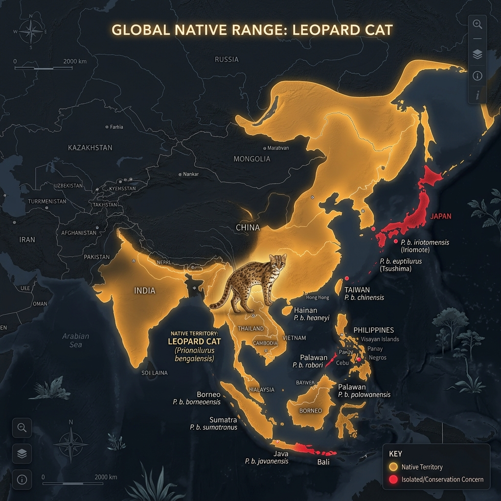

# Leopard Cat

> Asia's spotted ghost — the small, ancient forest cat whose bloodline runs through every domestic Bengal breed alive today.

## 1. Core Identity

- **Common name:** Leopard Cat
- **Alternative names:** Asian leopard cat; _Billi-bagh_ (Hindi); _Maung Kyaung_ (Burmese)
- **Scientific name:** _Prionailurus bengalensis_
- **Taxonomic group:** Family Felidae, Subfamily Felinae, Genus _Prionailurus_
- **Lineage:** Leopard cat lineage; the same _Prionailurus_ clade as the Fishing Cat (_P. viverrinus_) and Flat-headed Cat (_P. planiceps_); direct wild ancestor of the domestic Bengal hybrid breed
- **Exhibit role:** Asia's most widespread small felid; bridge species connecting wild forest ecology and human-modified agricultural landscapes; ancestor of the domestic Bengal cat
- **Main biome:** Tropical and subtropical forests, forest edges, and secondary growth across East, South, and Southeast Asia
- **Main hunting style:** Nocturnal stalk-and-pounce ambush in dense vegetation; an arboreal (tree-using) opportunist equally comfortable hunting in the canopy or on the ground

## 2. Museum Summary

From the mangrove forests of Bangladesh to the temperate pine forests of Siberia's Amur basin, from the teeming lowlands of Java to the high passes of the Himalayas at 3,000 metres, a small spotted cat pads silently through the undergrowth of Asia's most diverse forests. Its coat — a warm tawny or ochreous (golden-yellow) ground colour blanketed in dark brown or black spots arranged in loose rosettes (ring-like clusters of spots, like a reduced version of a leopard's markings) — is not mimicry of its larger namesake. It is an independent evolutionary solution to the same problem: how to disappear in dappled forest light. The Leopard Cat (_Prionailurus bengalensis_) looks like a miniature leopard, moves like smoke, and has quietly become the most geographically successful small felid in all of Asia.

What makes this cat genuinely remarkable is not just its ecological range but its evolutionary legacy. In the 1960s and 1970s, American breeder Jean Mill crossed domestic cats with wild Leopard Cats to create the Bengal breed — a domestic cat that carries the Leopard Cat's spectacular spotted coat, muscular build, and energetic temperament while remaining tame enough for a household. Every Bengal cat alive today — millions of them across the world — carries the genetic imprint of _Prionailurus bengalensis_. The Leopard Cat is thus both a living wild predator and the invisible ancestor woven into domestic living rooms on every continent. It is the only small wild cat in the world that has, through hybridisation (crossbreeding of two different species), successfully contributed its genome to a recognized domestic breed.

In the wild, the Leopard Cat is an ecological generalist (a species that thrives in multiple habitat types rather than specialising in one) of extraordinary adaptability. It hunts small rodents in rice paddies, pursues birds through the branches of tropical hardwood forests, and stalks lizards in secondary growth (regrown forest after clearing) where other cats cannot persist. Its sheer range — covering approximately 40 countries and spanning tropical, subtropical, and temperate zones — makes it the feline equivalent of the red fox in terms of ecological flexibility. Yet this success masks a critical vulnerability: several island subspecies (_P. b. bali_ in Bali, _P. b. sumatranus_ in parts of Sumatra) have been hunted and habitat-lost to the brink of extinction, and even mainland populations face mounting pressure from the wildlife trade that prizes their spotted pelts.

## 3. Range

- **Continents:** Asia
- **Countries/regions:** India, Sri Lanka, Bangladesh, Nepal, Bhutan, Pakistan (eastern), China, Taiwan, Japan (Tsushima Island — the critically endangered _P. b. euptilurus_ subspecies), Korea, Russia (Amur-Ussuri region), Myanmar, Thailand, Laos, Cambodia, Vietnam, Malaysia (Peninsular and Borneo), Indonesia (Sumatra, Java, Bali — with many island subspecies), the Philippines (Palawan and northern islands)
- **Range type:** Extremely broad continuous range across mainland Asia plus multiple island populations, many of which are recognized as distinct subspecies (geographically isolated populations with consistent distinguishing characteristics)
- **Range notes:** At least 12 subspecies are recognized, with island forms often showing more distinct morphology. The Tsushima Leopard Cat (_P. b. euptilurus_) in Japan and the Bali Leopard Cat (_P. b. bali_) are of particular conservation concern. The Amur Leopard Cat represents the northern extreme of the species' range in Russia's frigid Primorsky Krai.

## 4. Habitat

- **Primary habitat:** Tropical and subtropical moist broadleaf forest, including lowland rainforest, montane forest (mountain forest above 1,000 m), and riverine forest (forest along river corridors)
- **Secondary habitat:** Secondary forest (regrown forest after disturbance), bamboo forest, scrubland, agricultural margins and rice paddy edges, mangrove forest fringes, and plantation forest (rubber, oil palm, acacia). Notably tolerant of disturbed and human-modified landscapes.
- **Climate adaptation:** Highly versatile — occupies both humid tropical climates near the equator and cold temperate climates (Russian Far East, with winter temperatures below -30°C) with fur thickness adapting substantially between populations
- **Terrain preference:** Forest cover with dense undergrowth is preferred; the species uses trees extensively for resting, escape, and hunting. Will follow water bodies. Recorded at elevations from sea level up to 3,254 m in the Himalayas.

## 5. Diet

- **Main prey:** Small rodents — rats, mice, and voles form the dietary staple across most of the range. In forest habitats, adds tree squirrels, pikas (small mountain mammals related to rabbits), and forest rats.
- **Secondary prey:** Birds (both ground-nesting and arboreal — tree-living — species), frogs, lizards, snakes, large insects and arthropods (joint-legged invertebrates), bats, fish, and small ungulates (hoofed animals) such as mouse deer fawns
- **Hunting method:** Predominantly stalk-and-pounce from ground level, but regularly climbs trees to pursue squirrels and birds, and is comfortable taking prey from branches. Uses its acute hearing to locate prey under leaf litter and strikes with a rapid forepaw swipe followed by a nape bite (a killing bite to the back of the neck).
- **Feeding ecology:** A flexible mesopredator (a mid-level predator that is both predator and prey in its ecosystem); in agricultural landscapes, plays a significant role in controlling crop-damaging rodent populations — a service with measurable economic value to rice and sugar-cane farmers across Southeast Asia

## 6. Behaviour / Ecology

- **Social structure:** Solitary; adults maintain exclusive or partially overlapping home ranges. Pairs form temporarily during the mating season. Females raise young alone. In areas of high prey density (food abundance), home ranges may compress.
- **Activity rhythm:** Primarily nocturnal (active at night) but shifts to more crepuscular (twilight-active) behaviour in undisturbed habitats; in areas of high human activity, becomes strictly nocturnal to avoid contact
- **Territory:** Home ranges vary enormously with habitat — 1.5–3 km² in productive lowland forest up to 30 km² in marginal habitats. Territory is marked with urine sprays, scratch marks on trees (also used for claw maintenance), and cheek-gland rubbing on prominent features.
- **Ecological role:** An important mesopredator across a vast range; regulates small mammal and bird populations across diverse ecosystem types. In forest ecosystems, its tree-hunting behaviour spreads predation pressure into the arboreal layer, suppressing populations of squirrels and small birds that would otherwise overbrowse vegetation.

## 7. Build & Scale

- **Body size:** Head-body length 44–75 cm; tail 23–44 cm (moderately long). Considerable size variation across the range — Amur populations in Russia are significantly larger than Javan or Sri Lankan individuals.
- **Weight range:** 1.5–8 kg depending on geographic origin and sex; mainland Asian individuals (especially northern) at the heavier end; island populations at the lighter end
- **Key proportions:** Slender, lightly built body; long, lean legs adapted for arboreal movement (climbing and jumping in trees); relatively small, pointed head with white spots above each eye (tear-streak markings); two or four dark streaks running from the eyes to the crown of the head are characteristic.
- **Movement style:** Fluid, agile, and highly three-dimensional — equally at home on the ground, in dense undergrowth, or moving through the canopy branches. Jumps with precision and speed; a capable swimmer when necessary.

## 8. Signature Traits

1. **Rosette coat pattern:** The Leopard Cat's fur carries dark spots that frequently merge into partial rosettes (ring-like clusters of spots enclosing a lighter centre), a convergent (independently evolved, not copied from) version of the full leopard's pattern. The ground colour shifts dramatically across the range — vivid tawny orange in tropical populations, pale greyish-buff in colder northern individuals — a phenotypic (visually expressed) adaptation to local light environments.
2. **White ocular spots:** Two highly distinctive white spots, one above each eye on the inner brow, are present in all individuals and serve as a species-recognition signal in low light. The theory — supported by field observation — is that these mimic eyes when the cat is crouching in darkness, potentially deterring threats approaching from behind.
3. **Exceptional vertical range:** No other small felid occupies as wide an altitudinal gradient (range of elevations). The Leopard Cat hunts near sea level in the Sundarbans mangroves and tracks pikas (small herbivores related to rabbits) near permanent snowlines at over 3,000 m in the Himalayas — a climatic versatility matched by very few carnivores of any family.
4. **Ancestor of the Bengal breed:** The Leopard Cat is the only wild small felid whose genome has been deliberately incorporated into a domestic cat breed. F1 Bengal hybrids (first-generation crosses between a Leopard Cat and a domestic cat) are partially wild; modern Bengal pets are typically F4 or later — generations removed from the wild ancestor — but carry its distinctive coat and athleticism.

## 9. Conservation

- **IUCN status:** Least Concern (LC) for the species overall — assessed 2022; however, multiple island subspecies are Critically Endangered (facing extremely high risk of extinction in the wild), including _P. b. bali_ (Bali) and the Tsushima population in Japan
- **Population trend:** Stable to decreasing depending on region; mainland populations relatively stable but island subspecies declining sharply
- **Main threats:** Habitat destruction (deforestation for palm oil, rubber, and agriculture); hunting for the fur trade (particularly significant in China and Russia historically); persecution by poultry farmers; collection for the illegal pet trade (cubs sold as 'exotic pets'); road mortality; and invasive species competition on islands
- **Conservation notes:** Listed on CITES Appendix II (international trade regulated). Japan runs an intensive recovery programme for the Tsushima Leopard Cat, including captive breeding and road-crossing infrastructure (wildlife bridges and underpasses). In China, the species is protected under the National Key Protected Wildlife Law. The Bengal domestic breed has inadvertently raised public awareness of the wild Leopard Cat but has also created demand for wild-hybrid pets, which drives illegal capture.

## 10. Visual Production Notes

- **Hero poster:** A Leopard Cat frozen mid-stalk on a mossy jungle branch, one paw extended forward, dark rosette pattern vivid against a warm tawny coat, the dense green of a Southeast Asian rainforest canopy out of focus behind it. Dappled light. Golden-hour colour palette.
- **Preview card:** Close facial portrait emphasising the distinctive white ocular spots above each eye and the bold dark facial streaks. The eyes are brilliant greenish-yellow. Background: blurred green jungle. The image should feel simultaneously wild and eerily domestic.
- **Anatomy/trait image:** Comparative diagram panel: (1) Leopard Cat coat pattern vs. true Leopard coat (showing rosette convergence); (2) skull comparison with Fishing Cat; (3) elevation range infographic bar showing sea level to 3,254 m with habitat icons.
- **Range map:** Large Asia-Pacific map with the species' continuous mainland range shaded warm amber; isolated island populations shown as highlighted dots with subspecies labels. Japan, Bali, and Palawan highlighted in a distinct conservation-concern red.
- **Hunting scene poster:** Nighttime rice paddy scene — the Leopard Cat mid-pounce onto a brown rat between flooded paddy rows, moonlight shimmering on the water, the cat's spotted coat luminous in the blue-silver light. Shows its role as an agricultural pest controller.
- **AI prompt (Midjourney/DALL-E style):** _"A Leopard Cat (Prionailurus bengalensis) perched on a mossy rainforest branch at dusk, Southeast Asian tropical forest background, rich tawny coat with bold dark rosettes, piercing yellow-green eyes, characteristic white eyebrow spots clearly visible, sleek and alert posture, one paw dangling elegantly, hyper-realistic wildlife photography style, 85mm portrait lens, shallow depth of field, warm dappled light filtering through jungle canopy, National Geographic aesthetic, jewel-tone greens and burnt amber colour palette"_
- **Conservation panel:** Three-panel strip — (1) wild Leopard Cat in pristine forest; (2) a Bengal domestic cat in a home (showing the genetic connection, with a caption explaining the lineage); (3) a deforested palm oil landscape with a 'CRITICALLY ENDANGERED — Island subspecies' warning overlay. Text: _"One species, two worlds — and a shared future at risk."_

## 11. Visual Production Exhibits

This section showcases the native Antigravity AI generations for the Visual Production.

### 🪪 Preview Card

### 🧬 Anatomy Traits

### 🎬 Hunting Scene

### 🗺️ Range Map

## 12. Internal Links

- [[../01_Taxonomy_and_Evolution/Felidae_Overview.md|Felidae Overview]]
- [[../01_Taxonomy_and_Evolution/Pantherinae_vs_Felinae.md|Pantherinae vs Felinae]]
- [[../02_Species_Profiles/16_Fishing_Cat.md|Fishing Cat — Prionailurus viverrinus (Prionailurus lineage cousin)]]
- [[../02_Species_Profiles/24_Flat_Headed_Cat.md|Flat-headed Cat — Prionailurus planiceps (Prionailurus lineage cousin)]]
- [[../05_Ecology_Comparisons/Arboreal_Cats.md|Ecology Comparison: Asian Forest Felids]]
- [[../05_Ecology_Comparisons/Wetland_and_Grassland_Cats.md|Ecology Comparison: Wetland Specialists]]
