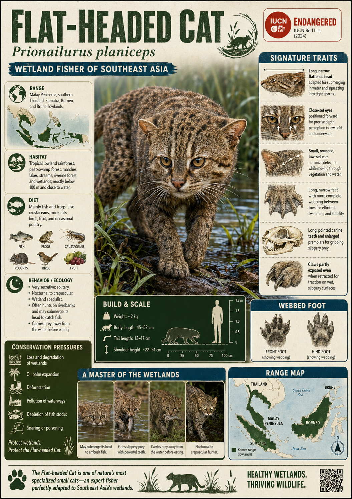

# Flat-headed Cat

> Evolution pressed this cat's skull into a wedge, webbed its paws, and sent it hunting underwater — producing one of the most bizarre and least-known felids alive.

## 1. Core Identity

- **Common name:** Flat-headed Cat
- **Alternative names:** _Kucing Hutan_ (Malay, meaning "forest cat"); no widely used alternative English name
- **Scientific name:** _Prionailurus planiceps_
- **Taxonomic group:** Family Felidae, Subfamily Felinae, Genus _Prionailurus_
- **Lineage:** Leopard cat lineage (_Prionailurus_ clade); closely related to the Fishing Cat (_P. viverrinus_) and Leopard Cat (_P. bengalensis_); the most morphologically (structurally) extreme member of the genus
- **Exhibit role:** Among the most specialised felids alive; a semi-aquatic (partially water-living) river hunter pushed to the absolute edge of what a cat's body plan can become
- **Main biome:** Lowland tropical rainforest rivers, forest streams, and mangrove-fringed waterways of Sundaland (the biogeographic region encompassing Sumatra, Borneo, the Malay Peninsula, and their surrounding islands)
- **Main hunting style:** Subaquatic (underwater) pursuit; the cat fully submerges its head and forequarters to seize fish and frogs from shallow riverbeds and stream margins

## 2. Museum Summary

Somewhere along a dark, root-tangled stream deep in the rainforests of Borneo, a creature is crouching at the water's edge that looks less like a cat and more like a river-adapted otter wearing a feline disguise. Its skull is long, low, and dramatically flattened — not rounded and domed like any other cat you have ever seen, but pressed almost parallel to the ground, as if the skull were a wide-bladed trowel. Its eyes sit high on that flat skull, angled slightly upward — oriented to watch above the waterline while the snout is submerged. And then it moves. It slides its entire head and forequarters into the current and, without hesitation, seizes a small fish from the streambed with teeth designed for a grip nothing slippery can escape. The Flat-headed Cat (_Prionailurus planiceps_) is not just a cat that tolerates water. It is a cat that the river has remade.

Of all the world's felids, the Flat-headed Cat represents the furthest anatomical (structural) departure from the standard cat body plan. Every feature speaks to its life in and around fast-moving water. The skull is elongated and dorsoventrally compressed (flattened from top to bottom) — the lowest profile of any living felid — allowing the head to enter shallow water without disturbing the surface. The eyes are positioned high and close to the midline (the centre of the face), providing binocular (two-eyed, depth-perceiving) vision downward into the water while the face is partially submerged. The teeth are unusual: the premolars (the sharp shearing teeth behind the canines) are enlarged and point backward, forming a trap-like grip that prevents slippery, struggling fish and frogs from escaping once seized. The claws are non-retractable (permanently extended, like a dog's) — a trait shared only with the Cheetah among all felids — and the forepaws are extensively webbed between the toes, providing propulsive grip on submerged rocks and pebbles.

Despite these extraordinary specialisations, almost nothing is known about this cat's behaviour in the wild. It is rarely photographed, almost never observed directly, and has never been radio-tracked (monitored via a collar-mounted GPS transmitter) for more than a few weeks in any published study. The Flat-headed Cat appears to be genuinely uncommon even in pristine habitat — its extreme dependence on clean, fish-rich forest rivers makes it one of the most ecologically constrained (narrowly dependent on specific conditions) felids alive. It is also, correspondingly, one of the most threatened. Across Sumatra, Borneo, and the Malay Peninsula, rivers are being poisoned by gold-mine runoff (mercury and cyanide contamination from artisanal and industrial gold extraction), polluted by agricultural fertiliser and palm oil mill effluent (liquid waste from oil processing), and stripped of forest cover by logging. A cat built around the health of a pristine river has no reserve strategy when that river dies.

## 3. Range

- **Continents:** Asia
- **Countries/regions:** Sumatra (Indonesia), Borneo (shared between Indonesia, Malaysia, and Brunei), Peninsular Malaysia (confirmed south of the Isthmus of Kra), southern Thailand (unconfirmed; a few historical records). Possibly Bangka Island (Indonesia).
- **Range type:** Restricted; confined to Sundaland — a geologically recent (Pleistocene-era, within the last 2.6 million years) land mass that connected the Malay Peninsula and the large Sunda Islands during periods of lower sea level
- **Range notes:** All records are closely associated with lowland rivers and streams below 600 m elevation. Camera-trap records are sparse and widely scattered. The species is almost certainly extirpated (locally extinct) from most of its former range in Peninsular Malaysia. Borneo's interior river systems are considered the current stronghold.

## 4. Habitat

- **Primary habitat:** Banks of lowland forest rivers, forest streams, and oxbow lakes (crescent-shaped lakes formed from isolated river meanders); also recorded along mangrove creek systems near the coast
- **Secondary habitat:** Fish ponds adjacent to forest, flooded forest interior during seasonal inundation (flooding), and occasionally the banks of degraded rivers if some forest cover and fish stocks remain
- **Climate adaptation:** Adapted entirely to the equatorial (near the equator, uniformly hot and wet year-round) climate of Sundaland; no evidence of any adaptation to dry or seasonal conditions. Requires continuous access to fish-bearing water.
- **Terrain preference:** Flat or gently sloping lowland terrain; almost never recorded above 600 m. Extremely sensitive to water quality — absent from heavily polluted or silted (sand-and-sediment-choked) rivers. Substrate preference (preferred riverbed material) appears to be smooth pebble and cobble, which supports the fish species it preys upon.

## 5. Diet

- **Main prey:** Fish — likely small to medium riverine fish including cyprinids (carp-family species, the most diverse freshwater fish family in Asia) and gobies; frogs and tadpoles
- **Secondary prey:** Crustaceans (freshwater crabs and crayfish), small aquatic mammals, lizards, and possibly large aquatic invertebrates including freshwater molluscs (snails and bivalves)
- **Hunting method:** The primary method is subaquatic head-plunge hunting — the cat wades into shallow water and submerges its head to pursue and seize fish from the streambed or midwater column. It uses its non-retractable claws for grip on slippery substrates while lunging. May also use shoreline pouncing (launching from the bank onto fish visible near the surface) and wading pursuit (slowly walking through shallow water to herd fish into shallows).
- **Feeding ecology:** An extreme piscivore (fish-specialist — an animal deriving the vast majority of its diet from fish); among all felids, likely the most fish-dependent after the Fishing Cat. Its teeth — especially the backward-angled premolars (shearing teeth positioned behind the canines) — suggest adaptation to processing struggling aquatic prey that would otherwise escape forward.

## 6. Behaviour / Ecology

- **Social structure:** Assumed solitary based on felid norms and the few fragmentary observations available; no confirmed data on group behaviour or male-female range overlap. Home range size is entirely unknown from field studies.
- **Activity rhythm:** Presumed primarily nocturnal (active at night) based on camera-trap data showing the overwhelming majority of detections (recorded sightings on motion-activated cameras) occurring after dark; one of the least-observed felids during daylight hours
- **Territory:** Entirely unknown in quantitative terms. Almost no GPS or radio telemetry (movement-tracking via collar-mounted transmitters) data exist from wild individuals. Territorial marking (scent and scratch posting) is assumed but unstudied.
- **Ecological role:** A highly specialised apex aquatic predator (the top fish-hunting predator within its river ecosystem) within forest river food webs; almost certainly an indicator species (a species whose presence signals the health of the ecosystem it inhabits) for clean, fish-rich, forested rivers. Its presence likely signals a functioning lowland river ecosystem with adequate aquatic biodiversity.

## 7. Build & Scale

- **Body size:** Head-body length 41–50 cm; tail 13–15 cm (the shortest tail relative to body length of any _Prionailurus_ species — a feature common to semi-aquatic specialists who need less tail-length for balance and more streamlining)
- **Weight range:** 1.5–2.5 kg; among the lightest members of its genus, despite being a fully committed aquatic hunter
- **Key proportions:** The head is the defining feature — long (front-to-back), narrow (side-to-side), and dramatically flattened (top-to-bottom), making the skull appear almost wedge-shaped when viewed from the side. Eyes are small, positioned high on the skull, and slightly convergent (angled inward), providing binocular overlap below the face. Ears are small and low-set. Legs are short. Body is elongated and sausage-like relative to leg length.
- **Movement style:** Deliberate and low-slung on land; in water, moves with unexpected power and control. The non-retractable claws grip wet surfaces effectively. Likely an adept shallow-water wader and short-distance underwater lunger rather than a long-distance open-water swimmer like the Fishing Cat.

## 8. Signature Traits

1. **Dramatically flattened skull:** The Flat-headed Cat's skull is so radically dorsoventrally compressed (flattened from the top downward) that the animal is immediately identifiable from above. This flattening allows the head to be inserted into shallow water at a low angle — minimising surface disturbance and maximising subaquatic (below-the-surface) vision — a convergent (independently evolved) solution to the same problem faced by herons and kingfishers.
2. **Non-retractable claws:** The Flat-headed Cat cannot sheath its claws into protective folds of skin as most felids do. The claws remain permanently extended, like a cheetah's or a dog's — providing constant grip on wet, moss-covered rocks and pebbly riverbeds while hunting underwater. This is one of only two known cases of non-retractability among the living felids (the cheetah being the other).
3. **Backward-pointing premolar teeth:** The premolars (shearing teeth set behind the canines) are enlarged and angled backward — pointing toward the throat rather than straight down. This tooth orientation creates a ratchet-like trap: prey can enter (toward the throat) but cannot push back out. A fish seized mid-body cannot flip forward and escape. It is a unique dental modification found in no other felid.
4. **Extensive paw webbing:** The forepaws carry more extensive interdigital webbing (skin connecting the toes) than those of the Fishing Cat — the most of any felid. This webbing functions as a paddle surface during underwater lunges and as a gripping platform on slippery substrate. Combined with the non-retractable claws, it gives the cat an almost otter-like purchase (grip) on wet surfaces.

## 9. Conservation

- **IUCN status:** Endangered (EN) — assessed 2015, due for reassessment
- **Population trend:** Decreasing; total population estimated at fewer than 2,500 mature individuals, possibly substantially fewer; no reliable census data exist
- **Main threats:** Deforestation from logging and palm oil and rubber plantation expansion (eliminates the riparian forest — forest along river banks — the cat requires for shelter and hunting); river pollution from artisanal gold mining (mercury and cyanide contamination that kills fish populations), agricultural runoff (fertiliser and pesticide contamination), and palm oil mill effluent; illegal fishing (depletion of the fish prey base using nets, poison, and electric stunning); road mortality; and incidental snaring in traps set for other species
- **Conservation notes:** Listed on CITES Appendix I (the highest level — all commercial international trade banned). Protected by national law in all three range countries (Indonesia, Malaysia, Thailand). The Cat Specialist Group (IUCN SSC) identifies it as a data-deficient priority — meaning conservation planning is severely hampered by the almost total absence of field data on population size, range use, and behaviour. Camera-trap surveys in Borneo's Kinabatangan floodplain (Malaysia) and Sumatra's Berbak-Sembilang National Park represent current frontline research. Ex-situ (captive) populations are extremely small; captive breeding has not been achieved successfully in most institutions.

## 10. Visual Production Notes

- **Hero poster:** The Flat-headed Cat crouched at the edge of a dark, root-tangled Bornean forest river at night, its entire head and forequarters submerged in the illuminated water, a small fish visible in the glow just inside its jaws. Underwater camera perspective from below, looking up through the surface at the cat's plunging face. Otherworldly, surreal, cinematic.
- **Preview card:** Close side-profile portrait showing the dramatically flattened skull from the side — long, wedge-like, low-slung. Eyes positioned high, wet fur clinging to the face, small rounded ears, water droplets on the chin whiskers. Background: blurred green forest reflections in dark water. The image should communicate "not quite a cat."
- **Anatomy/trait image:** Scientific comparison infographic — (1) skull profile silhouettes of Flat-headed Cat vs. Leopard Cat vs. domestic cat at same scale (showing progressive flattening); (2) paw webbing comparison between Flat-headed Cat, Fishing Cat, and a non-specialist felid (three panels); (3) dental diagram showing the backward-angled premolars with directional arrow annotation.
- **Range map:** Sundaland map centred on Borneo, Sumatra, and the Malay Peninsula; species range shown as fragmented river-corridor polygons in deep teal against a forest-green land background; rivers highlighted in silver. Conservation status stamp overlaid: "ENDANGERED."
- **Hunting scene poster:** Underwater perspective looking up through a clear forest stream: the cat's flat face and extended webbed paw visible above the water surface, breaking through into the underwater world, reaching toward a startled cyprinid fish. Bioluminescent-quality light refracting through the water surface. Hyper-realistic digital art style.
- **AI prompt (Midjourney/DALL-E style):** _"A Flat-headed Cat (Prionailurus planiceps) at the edge of a dark Bornean rainforest stream at night, plunging its dramatically flattened, elongated head into clear shallow water to catch a small fish, non-retractable claws gripping the mossy riverbank stones, webbed forepaws partially submerged, reddish-brown spotted fur glistening with water, high-set eyes catching green reflected light, hyper-realistic wildlife photography style, split-view waterline composition (half above water, half below), rich dark teal and forest green palette, National Geographic quality, 16mm wide angle"_
- **Conservation panel:** Split composition — left: pristine Bornean forest river with the cat silhouetted against reflected stars; right: the same river brown with mining silt and palm oil effluent foam, the cat absent. Text: _"The most specialised cat alive depends on the cleanest rivers. We are poisoning both."_ A stark, minimalist palette shift from deep jewel-greens to industrial ochre.

## 11. Deep Dive Exhibits

- [[../03_Exhibit_Modules/Behavior_and_Ecology/24_Flat_Headed_Cat_Behavior_and_Ecology.md|Behavior and Ecology]]
- [[../03_Exhibit_Modules/Build_and_Scale/24_Flat_Headed_Cat_Build_and_Scale.md|Build and Scale]]
- [[../03_Exhibit_Modules/Conservation/24_Flat_Headed_Cat_Conservation.md|Conservation]]
- [[../03_Exhibit_Modules/Diet_and_Hunting/24_Flat_Headed_Cat_Diet_and_Hunting.md|Diet and Hunting]]
- [[../03_Exhibit_Modules/Range_and_Habitat/24_Flat_Headed_Cat_Range_and_Habitat.md|Range and Habitat]]
- [[../03_Exhibit_Modules/Signature_Traits/24_Flat_Headed_Cat_Signature_Traits.md|Signature Traits]]

## 12. Internal Links

- [[../01_Taxonomy_and_Evolution/Felidae_Overview.md|Felidae Overview]]
- [[../01_Taxonomy_and_Evolution/Pantherinae_vs_Felinae.md|Pantherinae vs Felinae]]
- [[../02_Species_Profiles/16_Fishing_Cat.md|Fishing Cat — Prionailurus viverrinus (fellow semi-aquatic Prionailurus specialist)]]
- [[../02_Species_Profiles/23_Leopard_Cat.md|Leopard Cat — Prionailurus bengalensis (Prionailurus lineage cousin)]]
- [[../05_Ecology_Comparisons/Wetland_and_Grassland_Cats.md|Ecology Comparison: Wetland Specialists]]
- [[../05_Ecology_Comparisons/Arboreal_Cats.md|Ecology Comparison: Asian Forest Felids]]
