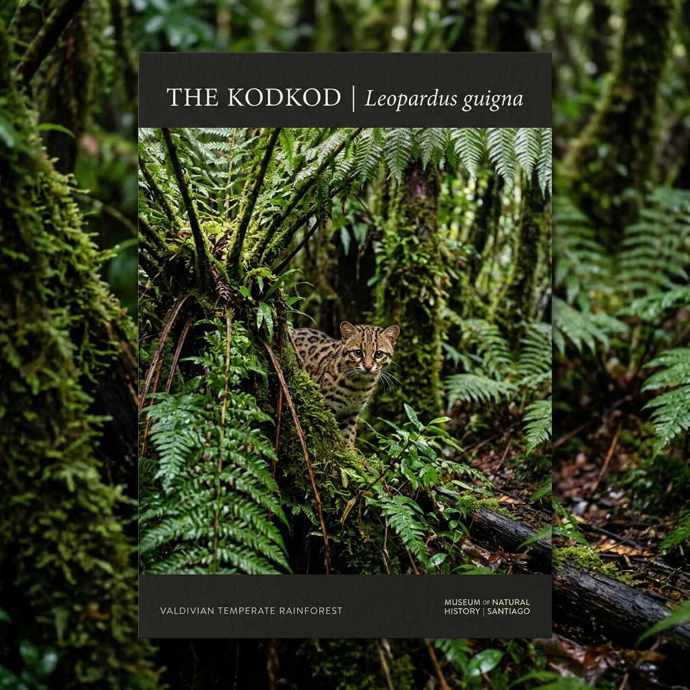
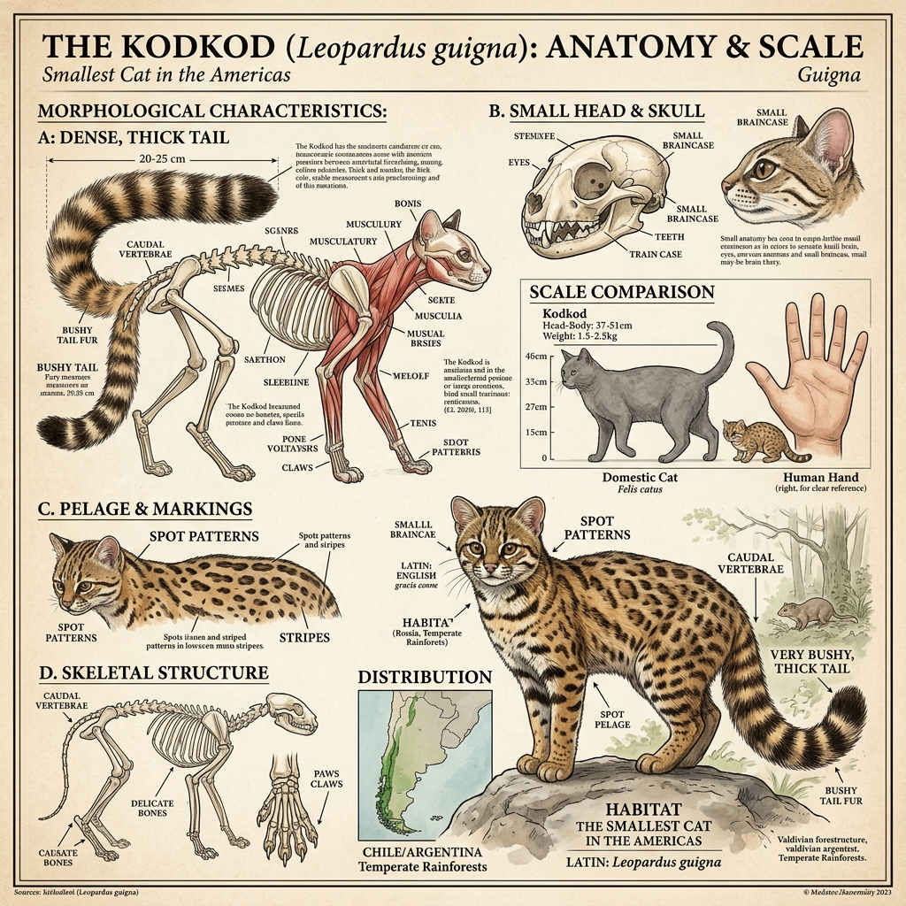
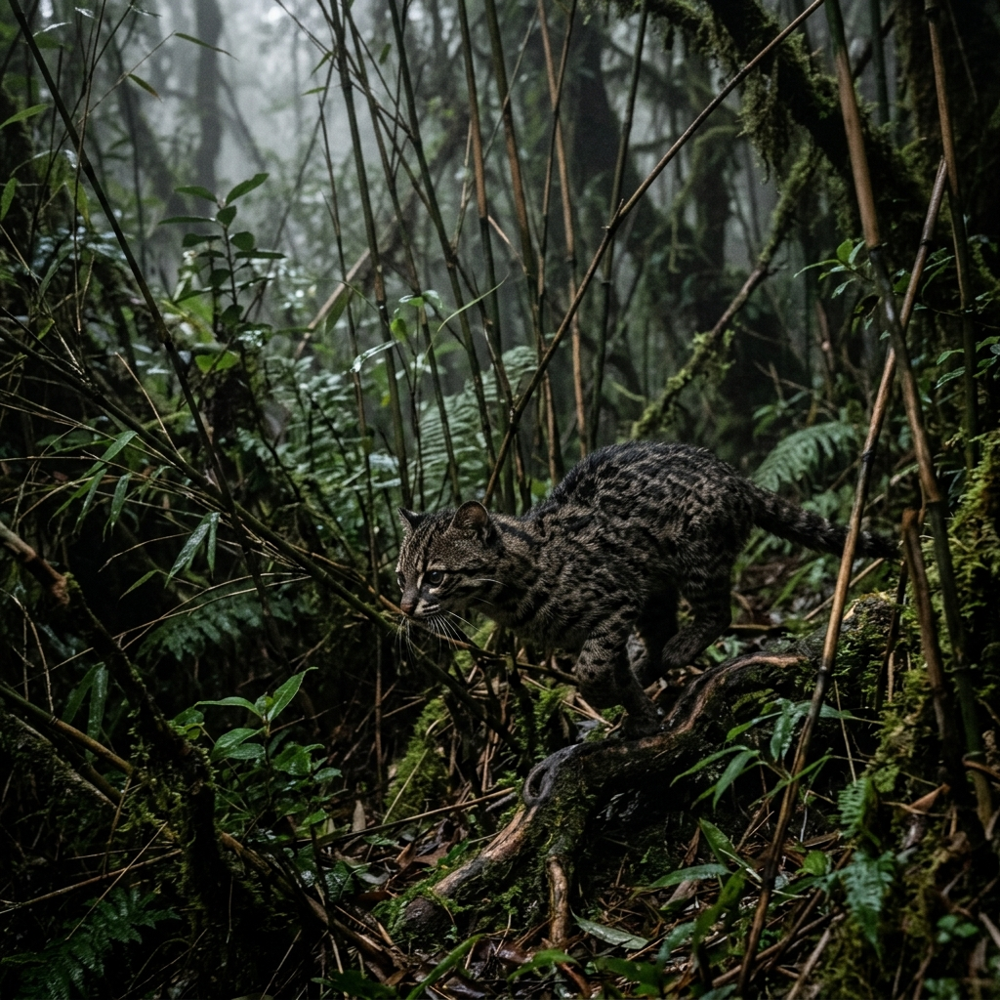
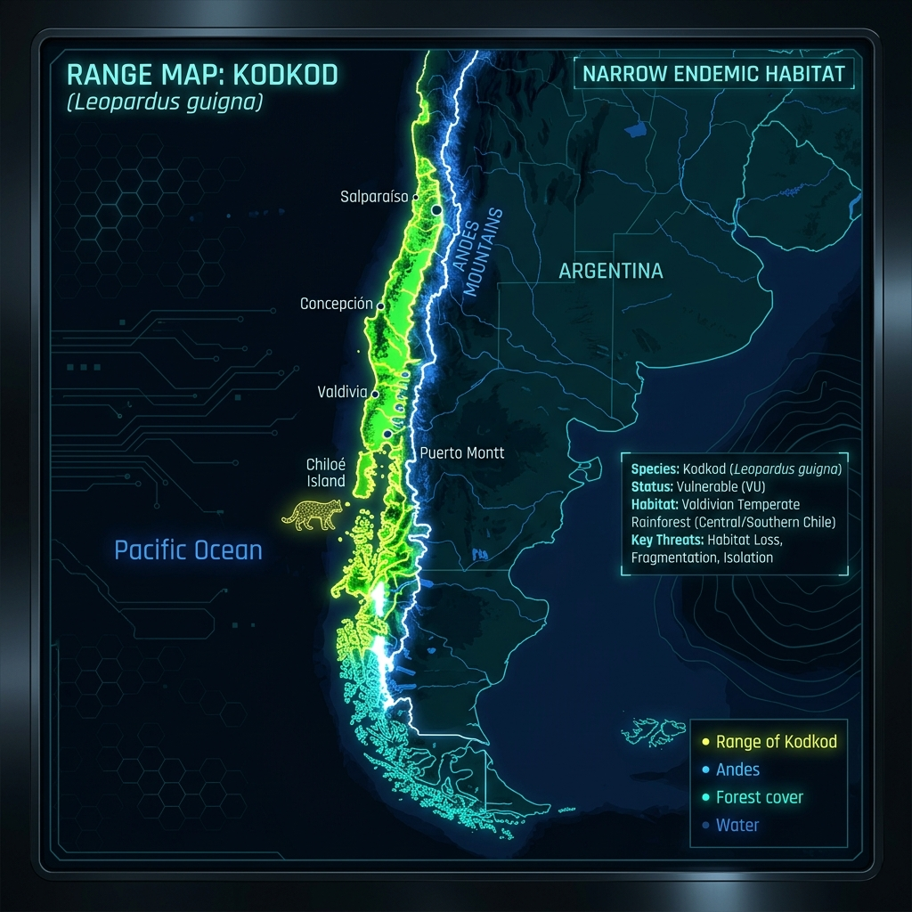

# Kodkod

> The phantom of the Valdivian rainforest, hiding deep within the ancient, moss-draped trees of Chile.

## 1. Core Identity

- **Common name:** Kodkod
- **Alternative names:** Güiña, Chilean Cat
- **Scientific name:** _Leopardus guigna_
- **Taxonomic group:** Felinae, Leopardus
- **Lineage:** Ocelot lineage
- **Exhibit role:** The Phantom of the Rainforest
- **Main biome:** Moist temperate forests (Valdivian)
- **Main hunting style:** Ground and arboreal stalk

## 2. Museum Summary

The kodkod—or _güiña_ in its native Chile—is the smallest wild cat in the Americas, barely larger than a guinea pig. It is a phantom of the ancient, mist-shrouded Valdivian temperate rainforests. With its heavily spotted coat and thick, bushy tail, the kodkod navigates a complex, three-dimensional world of dense bamboo thickets, giant ferns, and moss-draped southern beech trees. Despite its diminutive size, it is a ferocious predator, capable of scaling massive trunks to raid bird nests or plunging into the dark underbrush to hunt elusive forest rodents. Because it is so secretive and bound to such a specific, shrinking habitat, it remains one of the least understood and most vulnerable felines in the world.

## 3. Range

- **Continents:** South America
- **Countries/regions:** Central and southern Chile, with a marginal presence in bordering Argentina.
- **Range type:** Extremely restricted.
- **Range notes:** The smallest distribution of any wild cat in the Americas.

## 4. Habitat

- **Primary habitat:** Valdivian temperate rainforests, evergreen forests.
- **Secondary habitat:** Dense shrublands (matorral) and secondary forests.
- **Climate adaptation:** Adapted to cool, wet, and highly humid temperate environments.
- **Terrain preference:** Requires dense understory cover (like Chusquea bamboo) to survive.

## 5. Diet

- **Main prey:** Small terrestrial rodents and ground-dwelling birds (like the Chucao tapaculo).
- **Secondary prey:** Insects and reptiles.
- **Hunting method:** Terrestrial stalking through thick vegetation; occasional arboreal ambush.
- **Feeding ecology:** Highly dependent on the unique micro-fauna of the Chilean temperate rainforest.

## 6. Behaviour / Ecology

- **Social structure:** Solitary.
- **Activity rhythm:** Primarily nocturnal (night-active) and crepuscular (twilight-active).
- **Territory:** Very small home ranges (1-2.5 square kilometers), fiercely defended against intruders.
- **Ecological role:** Specialized micro-predator controlling local rodent populations.

## 7. Build & Scale

- **Body size:** 37–51 cm (15–20 in).
- **Weight range:** 1.5–3 kg (3.3–6.6 lbs).
- **Key proportions:** The smallest cat in the Americas; thick, bushy tail and relatively large feet for climbing.
- **Movement style:** Quick, darting movements through dense thickets.

## 8. Signature Traits

- **Extreme Miniaturization:** Weighing as little as 1.5 kg, the kodkod evolved its tiny size to perfectly navigate the impenetrable bamboo thickets of its native forests.
- **Arboreal Refuge:** When threatened by terrestrial predators (like domestic dogs or foxes), they will immediately scramble high into the canopy and wait motionless.
- **Melanism:** Black (melanistic) kodkods are relatively common, particularly in the dense, light-starved southern forests where dark fur offers superior camouflage.

## 9. Conservation

- **IUCN status:** Vulnerable (VU)
- **Population trend:** Decreasing.
- **Main threats:** Massive logging of the Valdivian rainforest, conversion to pine plantations, and predation by domestic dogs.
- **Conservation notes:** The kodkod's entire existence is tied to one of the most threatened forest ecosystems on Earth.

## 10. Visual Production Notes

- **Preview Card:** A tiny, heavily spotted kodkod peering out from behind a massive, moss-covered fern.
- **Anatomy Poster:** Emphasize its incredibly small scale and bushy, thick tail.
- **Hunting Scene:** A kodkod darting through a dense stand of bamboo in a misty, dark forest.
- **Range Map:** Showing its extremely narrow, restricted range along the coast of Chile.

## 11. Visual Production Exhibits

## 12. Internal Links

[[../01_Taxonomy_and_Evolution/Cat_Lineages_Overview.md|Ocelot Lineage]]
[[../05_Ecology_Comparisons/Big_Cats_vs_Small_Cats.md|Small Cats]]
