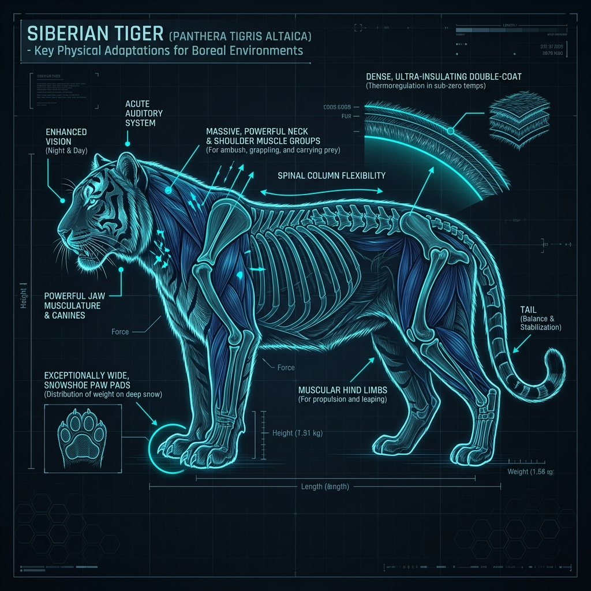

# Siberian Tiger – Build and Scale

## Overview

> A biological engine of pure power, wrapped in a pale orange coat of armor designed to deflect the freezing Siberian winds.

The physical morphology (form and structure) of the Siberian Tiger (_Panthera tigris altaica_) represents the extreme edge of feline evolution, adapted to survive and hunt in a sub-arctic climate.

## Key Information

- **Mass and Dimensions:** Generally considered the largest living wild cat. Males can exceed 300 kg (660 lbs) and reach up to 3.3 meters (10.8 ft) in total length.
- **Skull Morphometrics:** Max skull size for males ranges from 331–383 mm.
- **Bite Force:** Estimated at ~1050 PSI, capable of easily crushing the cervical vertebrae (neck bones) of a large wild boar.
- **Cold Adaptations:**
  - Possesses an exceptionally thick winter coat.
  - Maintains a thick subcutaneous (under the skin) fat layer on its flanks and belly.
  - Features wide, fur-covered paws that act as natural snowshoes.

## Interpretation and Comparisons

In accordance with Bergmann's rule (a principle stating that populations in colder climates tend to have larger body sizes), the Siberian tiger is bulkier and heavier than its tropical counterparts. Its stripes are also paler and fewer in number compared to the Bengal tiger, blending better with the snow-dusted, pale birch forests of its home.

## Visuals and Assets

_(Note: A 3D model placeholder is also linked in the main profile.)_

## References

- Mazák, V. (1981). _Panthera tigris_. Mammalian Species.
