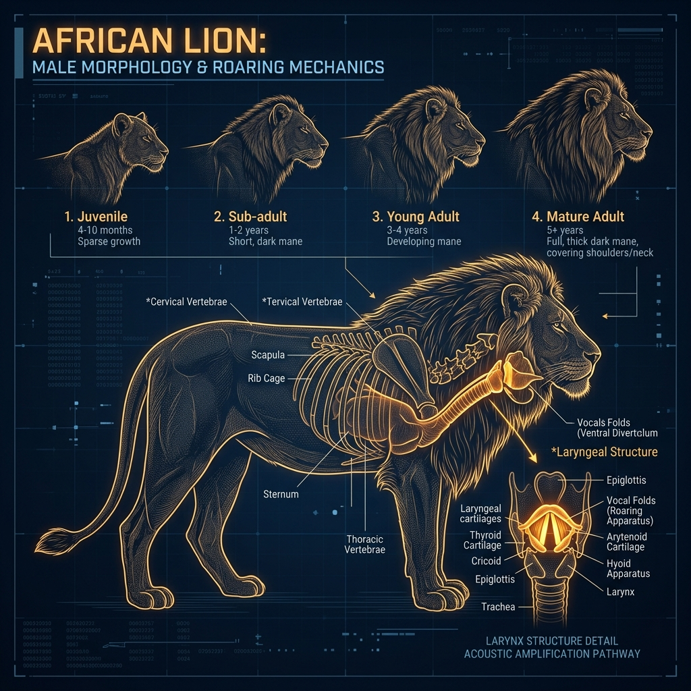

# African Lion – Build and Scale

## Overview

> A massive, heavy-chested brawler engineered for violent takedowns and fierce territorial combat.

The morphology of the African Lion (_Panthera leo_) is highly sexually dimorphic (males and females look drastically different) and optimized for two distinct roles: hunting for the females, and combat for the males.

## Key Information

- **Mass and Dimensions:** Males weigh 150–250 kg (330–550 lbs) and females weigh 120–182 kg (265–400 lbs).
- **Skull Morphometrics:** Designed for incredible structural integrity. When a lion bites down, the skull acts as a unified, rigid block to withstand the thrashing of a massive buffalo.
- **Bite Force:** Roughly 650–1,000 PSI. Armed with 30 specialized teeth and upper canines that can reach up to 10 cm (4 inches).
- **Musculature:** The forequarters (shoulders and chest) are incredibly heavily muscled, giving them the strength to pull down running prey with their dewclaws.

## Interpretation and Comparisons

Unlike the sleek, low-slung cheetah built for speed, or the highly flexible leopard built for climbing, the lion is a heavyweight brawler. The male's massive chest and mane serve both to protect his neck during fights with rival coalitions and to make him appear more intimidating.

## Visuals and Assets

_(Note: A 3D model placeholder is also linked in the main profile.)_

## References

- Haas, S. K. et al. (2005). _Panthera leo_. Mammalian Species.
