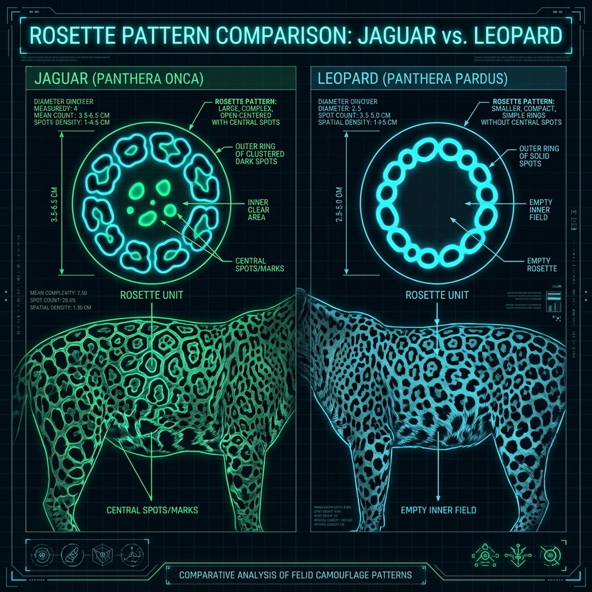

# Jaguar – Build and Scale

## Overview

> A compact, heavily armored gladiator built for power rather than speed, featuring the most devastating bite of any feline.

The morphology (physical form) of the Jaguar (_Panthera onca_) reflects its life in the dense jungle. It is the third-largest cat in the world, built like a weightlifter to wrestle massive aquatic prey.

## Key Information

- **Mass and Dimensions:** Males weigh between 56–96 kg (123–212 lbs), with some exceptional individuals in the Pantanal reaching 135 kg (298 lbs). They are stocky, with shorter, thicker limbs than a leopard.
- **Skull Morphometrics:** Features a massive, blocky skull with incredibly wide zygomatic arches (cheekbones) to anchor immense jaw muscles.
- **Bite Force:** Possesses the highest bite force relative to body size of any big cat, measuring up to 1,500 PSI (or 1,250+ Newtons).
- **Paws and Claws:** Exceptionally large, padded paws designed for swimming and gripping slippery prey like fish and caimans.

## Interpretation and Comparisons

A common mistake is confusing the jaguar with the leopard. While the leopard is lithe and built for agile climbing and hauling prey into trees, the jaguar is a low-slung powerhouse designed to stand its ground and crush bone. The jaguar's tail is also much shorter than a leopard's, as it relies less on high-speed arboreal (tree-dwelling) balance.

## Visuals and Assets

_(Note: A 3D model placeholder is also linked in the main profile.)_

## References

- Seymour, K. L. (1989). _Panthera onca_. Mammalian Species.
