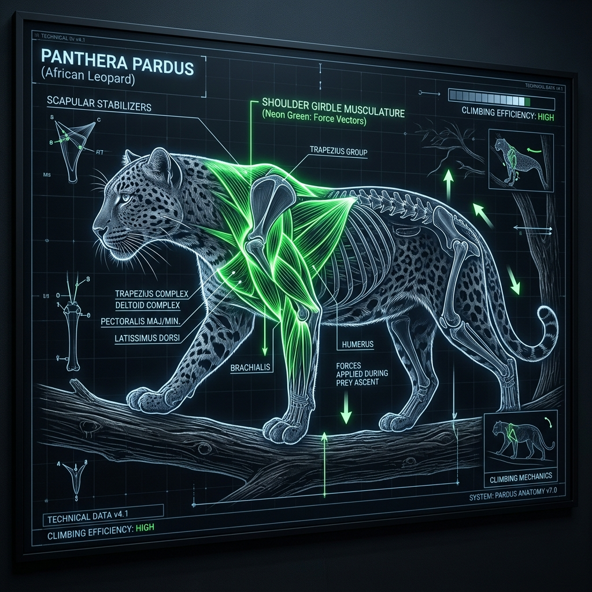

# African Leopard – Build and Scale

## Overview

> The perfect anatomical compromise between the speed of a cheetah and the raw power of a lion.

The physical morphology (form and structure) of the African Leopard (_Panthera pardus pardus_) is built around explosive, short-range ambush and exceptional arboreal (climbing) strength.

## Key Information

- **Mass and Dimensions:** Males weigh between 31–71 kg (68–157 lbs) and females weigh 24–40 kg (53–88 lbs). They are sleek, long-bodied, and relatively short-legged.
- **Skull Morphometrics:** Features broad, robust cheekbones and a specialized sagittal crest (a ridge of bone along the top of the skull) that anchors massive neck and jaw muscles.
- **Bite Force:** Roughly 300–370 PSI, designed for suffocating bites to the throat.
- **Musculature:** The shoulders, neck, and forelimbs are incredibly dense with muscle, providing the raw hauling power necessary to lift a 100 kg impala straight up the trunk of a tree.

## Interpretation and Comparisons

Leopards are the ultimate all-rounders of the feline world. They lack the specialized, rigid skull of the jaguar or the hyper-specialized spine of the cheetah. Instead, their build prioritizes agility and vertical strength, allowing them to exploit a three-dimensional environment that lions and hyenas cannot reach.

## Visuals and Assets

_(Note: A 3D model placeholder is also linked in the main profile.)_

## References

- Sunquist, M., & Sunquist, F. (2002). _Wild Cats of the World_.
