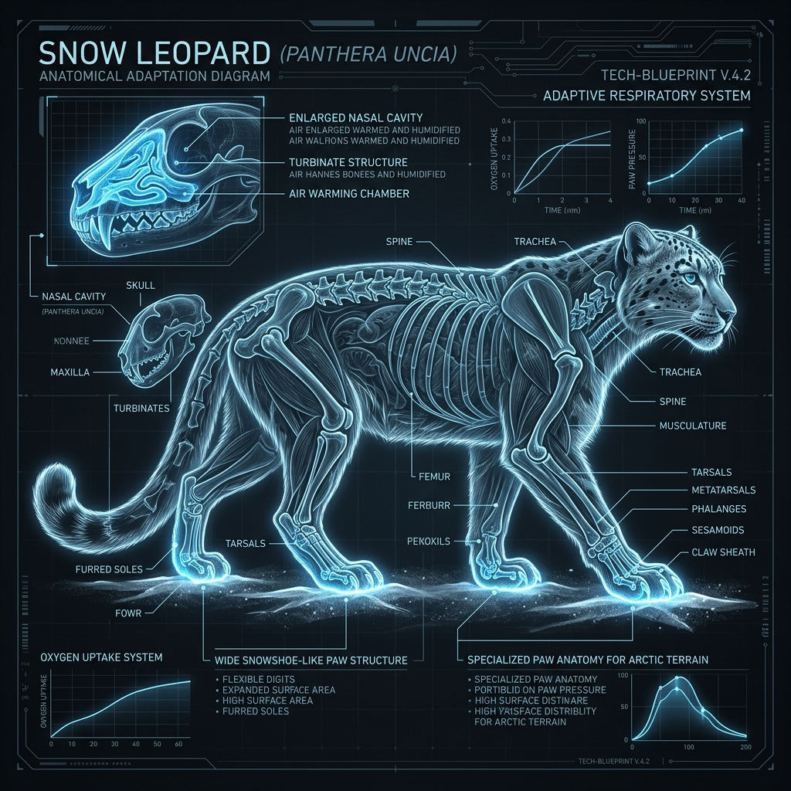

# Snow Leopard – Build and Scale

## Overview

> A compact, heavily furred acrobat with a built-in scarf and snowshoes.

The physical morphology (form and structure) of the Snow Leopard (_Panthera uncia_) is highly specialized for two things: retaining heat and maintaining balance on sheer cliffs.

## Key Information

- **Mass and Dimensions:** Smaller than other big cats. Males weigh 37–52 kg (82–115 lbs) and females weigh 32–39 kg (71–86 lbs).
- **Skull Morphometrics:** Features a notably short, broad skull with a highly enlarged nasal cavity. This acts as a radiator, warming the freezing alpine air before it reaches the lungs.
- **Chest Capacity:** They possess extremely well-developed chest muscles and large lungs, adapted for extracting oxygen from the thin, hypoxic mountain air.
- **Paws:** Enormous, fur-covered paws that distribute their weight evenly on snow (like snowshoes) and provide grip on jagged rocks.

## Interpretation and Comparisons

The snow leopard is essentially a smaller, more extreme version of the Siberian tiger's cold-weather adaptations. However, while the tiger is built for flat, snowy forests, the snow leopard's short forelimbs and long hind limbs are specifically designed for leaping up to 9 meters (30 feet) in a single bound across rocky chasms.

## Visuals and Assets

_(Note: A 3D model placeholder is also linked in the main profile.)_

## References

- Hemmer, H. (1972). _Uncia uncia_. Mammalian Species.
