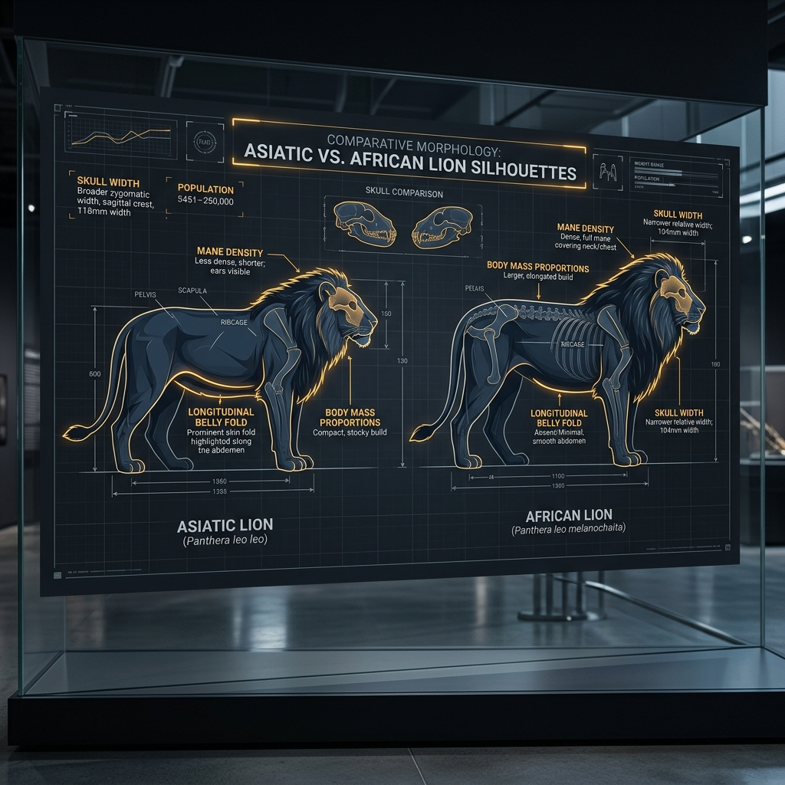

# Asiatic Lion – Build and Scale

## Overview

> Slightly smaller than its African cousin, but bearing ancient cranial adaptations unique to the Asian lineage.

The physical morphology of the Asiatic Lion (_Panthera leo persica_) reveals subtle but distinct evolutionary divergence from the African lion, shaped by centuries of isolation.

## Key Information

- **Mass and Dimensions:** Slightly smaller than African lions. Males weigh 160–190 kg (350–420 lbs) and females weigh 110–120 kg (240–260 lbs).
- **Skull Morphometrics:** Features a highly distinct cranial structure: bifurcated (divided) infraorbital foramina (small holes in the skull for nerves and blood vessels).
- **Musculature:** They possess a stronger sagittal crest (bone ridge on top of the skull) and a shorter post-orbital area than African lions, granting them immense biting leverage.
- **Belly Fold:** The most obvious physical characteristic is a pronounced longitudinal fold of skin running along the belly, which is very rare in African lions.

## Interpretation and Comparisons

While an untrained eye might struggle to tell them apart, the Asiatic lion's skull tells the story of thousands of years of separation. The bifurcated foramina and stronger sagittal crest are classic examples of genetic drift (random evolutionary changes in isolated populations).

## Visuals and Assets

_(Note: A 3D model placeholder is also linked in the main profile.)_

## References

- Pocock, R. I. (1939). _The Fauna of British India, including Ceylon and Burma. Mammalia._
