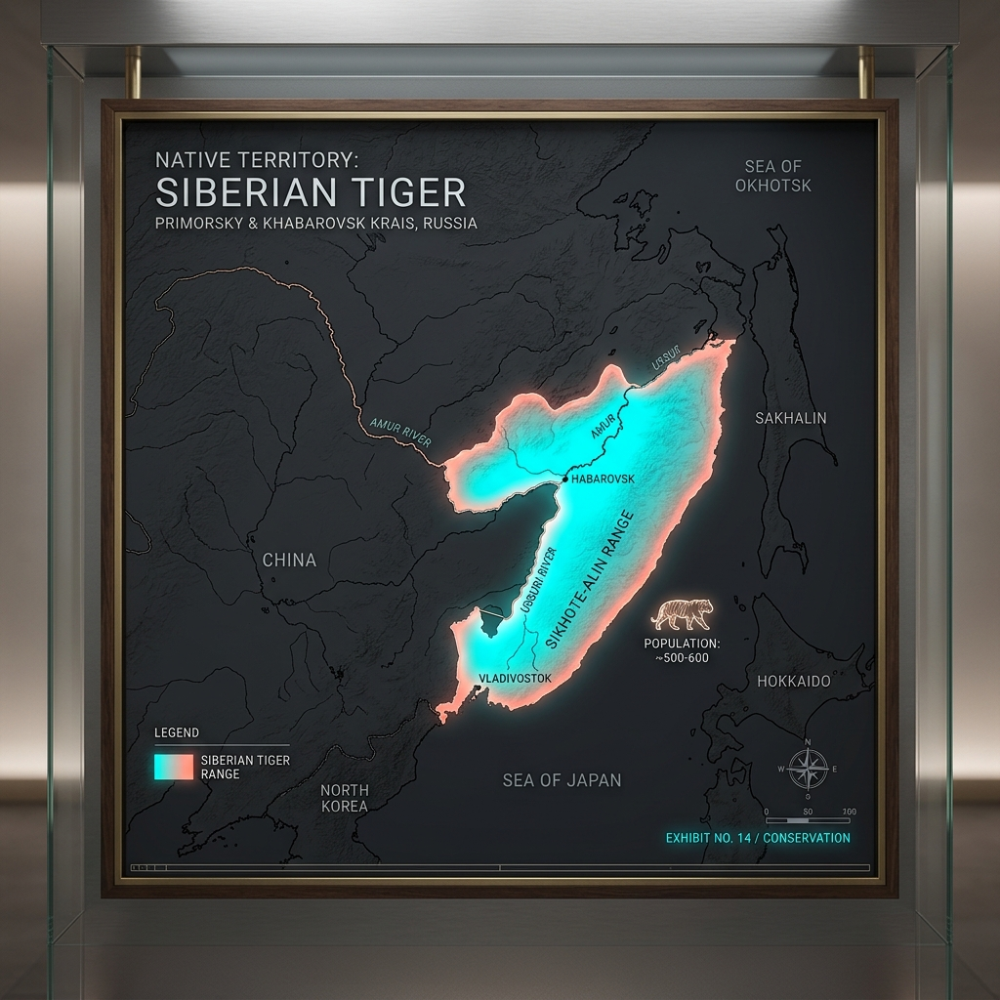

# Siberian Tiger – Range and Habitat

## Overview

> A vast, silent empire of frozen birch and snow, where the world's largest cat rules over a drastically shrinking kingdom.

Understanding the range and habitat of the Siberian Tiger (_Panthera tigris altaica_) is crucial for its conservation. As an apex predator in one of the most unforgiving climates on Earth, its distribution is inextricably linked to the availability of prey and the density of the boreal forest (taiga).

## Key Information

- **Historic Range:** Once spanned the Korean Peninsula, Manchuria, and the Russian Far East.
- **Current Range:** Highly restricted. ~95% of the population is confined to the Sikhote-Alin mountain range in the Russian Far East, with fragmented patches along the Russia-China border.
- **Habitat Type:** Mixed deciduous and coniferous boreal forests.
- **Climate Tolerance:** Anatomically adapted for extreme cold, surviving temperatures as low as -40°C.

## Interpretation and Comparisons

The Siberian Tiger requires a much larger home range than its tropical cousins like the Bengal Tiger. Because prey density in the frozen taiga is exceptionally low, a single Siberian tiger may patrol a territory ranging from 400 to over 1,000 km², whereas a Bengal tiger in a prey-dense Indian forest might only need 60 km².

## Visuals and Assets

## References

- IUCN Red List of Threatened Species: _Panthera tigris_ (Amur tiger subpopulation).
- Miquelle, D.G. et al. (2010). Tigers in the Russian Far East.
