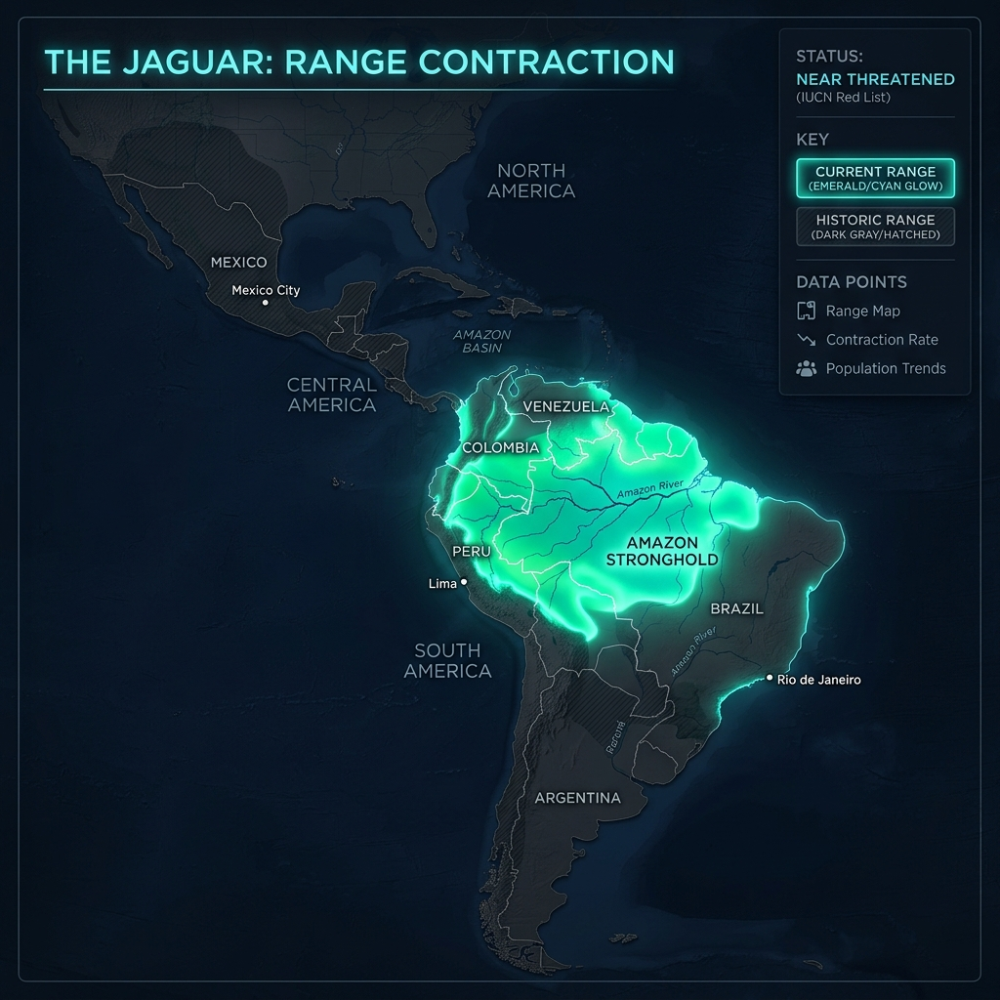

# Jaguar – Range and Habitat

## Overview

> A phantom of the Amazon, reigning over a flooded kingdom of emerald canopies and dark rivers.

The Jaguar (_Panthera onca_) is the only Panthera species found in the Americas. Its range and habitat are deeply tied to water, making it the most aquatic of all the big cats.

## Key Information

- **Historic Range:** Spanned from the southwestern United States (Arizona, New Mexico, Texas) down through Central America to the Rio Negro in Argentina.
- **Current Range:** It has been extirpated from over 50% of its historic range. Today, the Amazon basin (Brazil, Peru, Colombia) acts as its core stronghold.
- **Habitat Type:** Strongly prefers dense tropical rainforests, mangrove swamps, and seasonally flooded wetlands (like the Pantanal in Brazil).
- **Home Range:** Varies drastically based on prey density. Females in rich habitats may need only 10 km², while males in sparse areas patrol up to 142 km².

## Interpretation and Comparisons

While lions thrive in open plains and snow leopards in freezing mountains, the jaguar is a master of the jungle. Unlike leopards, which climb trees to escape competition, jaguars have no natural predators or equal competitors in their environment. Their habitat preference is driven purely by the availability of water and dense cover for ambush hunting.

## Visuals and Assets

## References

- Quigley, H. et al. (2017). _Panthera onca_. The IUCN Red List of Threatened Species.
