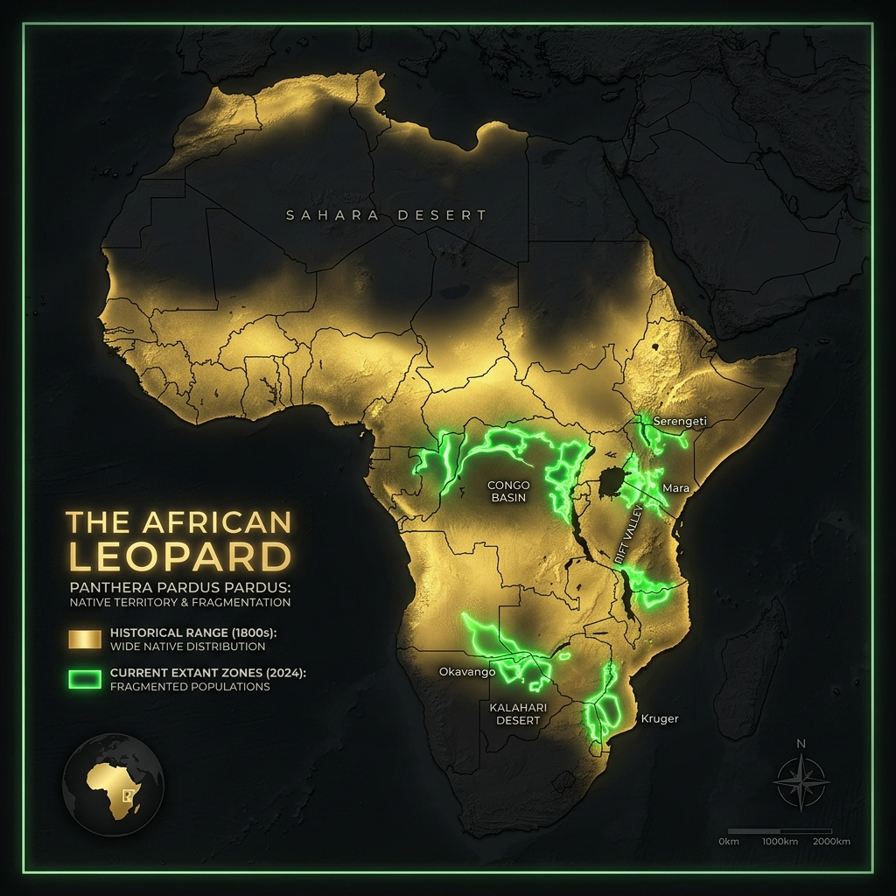

# African Leopard – Range and Habitat

## Overview

> From the blistering sands of the Kalahari to the humid canopies of the Congo basin, the leopard is the ultimate survivor.

The African Leopard (_Panthera pardus pardus_) is the most widely distributed wild cat in Africa. Its incredible adaptability allows it to thrive in environments that would instantly kill a tiger or a lion.

## Key Information

- **Historic Range:** Spanned nearly the entire African continent, except for the absolute driest interiors of the Sahara.
- **Current Range:** Still widely distributed across sub-Saharan Africa, though they have been largely eradicated from North Africa and South Africa's heavily populated regions.
- **Habitat Type:** Extremely versatile. Thrives in rainforests, open savannahs, mountainous highlands, and semi-deserts.
- **Home Range:** Fluctuates massively based on prey density. In rich savannahs, a female might need only 43 km², while a male in a sparse desert might patrol over 300 km².

## Interpretation and Comparisons

The leopard's geographic success is due to its lack of habitat specialization. While a snow leopard must have cold mountains and a jaguar must have dense jungles, a leopard simply needs a place to hide and something to eat. This flexibility makes them much more resilient to climate change than other big cats.

## Visuals and Assets

## References

- Stein, A.B. et al. (2016). _Panthera pardus_. The IUCN Red List of Threatened Species.
