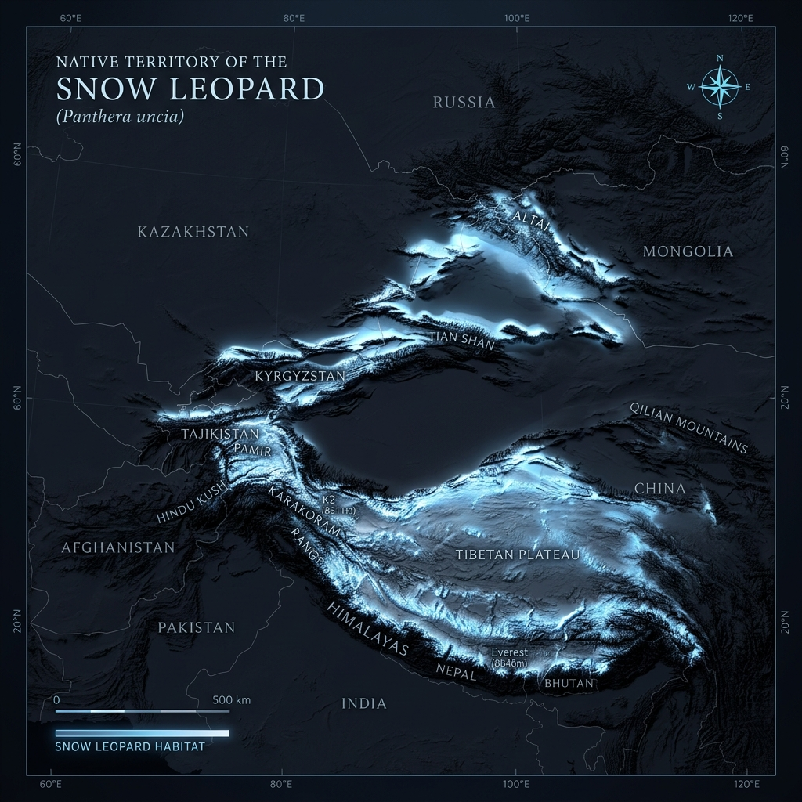

# Snow Leopard – Range and Habitat

## Overview

> The ghost of the mountains, navigating sheer cliffs and freezing alpine winds where few other animals can even breathe.

The Snow Leopard (_Panthera uncia_) is the apex predator of the high mountains of Central and South Asia. Its entire biology is uniquely adapted to survive in one of the most hostile, hypoxic (low oxygen) environments on the planet.

## Key Information

- **Historic Range:** Roughly the same as its current range, though significantly less fragmented in the past.
- **Current Range:** Inhabits approximately 1.8 to 2 million km² across 12 countries in Central Asia, including China, Mongolia, Nepal, and India.
- **Habitat Type:** Steep, rocky alpine and subalpine zones, typically found between 3,000 to 4,500 meters (9,800 to 14,800 feet) in elevation.
- **Home Range:** Because prey is incredibly scarce at high altitudes, home ranges are vast. A single snow leopard may patrol up to 1,000 km² to find enough food.

## Interpretation and Comparisons

While the jaguar evolved to exploit dense jungle water systems, the snow leopard evolved to conquer vertical space. They do not live in forests; their habitat consists of bare rock, snow, and sparse scrub. This requires them to have much larger home ranges than any other big cat except the Siberian tiger.

## Visuals and Assets

## References

- McCarthy, T. et al. (2017). _Panthera uncia_. The IUCN Red List of Threatened Species.
