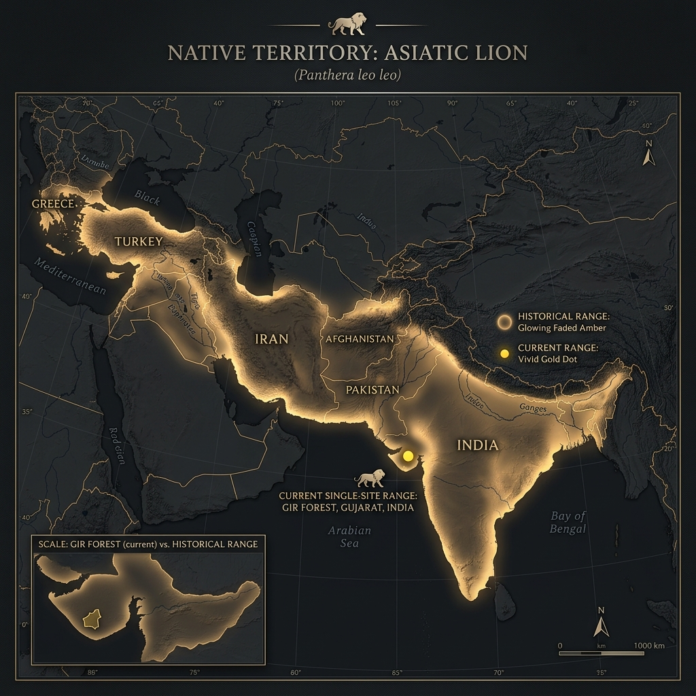

# Asiatic Lion – Range and Habitat

## Overview

> A king exiled to a single fortress; the last stronghold of the lions that once roamed Europe and Asia.

The Asiatic Lion (_Panthera leo persica_) has the most restricted and fragile range of any big cat on Earth. Once roaming from Greece to central India, it is now confined to a single dot on the map.

## Key Information

- **Historic Range:** Extremely vast. Spanned from the Balkans and Greece in Southern Europe, across the Middle East (Turkey, Iran, Iraq), all the way to eastern India.
- **Current Range:** Restricted entirely to a 20,000–30,000 km² landscape in and around the Gir Forest National Park in Gujarat, India.
- **Habitat Type:** Dry deciduous forests, thorny scrublands, and open savannahs.
- **Home Range:** Due to the dense concentration of lions in one area, male home ranges average ~266 km², while female ranges are smaller at ~114 km².

## Interpretation and Comparisons

While the African lion still roams across millions of square kilometers (despite its own severe declines), the Asiatic lion is an evolutionary prisoner in the Gir Forest. This extreme geographic isolation makes the entire subspecies highly vulnerable to localized extinction events, such as a single severe forest fire or a disease outbreak.

## Visuals and Assets

## References

- Singh, H. S. (2017). Asiatic lion (Panthera leo persica).
