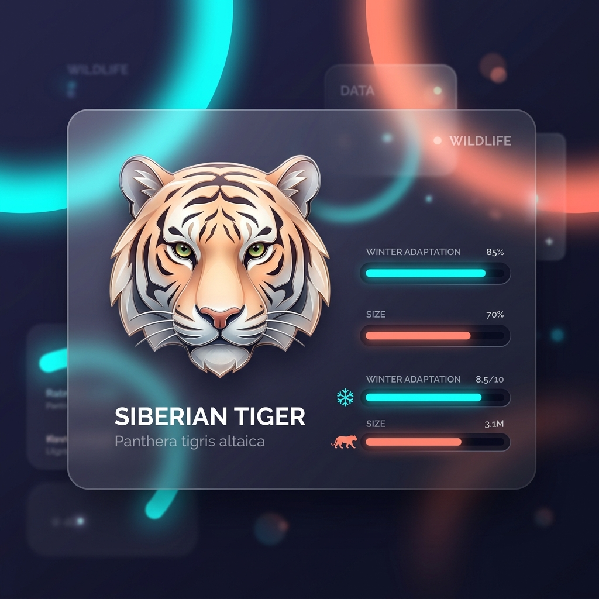

# Siberian Tiger – Signature Traits

## Overview

> A coat woven from the colors of winter dawn, fading into the blinding white snow.

While all tigers are breathtaking, the Siberian Tiger (_Panthera tigris altaica_) possesses several signature morphological (physical) traits that visually and biologically separate it from its tropical cousins.

## Key Information

- **The Pale Coat:** Its base fur is a muted, pale ochre or rusty-yellow, rather than the bright, fiery orange of the Bengal tiger.
- **Sparse Striping:** The stripes are fewer, wider apart, and often dark brown rather than pitch black.
- **The Winter Ruff:** During winter, it grows a massive, thick mane-like ruff around its neck and cheeks, protecting its face from biting winds.
- **Belly Fat Pad:** It is the only tiger subspecies that develops a thick, 5 cm (2 inch) layer of fat along its belly to protect its organs when resting in the snow.

## Interpretation and Comparisons

These traits are perfect examples of environmental adaptation. A bright orange coat with dense black stripes works perfectly in the dappled sunlight of a dense Indian jungle, but would be highly visible in a snow-covered Russian birch forest. The Siberian tiger's muted palette is the ultimate cold-weather camouflage.

## Visuals and Assets

## References

- Kitchener, A. C., et al. (2017). A revised taxonomy of the Felidae.
