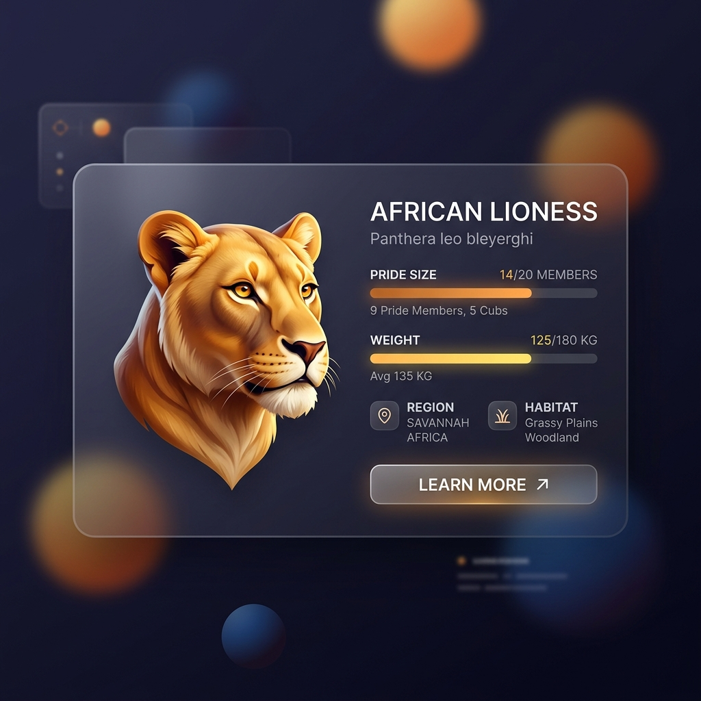

# African Lion – Signature Traits

## Overview

> A crown of dark hair and a roar that rattles the ribs of anything within a five-mile radius.

The African Lion (_Panthera leo_) possesses several signature morphological and physiological traits that completely separate it from the rest of the Panthera lineage, heavily tied to its social lifestyle.

## Key Information

- **The Mane:** Adult males possess a thick mane of hair around their neck and chest. The mane serves as a visual indicator of fitness, health, and testosterone levels.
- **The Roar:** A specialized, square-shaped vocal fold geometry in their larynx allows lions to produce a roar that reaches 114 decibels.
- **The Tail Tuft:** The end of the lion's tail features a dark tuft of hair concealing a hard, bony "spur." The tuft is highly visible and is flicked to communicate silently during cooperative hunts.

## Interpretation and Comparisons

The lion's mane is unique among all cats. Research has proven that manes that are darker and thicker indicate a male with higher testosterone, better nutrition, and a greater ability to heal. Lionesses actively choose to mate with males possessing darker manes, driving the sexual selection of this striking feature.

## Visuals and Assets

## References

- West, P. M., & Packer, C. (2002). Sexual selection, temperature, and the lion's mane.
