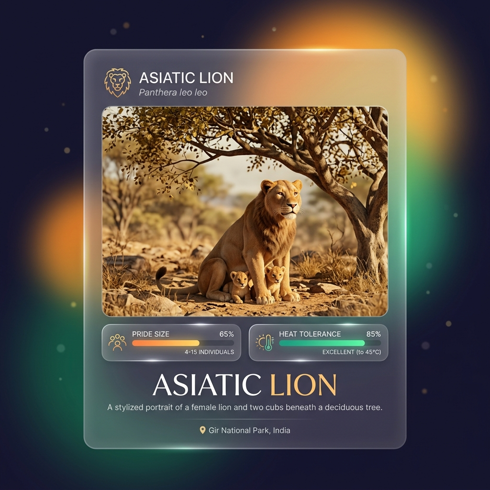

# Asiatic Lion – Signature Traits

## Overview

> A sparser mane reveals the true shape of the lion's head, leaving its ears alert and visible at all times.

While similar to the African lion, the Asiatic Lion (_Panthera leo persica_) possesses a few key visual traits that allow for instant differentiation by a trained observer.

## Key Information

- **The Sparse Mane:** The mane of an Asiatic male is significantly shorter and sparser at the top of the head compared to African lions. Because of this, their ears are always fully visible.
- **The Belly Fold:** They possess a very prominent longitudinal fold of skin running along their belly, a trait rarely seen in African lions.
- **Tail Tuft:** Their tail tufts are generally larger and more pronounced than those of African lions.

## Interpretation and Comparisons

The sparser mane of the Asiatic lion may be an adaptation to the dense, thorny scrubland of the Gir Forest. A massive, thick mane (like those seen in the Serengeti or Kalahari) would constantly snag on the dense underbrush of the Indian dry forest. The belly fold's exact evolutionary purpose remains a subject of debate among morphologists.

## Visuals and Assets

## References

- Pocock, R. I. (1939). _The Fauna of British India, including Ceylon and Burma. Mammalia._
