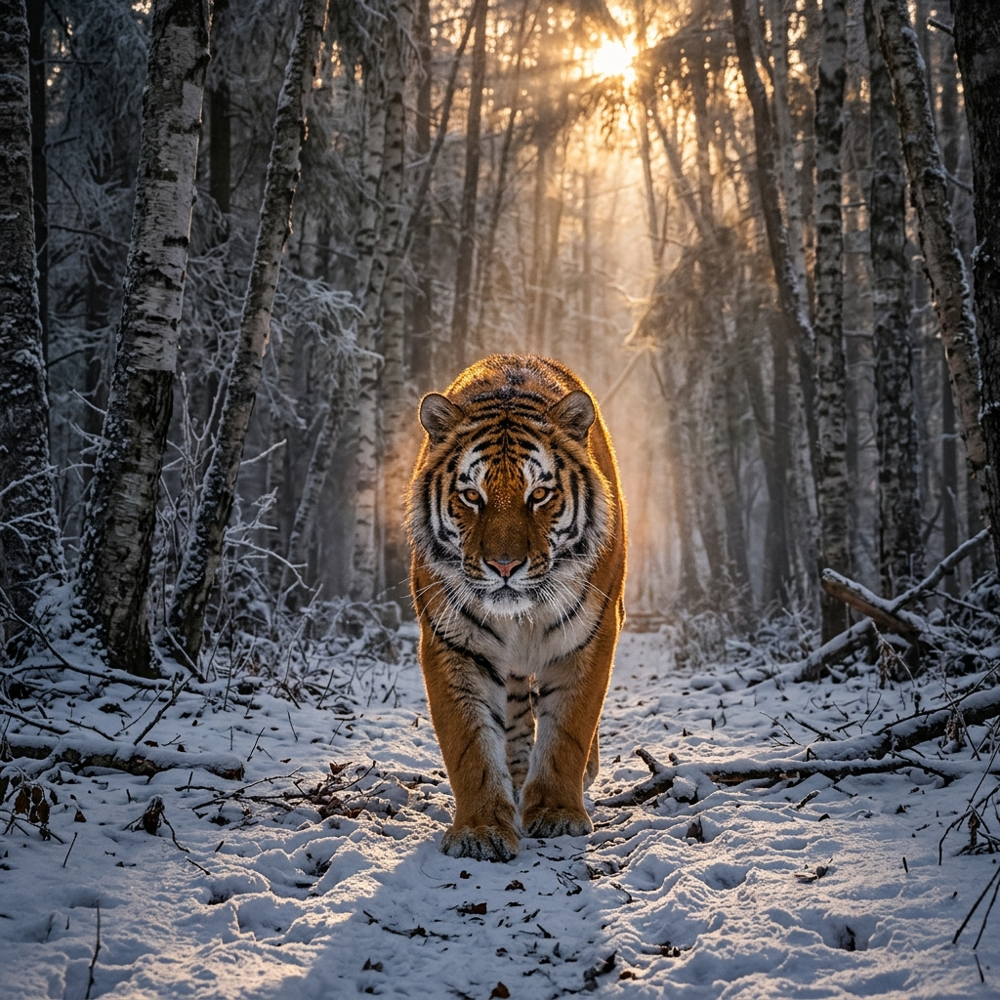
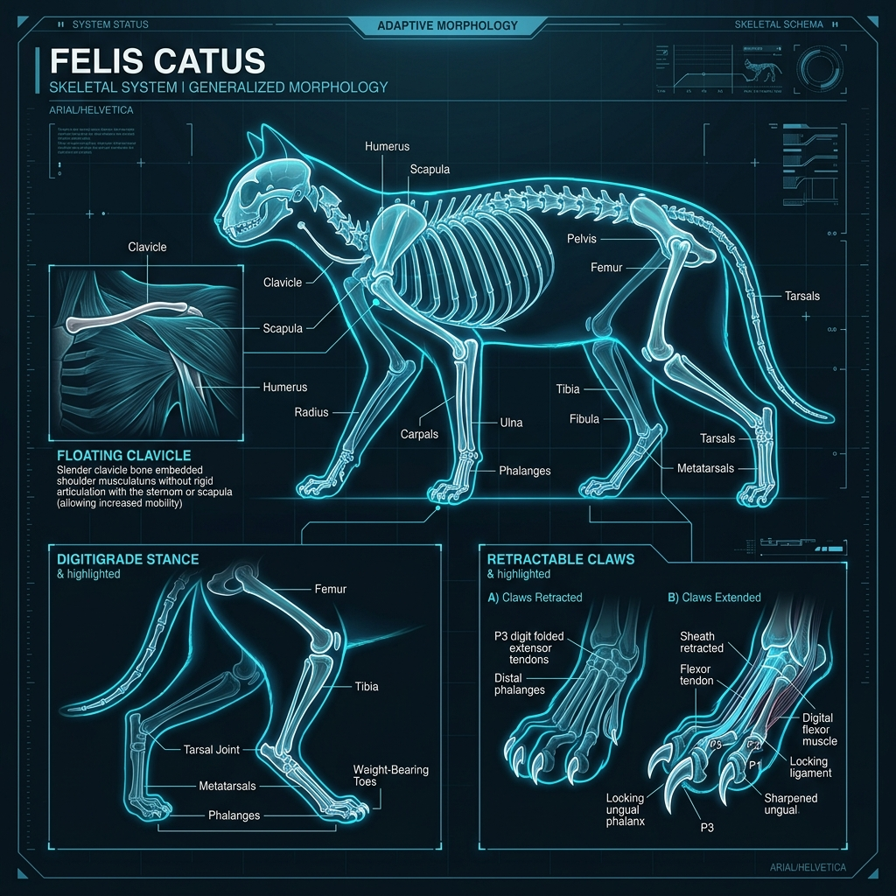

<div align="center">
  

  <h1>🦁 Cat Family Atlas</h1>
  
  <p><em>A living, modular knowledge base exploring every wild and domestic species of the Felidae — the cat family.</em></p>

  <p>
    <a href="./00_Atlas_Home/Cat_Family_Atlas_Home.md"><strong>Explore the Museum</strong></a> ·
    <a href="./00_Atlas_Home/Species_Index.md"><strong>Species Index</strong></a> ·
    <a href="./00_Atlas_Home/How_to_Use_This_KB.md"><strong>Contribution Guide</strong></a>
  </p>
</div>

---

## 🏛️ Welcome to the Museum

The **Cat Family Atlas** is organized like a grand natural-history museum. Each folder is a curated gallery, and each markdown file serves as a placard or an immersive exhibit module. Whether you are a curious beginner or a seasoned naturalist, this atlas is designed for you — written in vivid, evocative language that brings the world's most fascinating predators to life.

<div align="center">
  
</div>

---

## 🗺️ Museum Map

| 🖼️ Gallery | 📖 What you'll find inside |
| :--- | :--- |
| **[`00_Atlas_Home`](./00_Atlas_Home/)** | **The Lobby:** Welcome page, full species index, and museum system guide. |
| **[`01_Taxonomy_and_Evolution`](./01_Taxonomy_and_Evolution/)** | **Science Wing:** Evolutionary trees, lineage overviews, and subfamily comparisons. |
| **[`02_Species_Profiles`](./02_Species_Profiles/)** | **Main Exhibit Hall:** Individual hero panels for every species. |
| **[`03_Exhibit_Modules`](./03_Exhibit_Modules/)** | **Deep-Dive Rooms:** Detailed sub-exhibits on range, diet, behaviour, build & scale, and conservation. |
| **[`04_Visual_Production`](./04_Visual_Production/)** | **Art Studio:** Hero posters, anatomy art, range maps, and AI prompt sets. |
| **[`05_Ecology_Comparisons`](./05_Ecology_Comparisons/)** | **Comparison Arena:** Themed pages comparing cats by hunting style, habitat, speed, and sociality. |
| **[`06_Conservation`](./06_Conservation/)** | **Sanctuary Hub:** Threat overviews, conservation organisations, and habitat fragmentation. |
| **[`99_Templates`](./99_Templates/)** | **Blueprint Archive:** Templates for creating new species profiles and exhibit modules. |

---

## 🚀 Quick Start & Navigation

<div align="center">
  
</div>

Ready to start exploring? Begin your journey through the museum:

- 🏛️ **[Enter the Atlas Home](./00_Atlas_Home/Cat_Family_Atlas_Home.md)** — The main entrance to the knowledge base.
- 🐾 **[Browse the Species Index](./00_Atlas_Home/Species_Index.md)** — A complete catalog of every species with direct links to their profiles.
- 📖 **[How to Use This KB](./00_Atlas_Home/How_to_Use_This_KB.md)** — The essential guide for readers and contributors.

---

## 🛠️ Architecture & Web App

The repository also houses a **Next.js Website** located in the `website/` directory, which transforms this markdown knowledge base into an interactive frontend experience. 

- **Frontend:** Next.js, React 19, TypeScript
- **Testing:** Playwright (for e2e testing and relative markdown link validation)
- **Formatting:** Prettier

To run the web experience locally:
```bash
cd website
npm install
npm run dev
```

---

## 🤝 Contributing

We welcome contributions! Please adhere to the following museum standards:
- **Use Templates:** Always follow the blueprints in `99_Templates` when creating new profiles or modules.
- **Narrative Voice:** Write in a clear, vivid, layman-friendly tone — imagine you are writing an engaging museum placard.
- **Relative Links:** Use relative paths for all internal links to ensure compatibility across Obsidian and the Next.js app.
- **Commits:** Use Conventional Commits format (e.g., `feat(species): add fishing cat profile`).

<br>

<div align="center">
  <em>Currently covering <strong>24 wild and domestic species</strong> across <strong>8 evolutionary lineages</strong>, plus dedicated signature trait modules for colour morphs, subspecies variants, and myth-busting exhibits.</em>
</div>
