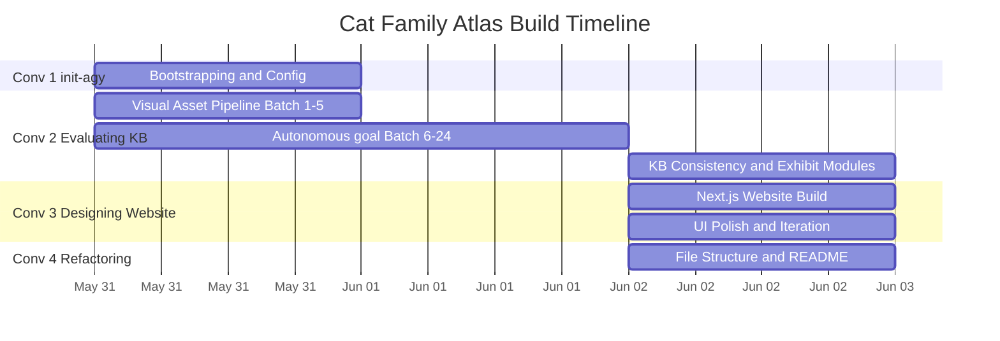

# Cat Family Atlas: Fupan (复盘) Retrospective

> A retrospective analysis of the vibe coding journey for the **Cat Family Atlas** project.
> Generated on 2026-06-03.

---

## Project Timeline

### Conversation Summary Table

| # | Conversation | Start (Local) | End (Local) | Duration | User Messages | Top Tool |
|---|---|---|---|---|---|---|
| 1 | `/init-agy` — Bootstrapping | May 31, 14:54 | May 31, 15:53 | ~1 hour | 8 | `run_command` (42) |
| 2 | Evaluating KB — Assets & Content | May 31, 19:33 | Jun 02, 09:04 | ~37.5 hours | 19 | `generate_image` (130) |
| 3 | Designing Website — Next.js Frontend | Jun 02, 07:25 | Jun 02, 19:59 | ~12.5 hours | 24 | `code_action` (94) |
| 4 | Refactoring Structure — Final Polish | Jun 02, 20:03 | Jun 02, 22:25 | ~2.4 hours | 3 | `grep_search` (11) |

**Total wall-clock span**: May 31, 14:54 → Jun 02, 22:25 = **~55.5 hours across 3 days**
**Total user messages**: **54 messages** across 4 conversations

---

## Phase-by-Phase Analysis

---

### Phase 1: Bootstrapping & Configuration

**Conversation**: `/init-agy this is a KB with all the different Cats`
**Timespan**: May 31 14:54 → 15:53 (~1 hour)
**User Messages**: 8
**Model**: Gemini 3.5 Flash → Claude Sonnet 4.6 (Thinking) → Claude Opus 4.6 (Thinking) → Gemini 3.5 Flash

#### Summary

You initialized the Cat Family Atlas repository using the `/init-agy` skill. After answering the diagnostic interview, you immediately gave a complex, multi-part instruction that spawned 3 specialized subagents: one for KB quality research, one for visual asset checking, and one for overall planning. You also set a clear boundary — "let's make the KB as our solo focus, no thinking on the website side."

#### What Went Right ✅

- **Immediate parallelization.** In your very first substantive prompt (step 80), you spun up 3 subagents at once. This is an advanced orchestration pattern that most users never discover.
- **Strong boundary setting.** Telling the AI to ignore website development kept the conversation focused and prevented scope creep across hundreds of subsequent steps.
- **Decisive plan review.** You used artifact comments to give inline feedback on the implementation plan (e.g., rejecting citation tether codes, deferring 3D models), which is much more efficient than describing changes in free text.

#### What Went Wrong (or Could Be Improved) ⚠️

- **Monorepo architecture was not established.** The KB files, Next.js app files, and config files all ended up in the root directory. This led to a full refactoring conversation (Conv 4) two days later.
- **Multi-part mega-prompts.** Your step-80 prompt packs 4 separate tasks into one message. While impressive, if any single task fails or needs clarification, the entire prompt becomes hard to reference back to.

#### Prompting Polish (Before → After)

❌ **Loose Vibe Coding** (your actual prompt, step 80):
> "1. no need for this Copy .env.example to .env... 2. i want you to spawn out subagent for research and start making sure the KB itself is well structured and well written, using layman style of writing... 3. spawn out another subagent for quick check the 04_Visual_Production/Hero_Posters... 4. i need another planning subagent, start to make the overall plan for modification on the KB, if there are good structured, what would be the plan to make a modern website..."

✅ **Structured Vibe Coding**:
> **Goal**: Set up the project for parallel KB improvement work.
> **Architecture**: Before spawning any agents, restructure the repo into a monorepo: move all markdown content into `/kb` and reserve `/app` for future website code.
> **Task 1 (Subagent — Researcher)**: Audit the KB for writing quality. Rewrite any scientific prose into layman-friendly, museum-narrative style.
> **Task 2 (Subagent — Visual Checker)**: Scan `04_Visual_Production/Hero_Posters` and cross-reference against `02_Species_Profiles`. List any species that have images but no profile.
> **Task 3 (Subagent — Planner)**: Draft a phased improvement plan for the KB only. Website planning is out of scope for now.
> **Validation**: Each subagent should report back with a summary artifact before making any file changes.

---

### Phase 2: Visual Asset Pipeline (Batch Testing)

**Conversation**: Evaluating Repository Knowledge Base
**Timespan**: May 31 19:33 → 22:17 (~2.7 hours)
**User Messages**: 5
**Model**: Gemini 3.1 Pro

#### Summary

You transitioned to generating visual assets (Preview Cards, Anatomy Posters, Hunting Scenes, Range Maps) for each species. Crucially, you tested the pipeline on the first 5 species before scaling. You reviewed the batch, gave inline feedback ("this is a very good idea, we should start with the 01-05"), and approved before moving to the full run.

#### What Went Right ✅

- **Batch-first testing.** Testing on Species 01-05 before running all 24 is a textbook software engineering practice. You caught formatting and quality issues early.
- **Clear feedback loop.** Using artifact comments to approve specific options ("Option B: By Species Batch") gave the AI unambiguous direction.

#### What Went Wrong (or Could Be Improved) ⚠️

- **No failure criteria defined.** You told the AI to generate and embed images, but didn't specify what to do if an image looked wrong (e.g., "If any generated image is clearly off-topic, skip it and flag it for manual review").

#### Prompting Polish (Before → After)

❌ **Loose Vibe Coding** (your actual prompt, step 85 comment):
> "this is a very good idea, we should start with the 01-05 in 02_Species_Profiles, then i can check them, then we go for 06-10, etc"

✅ **Structured Vibe Coding**:
> **Goal**: Generate all 4 visual assets for Species 01-05 as a test batch.
> **Action**: For each species, generate: Preview Card, Anatomy Poster, Hunting Scene, Range Map. Embed them into the respective markdown profiles.
> **Quality Gate**: After generating the batch, show me a summary table of all 20 images (5 species × 4 types) so I can review before we proceed to the next batch.
> **Failure Handling**: If any image looks clearly wrong, skip embedding it and add a `<!-- TODO: regenerate -->` comment instead.

---

### Phase 3: Autonomous Overnight Execution (`/goal`)

**Conversation**: Evaluating Repository Knowledge Base (continued)
**Timespan**: May 31 22:16 → Jun 01 22:26 (~24 hours, mostly autonomous)
**User Messages**: 4 (over 24 hours!)
**Model**: Gemini 3.1 Pro

#### Summary

After validating the test batch, you launched a `/goal` command to generate all remaining visual assets for Species 06-24 autonomously overnight. The agent hit API quota limits and had to pause multiple times. You checked in the next day, asked about quota timing, and eventually the job completed. You then asked the agent to evaluate the full repo for improvement points.

#### What Went Right ✅

- **Masterful use of `/goal`.** Letting the AI grind through 19 species × 4 assets = 76 images while you slept is peak agentic workflow. Only 4 messages over 24 hours!
- **Trust but verify.** You came back the next day and immediately asked for an improvement audit rather than blindly trusting the output.

#### What Went Wrong (or Could Be Improved) ⚠️

- **Wasted idle time during quota limits.** The agent hit image generation quotas and simply waited. During that downtime, it could have been writing exhibit module text, researching missing species, or checking link consistency.
- **No progress reporting.** You had to manually ask "how long do i need to wait?" There was no scheduled progress update mechanism.

#### Prompting Polish (Before → After)

❌ **Loose Vibe Coding** (your actual `/goal` prompt, step 163):
> "/goal Generate all remaining visual production images (Preview Card, Anatomy Poster, Hunting Scene, Range Map) for Species 06 through 24 in the Cat Family KB. Embed the generated images into their respective markdown profiles and run the Playwright link checker after each batch. If you hit an image generation quota limit, automatically wait for it to reset and resume. Do not stop until every single species is fully completed."

✅ **Structured Vibe Coding**:
> **/goal** Generate all remaining visual assets for Species 06-24.
> **Batch Size**: Process 5 species at a time.
> **Per Species**: Generate Preview Card, Anatomy Poster, Hunting Scene, Range Map. Embed into markdown profiles.
> **Validation**: Run `npx playwright test` link checker after each batch of 5.
> **Quota Fallback**: If image generation hits a quota limit, do NOT idle. Switch immediately to: (1) writing `03_Exhibit_Modules` text for upcoming species, (2) researching missing taxa data, or (3) fixing any broken links found so far. Resume image generation when the quota resets.
> **Progress Updates**: After each batch of 5 species completes, write a progress summary to `progress.md` so I can check status asynchronously.

---

### Phase 4: KB Consistency & Exhibit Modules

**Conversation**: Evaluating Repository Knowledge Base (continued)
**Timespan**: Jun 02 07:18 → 09:04 (~1.8 hours)
**User Messages**: 6

#### Summary

With images done, you shifted focus to content consistency. You asked the agent to ensure images were in the right folders, link the visual assets to the correct exhibit modules, and keep `02_Species_Profiles` clean by only including hero posters with links to the detailed `03_Exhibit_Modules`.

#### What Went Right ✅

- **Excellent data architecture.** The hub-and-spoke model (Profiles link to Modules) is clean, scalable, and easy to navigate. This was a strong design decision.
- **Specific linking instructions.** Your prompt about linking `04_Visual_Production/Anatomy_Trait_Posters` to `03_Exhibit_Modules/Build_and_Scale` showed deep understanding of the content structure.

#### What Went Wrong (or Could Be Improved) ⚠️

- **This could have been automated from the start.** A simple script could have enforced the "hero poster only in profiles, everything else in modules" rule automatically. Instead, it was a manual sweep.

#### Prompting Polish (Before → After)

❌ **Loose Vibe Coding** (your actual prompt, step 607):
> "i think for now, the image is good enough and quite a lot now, i need you to switch focus to the consistency issue, i need you to put the image in the right file and make consistent between different md files also, do the final sweep on the KB"

✅ **Structured Vibe Coding**:
> **Goal**: Enforce content consistency across the KB.
> **Rule 1**: `02_Species_Profiles/*.md` should ONLY contain the hero poster image. All other images (anatomy, hunting, range) should be referenced via relative links to `03_Exhibit_Modules/`.
> **Rule 2**: Each `03_Exhibit_Modules/` subfolder should embed its corresponding image from `04_Visual_Production/`.
> **Action**: Audit all 24 species and fix any violations. Create a summary table of changes made.
> **Automation**: Write a bash script that checks these rules so we can run it automatically in the future.

---

### Phase 5: Next.js Website Build

**Conversation**: Designing Modern Knowledge Base Website
**Timespan**: Jun 02 07:25 → 12:55 (~5.5 hours)
**User Messages**: 11
**Model**: Gemini 3.1 Pro

#### Summary

With the KB data solid, you pivoted to building a Next.js frontend to visualize it as a modern, museum-style website. You iterated aggressively: requesting dashboard layouts instead of simple rows, fixing taxonomy navigation, asking for a sticky sidebar, and swapping hero poster crops for better-suited hunting action images in the species dashboard cards.

#### What Went Right ✅

- **Strong design intuition.** Moving from simple rows to dashboard cards, and replacing cropped hero posters with action shots for card thumbnails, showed excellent UX instincts.
- **Leveraging `/modern-web-guidance`.** You explicitly asked the agent to use the modern web guidance skill and Playwright for testing, ensuring best practices were followed (referenced 45 times in this conversation!).
- **Inline code feedback.** At step 471, you pasted actual JSX code and said "i think you should make it more related to the conservation center?" — giving the AI exact context of what to change.

#### What Went Wrong (or Could Be Improved) ⚠️

- **Conversational bug reporting.** Many prompts were fast and loose, leading to potential misinterpretation by the AI (see prompt examples below).
- **Multiple UI issues in one message.** Bundling 3+ UI fixes into a single prompt makes it hard for the AI to track and verify each fix independently.

#### Prompting Polish (Before → After)

❌ **Loose Vibe Coding** (your actual prompt, step 328):
> "fix all the things inside the about us page also, you need to design a side bar that can let the user to select the different page once they are in the specific pages, for example, when i am in the http://localhost:3000/taxonomy/Big_Cats_vs_Small_Cats, then maybe on the left side bar, i can see the list under the http://localhost:3000/taxonomy, so i can easily navigate to different place, same for the http://localhost:3000/species part final thing to improve, the http://localhost:3000/species page io like the dashboard, but you do not need to have the hero poster cropped in each dashboard, you can have the hunting image scaled inside the dashboard"

✅ **Structured Vibe Coding**:
> **Fix 1 — About Us Page**: Debug and fix all broken elements on the About Us page. List each fix you make.
> **Fix 2 — Taxonomy Sidebar**: Add a persistent left sidebar to taxonomy pages. When viewing `/taxonomy/Big_Cats_vs_Small_Cats`, the sidebar should list all articles under `/taxonomy` for easy navigation. Apply the same pattern to `/species` pages.
> **Fix 3 — Species Dashboard Images**: Replace the cropped hero posters in the dashboard cards with the hunting scene images (from `04_Visual_Production/Hunting_Video_Posters/`). Scale them to fit the card without cropping.
> **Validation**: After all 3 fixes, take a screenshot of each affected page and show me the before/after.

---

### Phase 6: UI Polish & Iteration

**Conversation**: Designing Modern Knowledge Base Website (continued)
**Timespan**: Jun 02 19:34 → 19:59 (~25 minutes)
**User Messages**: 5

#### Summary

A rapid-fire polish session. You fixed the Explore Species sidebar (it was rendering empty), improved the main page by requesting a full-screen 16:9 hero image with multiple cat species, removed unnecessary text rows, renamed navigation elements, and refined the About Us section to feel more like a conservation center.

#### What Went Right ✅

- **Fast iteration speed.** 5 messages in 25 minutes shows a tight feedback loop — you knew exactly what you wanted and communicated it quickly.

#### What Went Wrong (or Could Be Improved) ⚠️

- **Typos and ambiguity.** Prompts like *"check ti yourself"* and *"remove the uncessary three row"* rely on the AI's error-correction ability. This usually works, but in complex UI layouts, it can lead to the AI removing the wrong elements.

#### Prompting Polish (Before → After)

❌ **Loose Vibe Coding** (your actual prompt, step 462):
> "check ti yourself, i think you still need to do the remove the uncessary three row in the main page, and also ,one more important thing is we need to make sure the image in the main is very epic, which means the size of the image should cover the whole screen"

✅ **Structured Vibe Coding**:
> **Goal**: Finalize the main page hero section.
> **Current Issue**: There are 3 text/card rows below the hero that clutter the entrance. Remove them.
> **Design Spec**: The hero image should be `100vw × 100vh` (full viewport), creating an immersive "museum entrance" feel.
> **Validation**: Run the dev server and check `http://localhost:3000`. The hero image should fill the entire screen with no scroll needed to see it.

---

### Phase 7: Refactoring & README Presentation

**Conversation**: Refactoring And Finalizing Repository Structure
**Timespan**: Jun 02 20:03 → 22:25 (~2.4 hours)
**User Messages**: 3
**Model**: Gemini 3.1 Pro

#### Summary

The final session focused on structural cleanup. You asked the agent to separate the Next.js website files from the markdown KB by moving all web-related files into a dedicated `website/` directory. You then requested a polished, "show-off" README with images and decorative text.

#### What Went Right ✅

- **Proactive separation of concerns.** Recognizing that code and data were tangled and initiating a refactor is a mark of engineering maturity.
- **Ending with presentation.** Polishing the README as the final step is excellent open-source practice — first impressions matter.
- **Minimal interaction.** Only 3 messages to accomplish a major refactor shows high trust and clear communication.

#### What Went Wrong (or Could Be Improved) ⚠️

- **Retroactive architecture.** This entire conversation could have been avoided if the monorepo structure was established in Phase 1 during `/init-agy`.
- **No automated path validation.** Moving ~20 files and updating all path references is inherently risky. A post-move link-checking script should have been run immediately.

#### Prompting Polish (Before → After)

❌ **Loose Vibe Coding** (your actual prompt, step 0):
> "I want you to check if the repo should be finalized by refactoring the file structure and remove unnecessary files"

✅ **Structured Vibe Coding**:
> **Goal**: Decouple the website from the knowledge base in the file structure.
> **Action**: Move all Next.js related files (`src/`, `public/`, `tests/`, `package.json`, `tsconfig.json`, `next.config.mjs`, `playwright.config.js`) into a new `website/` subdirectory.
> **Keep in root**: All markdown folders (`00_Atlas_Home/` through `99_Templates/`), `GEMINI.md`, `.gitignore`, `README.md`.
> **Validation**: After the move, run the Playwright link checker to ensure no broken references. Run `cd website && npm run build` to verify the app still compiles.

---

## Cross-Cutting Analysis

### Agentic Patterns Scorecard

| Pattern | Rating | Notes |
|---------|--------|-------|
| Subagent Delegation | 🌕 | Deployed 3 subagents in the very first conversation. Used 12+ subagents total across the project. Expert-level parallelization. |
| Autonomous Execution (`/goal`) | 🌕 | Launched a 24-hour autonomous image generation pipeline with a single prompt. Let the AI work overnight. |
| Batch Testing Before Scaling | 🌕 | Tested image generation on 5 species before running the remaining 19. Textbook approach. |
| Automated Validation (CI/CD) | 🌒 | Relied on manual "sweep" requests and ad-hoc Playwright runs. No pre-commit hooks, no GitHub Actions, no automated link-checking pipeline. |
| Structured Prompting | 🌓 | Strong when giving multi-part strategic directives. Weaker during rapid UI iteration (typos, bundled fixes, vague adjectives like "epic"). |
| Architecture-First Thinking | 🌓 | Excellent data architecture (hub-and-spoke KB). But didn't establish the monorepo file structure up front, causing a late refactor. |
| Model Selection Strategy | 🌔 | Switched between Flash (speed), Sonnet (thinking), Opus (deep reasoning), and Pro. Mostly strategic, but some switches seem experimental. |
| Downtime Optimization | 🌑 | During quota limits, the agent idled rather than switching to text-based tasks. No fallback instructions were given. |

### Model Switching Analysis

You used **4 different models** across the project:

| Model | Used For | Assessment |
|-------|----------|------------|
| **Gemini 3.5 Flash** | Initial bootstrapping, bulk generation | ✅ Good choice — fast and cheap for high-volume tasks |
| **Claude Sonnet 4.6 (Thinking)** | Plan approval, complex decisions | ✅ Good choice — thinking models excel at plan evaluation |
| **Claude Opus 4.6 (Thinking)** | Brief appearance during Phase 1 | ⚠️ Possibly overkill for the task at hand |
| **Gemini 3.1 Pro** | Website development, refactoring, evaluating | ✅ Good all-rounder for code generation and UI work |

**Verdict**: Your model switching is mostly strategic — Flash for bulk work, Thinking models for planning, Pro for coding. To sharpen this further, consider:
- Using **Flash** for all simple continuations ("continue", "next batch")
- Reserving **Thinking models** exclusively for architecture decisions and plan reviews
- Using **Pro** for complex multi-file code changes and debugging

### Time Efficiency Analysis

| Metric | Value |
|--------|-------|
| **Total wall-clock time** | ~55.5 hours (May 31 14:54 → Jun 02 22:25) |
| **Estimated hands-on time** | ~8-10 hours (based on 54 messages with avg. gaps) |
| **AI autonomous time** | ~24+ hours (the `/goal` overnight run alone) |
| **Hands-on ratio** | ~15-18% of total time was human interaction |
| **Longest idle gap** | ~18 hours (quota-limited image generation, May 31 22:17 → Jun 01 16:43) |
| **Most efficient session** | Phase 7 Refactoring: 3 messages → major structural change in 2.4 hours |
| **Most interactive session** | Phase 5-6 Website: 16 messages in ~6 hours of active UI iteration |

**Idle Time Root Cause**: The 18-hour gap was caused by image generation API quota limits. With a fallback instruction ("if quota is hit, switch to text tasks"), this could have been reduced to zero idle time while still completing the same work.

---

## Key Takeaways

1. 🎯 **You are already an advanced AI orchestrator.** Using subagents, `/goal`, batch testing, and model switching puts you in the top tier of agentic workflow users. Most people never get past single-turn prompting.

2. 🏗️ **Architecture decisions in the first 10 minutes save hours later.** The monorepo structure should have been established during `/init-agy`. This one decision would have eliminated the entire Refactoring conversation (Conv 4).

3. ⚡ **Downtime is your biggest inefficiency.** The agent idled for ~18 hours during quota limits. A single sentence in your `/goal` prompt — "if quota is hit, do text work instead" — would have maximized that autonomous time.

4. ✍️ **Structured prompts matter most for complex UI tasks.** Your strategic prompts (subagent delegation, architecture decisions) are excellent. But during rapid UI iteration, loose prompts with typos and bundled fixes occasionally led to rework.

5. 🔧 **Automate the last mile.** You manually asked for "final sweeps" and link checks multiple times. Setting up a pre-commit hook or CI pipeline once would eliminate this recurring overhead forever.

---

## Recommendations for Next Project

1. **First prompt after `/init-agy`: establish the directory architecture.** Before any content or code work begins, define where KB data, app code, tests, and assets will live. Use a tree diagram in your prompt.

2. **Always include a quota fallback in `/goal` prompts.** Template:
   > "If you hit any API rate limit, do NOT idle. Switch to [fallback task A] or [fallback task B] until the limit resets."

3. **Set up automated validation in the first session.** Ask the agent to create:
   - A pre-commit hook that runs Prettier and link-checking
   - A simple CI script that validates all relative markdown links
   - A formatting script that enforces your content rules

4. **Split complex UI prompts into numbered, independent fixes.** Instead of one paragraph with 3+ changes, use:
   > Fix 1: [specific change with validation]
   > Fix 2: [specific change with validation]
   > Fix 3: [specific change with validation]

5. **Use progress artifacts for long-running tasks.** Ask the agent to write a `progress.md` file that it updates after each batch, so you can check status without sending a message.

6. **Create a "model playbook" for your workflow:**
   - `Flash` → Bulk generation, simple continuations, formatting
   - `Pro` → Multi-file code changes, debugging, complex edits
   - `Thinking models` → Architecture reviews, plan approval, ambiguous decisions
